<div style="direction: rtl;">
<p>
  <a href="https://eqraatech.com/"> </a>
</p>

  [](https://www.linkedin.com/company/eqraatechcom/)
  [](https://www.facebook.com/eqraatechcom)
  [](https://eqraatech.com/)
  [](https://twitter.com/Eqraatechcom)

  [](https://www.buymeacoffee.com/mahyoussef)
  [](https://www.patreon.com/mahyoussef)
  [](https://www.paypal.com/paypalme/mahyoussef97)

  
# ورقة وقلم 🚀
محتوى تقني متميز في مختلف مجالات هندسة البرمجيات عن طريق تبسيط المفاهيم البرمجية المعقدة بشكل سلس وباستخدام صور توضيحية مذهلة

<p>
  
</p>

# فهرس المواضيع 🌠
- [Distributed Systems and System Design](#distributed-systems-and-system-design)
  - [CAP Theorem](#cap-theorem) 
  - [Scalability](#scalability)
  - [Replication](#replication)
  - [Load Balancer](#load-balancer)
  - [Load Balancer Algorithms](#load-balancer-algorithms)
  - [Caching Strategies](#caching-strategies)
  - [Proxy Vs Reverse Proxy](#proxy-vs-reverse-proxy)
  - [Rate Limiting](#rate-limiting)
  - [Database Cheatsheet for System Design](#database-cheatsheet-for-system-design)
- [Security](#security)
  - [Json Web Token](#json-web-token)
  - [How to Store Passwords In Databases](#how-to-store-passwords-in-databases)
- [Networks and Communication Protocols](#networks-and-communication-protocols)
  - [URL Explanation](#url-explanation)
  - [What is DNS](#what-is-dns)
  - [APIs](#apis)
  - [HTTP Status Codes](#http-status-codes)
  - [RESTful APIs Vs GraphQL](#restful-apis-vs-graphql)
- [DevOps](#devops)
  - [Infrastructure as a Code](#infrastructure-as-a-code)
- [Version Control](#version-control)
  - [Introduction Into Version Control](#introduction-into-version-control)
  - [5 Takeaways for README File](#5-takeaways-for-readme-file)
  - [Git Commit Message Cheatsheet](#git-commit-message-cheatsheet)
- [Agile](#agile)
  - [Agile Method](#agile-method)
  - [Estimated Time for Task](#estimated-time-for-task)

## Distributed Systems and System Design

النظم الموزعة أو ما يعرف بالـ Distributed Systems هي مجموعة من الأنظمة تتشارك وتتعاون معًا من خلال التواصل بينها وبين بعضها عبر بروتوكولات معينة من أجل إتمام المهمة أو الوظيفة المسئولة عنها وتحقيق الهدف المشترك.

تلك الأنظمة من الممكن أن تكون Hardware كالهاتف أو Software Process كالمتصفح، ومن أهم مميزات الأنظمة الموزعة هي أنها تظهر للمستخدم كوحدة واحدة متكاملة أو كجهاز واحد.

وهذا لإن هدفها الرئيسي هو تحقيق أقصى استفادة ممكنة من الموارد المتاحة والمتنوعة المتواجدة في الأنظمة ومنع وتقليل حدوث أي خطأ قد يتسبب في فشل النظام ككل، وهذا لإنه إن حدث خطأ في أحد تلك الأنظمة فلن يقف حائلًا في إتاحة وعمل النظام ككل وذلك لإنه جزء من الأنظمة وليس النظام قائمًا عليه بمفرده.

### CAP Theorem
<p>
  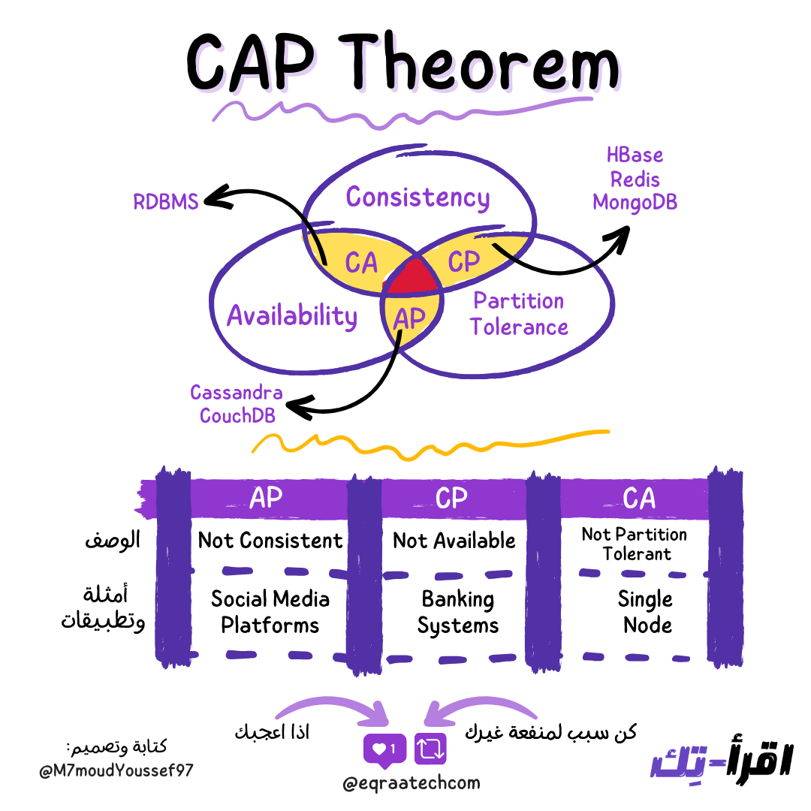
</p>

الـCAP Theorem واحدة من أهم النظريات الأساسية والمهمة في علوم الحاسب عامةً وفي النظم الموزعة خاصةً وبتنص على:
إن في النظم الموزعة ما ينفعش الـSystem يوفر إلا ضمانين أو خاصيتين اتنين بس في نفس ذات الوقت. 

**ايه اللي بتمثله الـ CAP والضمانات اللي بتقدمها ؟**

الـ C بتمثل الـ Consistency، والـ A بتمثل الـ Availability، والـ P بتمثل الـ Partition Tolerance..

**طب كل واحدة من دول معناها إيه؟**

1. الـ Consistency: معناها إن كل الـClients يقدروا يشوفوا نفس البيانات في أي وقت من غير أي اختلافات، فبنقول على البيانات أنها متسقة أو Consistent

2. الـ Availability: معناها إن كل Request الـSystem هيستقبله مفروض يكون ليه Response والنظام يقدر يكمل شغله من غير مشاكل حتى في وجود Nodes أو Servers واقعة وفيها مشاكل.

3. الـ Partition Tolerance: معناه قدرة الـSystem على إنه يكمل شغله بدون مشاكل حتى في وجود مشاكل في الـNetwork Communication بين الـNodes وبعضها.

وبما إن النظرية دي بتنص على وجود ضمانين اتنين بس يتحققوا في نفس الوقت فممكن يكون عندنا الـSystem حاجة من (3)

**الـ Consistency & Partition Tolerance**

 الـCP وده معناه إن في وجود الـParition Tolerance، الـSystem محتاج يضحي بالـAvailbility في سبيل توفر الـConsistency بين البيانات وبعضها.

وممكن نشوف مثال على ده مثلا في البنوك، اللي بنسبة كبيرة بتحتاج إن البيانات تكون متسقة ومفيهاش أي اختلاف في أي وقت الـClient هيطلب فيه ده، وده لإن الـClient مش هيحب إنه كل شوية يشوف حسابه فيه أرقام مختلفة ومتغيرة..

**الـ Availability & Partition Tolerance**

 الـAP وده معناه إن في وجود الـParition Tolerance، الـSystem محتاج يضحي بالـConsistency في سبيل توفر الـAvailability وده معناه إن مش لازم البيانات تكون متسقة في نفس ذات الوقت ممكن يكون فيه تغيير وتأخير لحد ما يحصل الاتساق وده يسمى بالـEventual Consistency، بس الأهم إن أي Request الـClient هيعمله لازم النظام يفضل شغال وبيرد عليه بدون مشاكل.

وممكن نشوف مثال على ده في مواقع التواصل الإجتماعي، فالـClient هيسمح بوجود تأخير على ما يحصل إن البيانات تبقى موحدة أو مستقرة زي عدد الـLikes والـNewsfeed Updates بس مش هيبقى مبسوط إن الـSystem مش متاح اصلًا.

**الـ Consistency & Availability**

 الـCA وده معناه إن الـSystem هيضحي بالـPartition Tolerance في سبيل تحقيق الـConsistency والـAvailability لكن ده غير منطقي في النظم الموزعة لإن مستحيل يكون فيه نظام متأكد بنسبة ١٠٠٪ من عدم غياب مشاكل في الـNetwork لإي سبب، وصعب تحقيق الـAvailability والـConsistency في نفس الوقت مع وجود Partition Tolerance..

وممكن نشوف مثال على ده في الـRDBMS الـSingle Node اللي مش بتحتاج لـNetwork Communication مع Nodes تانية.

وعشان كده ممكن نغير في نص النظرية ونقول إن في حالة وجود Partition Tolerance إما إن النظام يفضل الـConsistency أو الـAvailability كـTrade-Offs ويضحي بالتانية.

و وجب التنويه برضو إن تحقيق الـAvailability أو الـConsistency بنسبة ١٠٠٪ مستحيل، وإن النظرية دي بتفيدنا في التفكير بشكل مختلف أثناء تصميم النظام وإننا نسأل نفسنا إيه الـTrade-Offs اللي بنتعامل معاها. ✨


### Scalability
<p>
  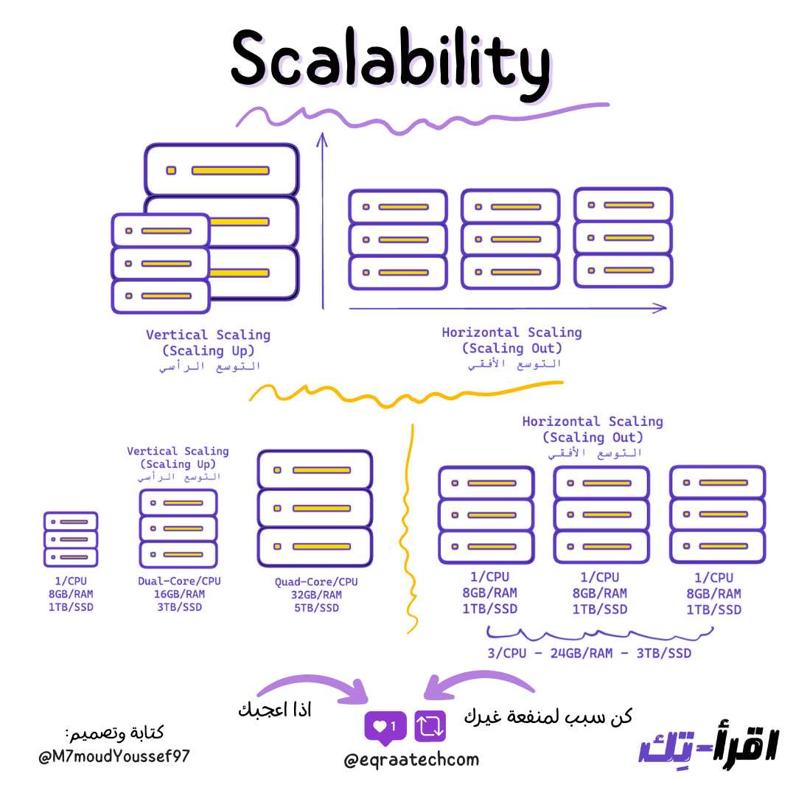
</p>

التوسع أو ما يعرف بالـ Scaling هو ببساطة قدرة النظام على تحمل أي حمل زائد أثناء استخدامه، فمثلا:
لو فيه نظام بيخدم 20 مستخدم في نفس الوقت، وفجأة العدد ارتفع لـ2000 مستخدم مرة واحدة والنظام قدر يتعامل مع الزيادة دي ويخدمهم من غير أعطال أو مشاكل، فده معناه إن النظام Scalable 

**إزاي نحقق الـ Scaling؟**

<ins>
 في طريقتين لتحقيق الـ Scaling في النظام اللي بنحاول نبنيه: 
</ins>

 1. التوسع الرأسي أو ما يعرف بالـ Vertical Scaling أو Scaling-Up
 
 2. التوسع الأفقي أو ما يعرف بالـ Horizontal Scaling أو Scaling-Out


 **ايه هو الـ Vertical Scaling؟**
 
هو زيادة قدرة وإمكانية النظام الواحد من خلال زيادة عدد الـ Resources في الـ Machine اللي بيكون فيها الـ Server، أو استبدال الـ Machine بواحدة تانية أقوى منها عشان تتحمل الحمل الزائد.

<ins>
وده بيتم بأكثر من شكل زي:
</ins>

1. زيادة الـ CPU/RAM عشان التطبيق يتحمل خدمة عدد أكبر من المستخدمين.

2. زيادة الـ Storage عشان قاعدة البيانات تقدر تخزن عدد أكبر من البيانات.

**ايه هو الـ Horizontal Scaling؟**

هو زيادة عدد الـ Nodes أو الـ Machines اللي بيكون فيها الـ Server، فبدل ما يكون فيه Node واحدة بس نعتمد عليها، بنعتمد على أكثر من Node.

<ins>
وده بيتم بأكثر من شكل زي:
</ins>

1. زيادة عدد الـNodes فلو كانت الـNode الواحدة قادرة على خدمة 20 مستخدم في وقت واحد، هيكون عندنا No.Nodes * 20 مستخدم نقدر نخدمهم في وقت واحد.

2. زيادة عدد الـNodes وزيادة سعة التخزين، فلو كانت قاعدة البيانات الواحدة تقدر تخزن 1TB، فنقدر دلوقتي نخزن No.Nodes * 1TB من البيانات.

تحقيق الـ Scalability مش حاجة سهلة زي ما يبان ولكن الموضوع محتاج لدراسة وفهم لطبيعة النظام والمتطلبات اللي مفروض يحققها في نطاق العمل أو ما يعرف بالـ Business Domain


### Replication
<p>
  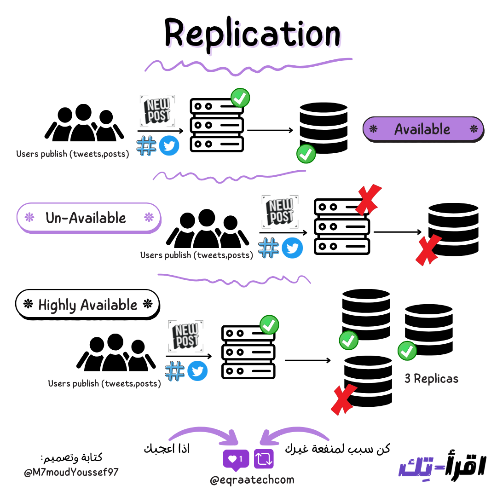
</p>

خلونا نتخيل كده مع بعض على سبيل المثال ان عندنا Service دورها بكل بساطة انك لما تيجي تكتب Post أو Tweet وتيجي تعمله Publish فالـ Service بتاخد الكلام ده وتحطه في الـ Database .. ولما تيجي تفتح الـ Profile بتاعك أو لحد من الناس فانت بتكون مستني انك تشوف الـ Posts أو الـ Tweets اللي في الـ Profile ده .. 

الـ Service دي بتتعامل مع الـ Database بشكل أساسي عشان تقدر تـ Fetch الـ Data لما تيجي تشوف الـ Posts أو الـ Tweets وبتـ Write Data لما الناس تيجي تعمل Publish .. 

الدنيا كانت ماشية كويس لحد ما في لحظة معينة ولسبب ما .. حصل مشكلة في الـ Database .. السبب هنا ليه احتمالات كتيرة مش هنتطرق ليها .. بس نتيجة ده ايه الي هيحصل ؟ 

**الـ Single Point of Failure**

الـ Service هتقع .. وده لانها اصبحت مش عارفة تـ Fetch البيانات ولا انها تـ Write في الـ Database .. ودي بنسميها عندنا في الـ Distributed Systems .. مشكلة في الـ Availability بتاعة الـ Systems وبالأخص الـ Single Point of Failure .. وده معناه انك عندك جزء في الـ System لو وقع .. النظام ككل هيقع ومش هيقدر يؤدي دوره بالشكل المطلوب .. يعني مش Highly Available

**طب كان حل المشكلة دي ايه ؟**

الناس قالوا بدل ما يكون عندنا Database واحدة شايلة البيانات كلها .. خلونا ناخد “نسخ متماثلة” من الـ Database دي .. فيكون عندنا أكتر من واحدة وليكن (3) .. والـ 3 نسخ دول هيكونوا متماثلين وشايلين نفس البيانات بالظبط .. بحيث لو حصل مشكلة في واحدة .. فيكون لسه عندنا 2 .. وبكده نضمن ان لو حصل اي مشكلة في اي وقت للـ Database الـ System هيفضل مكمل شغل وبيؤدي دوره بشكل كويس .. 

**الـ Replication**

وهو ده الـ Replication .. اني اعمل نسخة متماثلة واكررها فيكون عندي اكتر من نسخة بدل نسخة واحدة .. وده طبعا فادنا كتير في الـ Distributed Systems من حيث الـ Availability وكمان الـ Scalability .. فلو عندنا الـ Service بيحصل عليها عمليات قراءة كتير فبدل ما اكون عندي Database واحدة بتاحد كل الـ Requests دي وترجع نفس الـ Data .. أصبح ممكن يبقى عندي الحمل متوزع على X Numbers of Database Instances شايلين نفس البيانات .. 

**أنواع الـ Replication**

<ins>
عندنا نوعين من الـ Replication , وهم : 
</ins>

1. الـ Pessimistic Replication

2. الـ Optimistic Replication 

**الـ Pessimistic Replication**

الـ Pessimistic Replication ده هدفه الاساسي انه يضمن الـ Consistency بين الـ Database Instances وبعضها في اي لحظة زمنية , وعشان كده من اسمها فهي متشائمة .. فلما الـ Service هتيجي تكتب في الـ Database اي حاجة .. النوع ده من الـ Replication عشان متشائم .. هيكون دايما خايف ان البيانات متكونش زي بعض في اي وقت من الأوقات ..

وهيعمل ايه ؟ 

كل اما الـ Service تيجي تكتب في الـ Database .. مش هيـ Acknowledge ان الـ Write تم بشكل سليم وان الـ Operation Succeeded .. الا لما يتاكد ان عملية الـ Write حصلت على باقي الـ Database Instances وان البيانات اتكتبت فيهم كلهم .. ولو حصل مشكلة في واحدة منهم بس .. هيعتبر العملية كلها انها Failure .. ( يا نعيش عيشة فل ، يا نموت احنا الكل ) 

**الـ Optimistic Replication**

الـ Optimistic Replication هو نوع متكاسل شوية وهو ده الشائع في الـ Distributed Systems .. بيعتمد انه عارف ان في نفس اللحظة الزمنية هيكون فيه اختلاف في البيانات وانها مش كلها متسقة ومش كلهم شبه بعض .. بس متأكد ان في النهاية البيانات كلها هتبقى زي بعض .. وده بيكون اسمه Eventual Consistency .. طب امتة ده هيحصل ؟ ممكن بعد ثواني او بعد دقائق .. مش مشكلة .. بس المهم ان في النهاية كل البيانات هتبقى زي بعض .. 

أي النوعين اختاره وأعتمد عليه؟
ده بيكون على حسب الـ Requirements بتاعة الـ System اللي بتبنيه .. وكل نوع ليه الـ Trade-offs الخاصة بيه .. على سبيل المثال الـ Pessimistic بيكون كويس في ضمان الـ Consistency ولكن هيأثر في الـ Write Throughput وعلى النقيض الـ Optimistic كويس جدا انه يديك Write Throughput عالي زي تطبيقات الـ Social Media اللي بيكون فيها ملايين الناس بتكتب في نفس الوقت .. بس في نفس الوقت انت بتضحي هنا بالـ Consistency .. فمش كل الناس هتشوف نفس الـ Posts او الـ Tweets في نفس الوقت .. ممكن حد يشوفها قبل كده بس في النهاية الكل هيشوفها .. 

 

طب الـ Replication بيشتغل ازاي ؟ وايه الخورازميات اللي قايمة عليه ؟ ده ممكن نكلم عنه في ورقة تانية 


### Load Balancer
<p>
  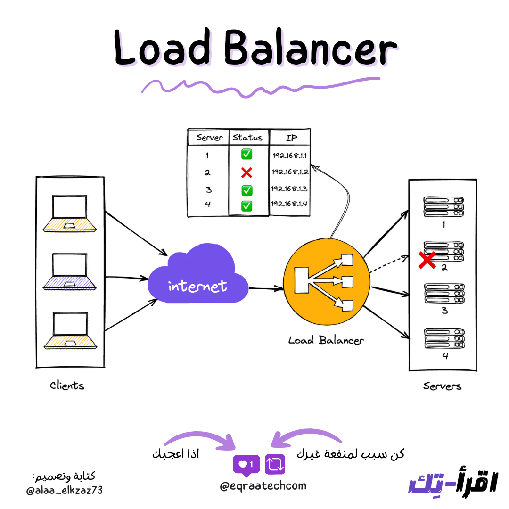
</p>

اتكلمنا عن الـ Scaling المرة اللي فاتت بالورقة والقلم، ومن أهم الحاجات اللي بتساعدنا نحقق الـ Scaling هو ظابط المرور!

الـ load balancer أو “مُوزع الأحمال” هو بكل بساطة ضابط مرور بيوجه الطلبات اللي جاية من الـ clients إلى الـ server المناسب في النظام.

زمان كنت بتعمل application ويشتغل على سيرفر لكن مع تزايد عدد الطلبات، السيرفر مش بيقدر يخدم كل دا وبيقع. فبنتجه للـ Scaling: 

 1. تشغل أكثر من نسخة من التطبيق على أكتر من server
 
 2. تقسم التطبيق لأجزاء مستقلة ونحط كل جزء علي server مختلف
 
 بس في الحالتين الـ client هيعرف هيكلم انهي سيرفر بالظبط ازاي؟ 

**ازاي الـ Client هيعرف الـ Server اللي مفروض يكلمه ؟**

هنا بيجي دور الـload balancer اللي بيكون عنده جدول فيه كل السيرفرات المتاحة، وعنده معلومات عن كل واحد عليه service ايه بالظبط؟ هل الـ Server شغال ولا واقع؟ ولو شغال فمشغول اد ايه؟ وباستخدام خوارزمية معينة بيوجه الـ client لل server المناسب.

**خوارزميات الـ Load Balancer**

 الخوارزميات اللي بيشتغل بيها موزع الأحمال بسيطة في فكرتها ولكن فعالة ومن أهمهم: 

1. الـ Round Robin

2. الـ Least Connections

3. الـ Least Response Time

4. الـ Hash

وهنعرف كل واحد بيشتغل ازاي في ورقة تانية بإذن الله.

**مميزات الـ Load Balancer**

<ins>
 الـ load balancer بفكرته البسيطة بيقدم مميزات كتير منها: 
</ins>

1. بيقلل الوقت اللي بيكون فيه النظام مش متاح؛ لأنه ببساطة لو سيرفر وقع الـload balancer مش هيبعت له أي طلبات من الـclients.

2. بيخلي النظام ككل، أكثر كفاءة ومرونة، ويقدر يتعامل مع عدد أكبر من الطلبات في وقت أسرع.

الـload balancer من الأفكار السهلة ولكن الأساسية في تصميم النظم، وليه نوعين: نوع hardware ونوع software ودا الأكثر استخدامًا؛ لأنه بالتأكيد أكثر مرونة من الـhardware


### Load Balancer Algorithms
<p>
  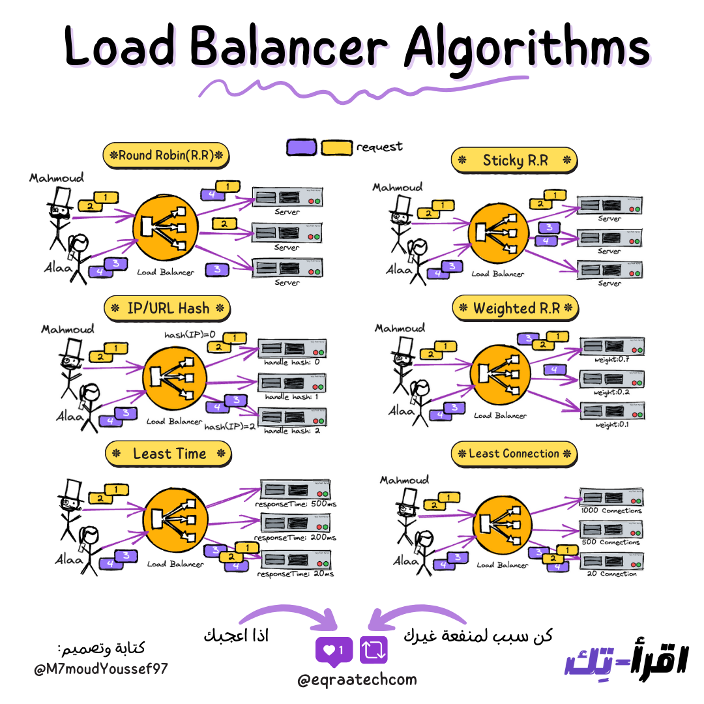
</p>

اتكلمنا قبل كده عن الـ Load Balancer وعرفنا قد ايه هو مهم في عالم الـ Distributed Systems والـ System Design، ودلوقتي جه الدور اللي نتكلم فيه عن الـ Algorithms اللي بيشتغل بيها والمتنوعة.

بتنقسم الـ Algorithms لنوعين أساسين وهم Static و Dynamic.

**الـ Load Balancer Static Algorithms**


<ins>
1. الـ Round Robin :
</ins>


وهو من أبسطهم وفيه الـ Requests اللي الـ Client بيبعتها ويستقبلها الـ LB بتتبعت لـ Service Instance مختلفة عن اللي قبلها بشكل Sequential. الـ LB بيكون عنده List بالـ Available Servers وبيبدأ يـ Route كل Request للـ Server المقابل .. فالـ Request No.1 يروح للـ Server No.1 وهكذا ..

<ins>
2. الـ Sticky Round Robin :
</ins>

وهو عبارة عن تحسين بسيط للـ Round Robin واللي فيه مثلا لو “محمود” بعت Request للـ Service Instance No.1 فالـ Requests الجاية هتتبعت برضو لنفس الـ Service Instance. وهنا بتكمن قوة الـ Sticky Round Robin وده مهم جدًا خصوصًا للـ Sessions فمفيش حد هيحب كل شوية يلاقي الـ Shopping Cart بتاعته فاضية عشان Service تانية غير اللي قبلها اللي استقبلت الـ Request

<ins>
3. الـ Weighted Round-Robin :
</ins>

وده برضو تحسين بسيط للـ Round Robin بس هنا بنحط Weight أو نسبة على كل Service واللي عليها نسبة أعلى أو Weight أكبر بيـ Handle Requests أكتر.

<ins>
4. الـ Hash :
</ins>

وهنا بنتطبق Hashing Function على الـ IP مثلًا أو الـ URL وبناءًا على نتيجة الـ Hash Function الـ Request بيوصل للـ Service Instance المطلوبة. في الطريقة دي مثلا كل الـ Requests اللي بتروح لنفس الـ URL هتتـ Handle من خلال نفس الـ Service Instance

**الـ Load Balancer Dynamic Algorithms**

<ins>
1. الـ Least Connections :
</ins>

وهنا الـ Request اللي الـ Client بيبعته بيتـ Handle من خلال الـ Service Instance اللي عندها أقل عدد من الـ Concurrent Connection.

<ins>
2. الـ Least Response Time :
</ins>

وهنا الـ Request اللي الـ Client بيبعته بيتـ Handle من خلال الـ Service Instance اللي عندها اسرع Response Time.

دول كانوا أشهر الـ Algorithms وأكترها شيوعًا وكل واحد منهم ليه الـ Trade-Offs الخاصة بيه واللي تحديده بيفرق من Application للتاني على حسب الـ use-cases واحتياجات التصميم.


### Caching Strategies
<p>
  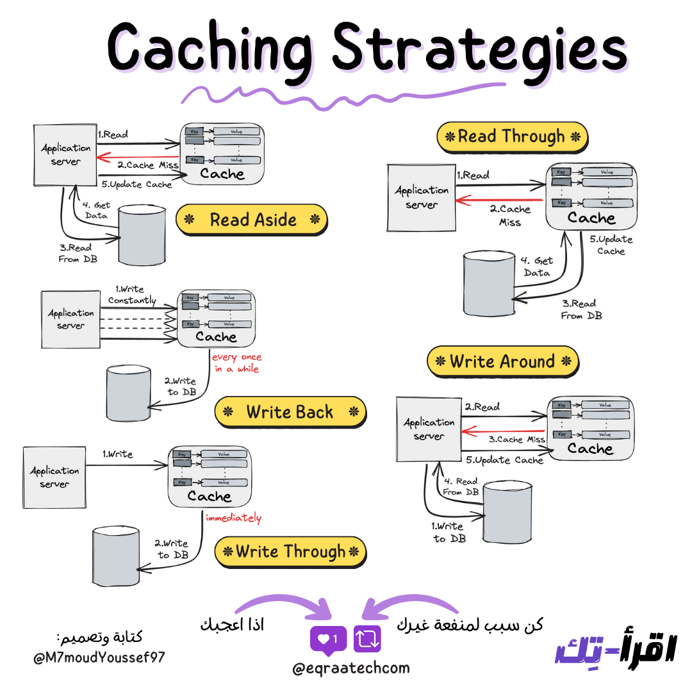
</p>

الـ Caching من المفاهيم المهمة جدًا اللي منقدرش نستغنى عنها في صناعة البرمجيات، وجوكر في مواقف كتير لتحسين الـ Performance. وفيه أكتر من تكنيك بيتم الـ Caching من خلاله وده بيعتمد بنسبة كبيرة على الـ Data Access Patterns، وكل تكنيك ليه الـ Trade-offs اللي لازم تكون مُلم بيها.

**الـ Cache Hit Vs Cache Miss**

قبل ما نتكلم عن الـ Caching Strategies فلازم نكون عارفين إن الـ Application لما بيلاقي الـ Data موجودة في الـ Cache فده معناه Cache Hit ولو ملقهاش فبيكون اسمه Cache Miss. 

**الـ Cache Reading Strategies**

1. الـ Read Aside

2. الـ Read Through

<ins>
الـ Read Aside
</ins>

الـ Cache Aside لو الـ Application حصله Cache Miss، فبيروح يجيب الـ Data من الـ Database وبعدين يعمل Update للـ Cache بالـ Data اللي عملها Fetch.

<ins>
الـ Read Through
</ins>

الـ Read Through لو الـ Application حصله Cache Miss، الـ Cache ذات نفسه بيروح يجيب الـ Data من الـ Database ويعمل لنفسه Update بحيث الـ Data تبقى عنده.

**الـ Cache Writing Strategies**

1. الـ Write Around

2. الـ Write Through

3. الـ Write Back

<ins>
الـ Write Around
</ins>

 الـ Write Around الـ Application بيكتب الـ Data في الـ Database الأول، ولو جه يعملها Fetch بيروح للـ Cache الأول، ولو حصل Cache Miss بيروح يقرأها من الـ Database ويعمل Update للـ Cache.

<ins>
الـ Write Through
</ins>

 الـ Write Through الـ Application بيكتب الـ Data في الـ Cache وبعدين بيكتبها على طول في الـDatabase.

<ins>
الـ Write Back
</ins>

 الـ Write Back الـ Application بيكتب الـ Data في الـ Caching وتفضل الـData تتكتب في الـ Caching وكل فترة من وقت للتاني الـ Cache ياخد الـ Data دي ويحطها في الـ Database مرة واحدة.

كل طريقة من دول ليها الـ Trade-offs بتاعتها وممكن نعمل مزيج بينهم ونستفاد من أكتر من طريقة.

### Proxy Vs Reverse Proxy
<p>
  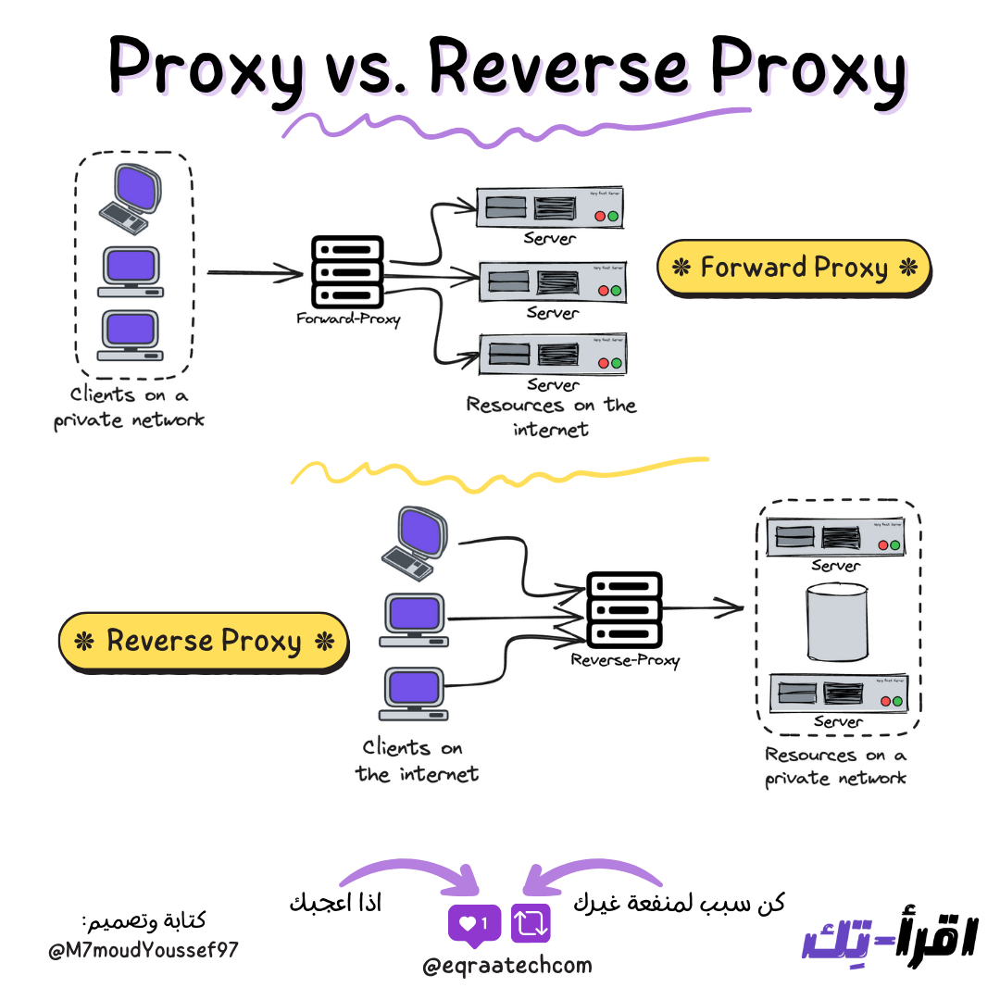
</p>

كتير من الشركات دلوقتي بتستعمل الـ Proxy عشان تـ Route وتـ Secure الـ Traffic بين الـ Networks وبعضها بالاضافة لفوايد تانية كتير هنعرفها سوا.

**ايه هو الـ Proxy ؟**

الـ Proxy بكل بساطة بيتمثل دوره في كونه عبارة عن وسيط بين الـ Clients والـ Servers، وفيه نوعين ليه وهم الـ Forward Proxy والـ Reverse Proxy

**الـ Forward Proxy**

وعادة بيتم الاشارة ليه بكلمة Proxy بس .. فلو قابلت اسم Proxy المفترض ان يكون المقصد هو الـ Forward Proxy .. والنوع ده من الـ Proxy بيكون شغله ناحية الـ Clients وبيشتغل كوسيط بين الـ Clients والـ Servers

**استخدامات الـ Forward Proxy**

1. وأحد أهم استخداماته هو انه بيعمل Processing للـ Requests الخارجة من الـ Clients ورايحة للـ Outgoing Resources أو للـ Internet

2. الـ Forward Proxy برضو بيتم استعماله في الشركات بشكل كبير عشان يحمي الـ Clients اللي موجودين في Private Network من أنهم يعملوا Access للـ Internet Resources

3. الـ Client Anonymity يعني بيخفي هوية الـ Client وده لإن الـ Outgoing Requests اللي خارجة من الـ Clients ورايحة للـ Servers أو للانترنت عمومًا .. بيكون المسئول عنها دلوقتي هو الـ Proxy لانه بيستقبل الـ Request ويبعته بالنيابة عنهم .. وبالتالي الـ Servers مش عارفة هوية الـ Clients الحقيقية .. (ودي احدى اهم استخداماته واللي بنشوفها في الـ VPN )

4. الـ Content Filtering وده لإن زي ما عرفنا انه هو بيستقبل الـ Requests من الـ Client فيقدر يعمل عليها Filtration قبل ميبعتها وبالتالي ممكن هنا يعمل URL Blocking لكتير من الـ Websites اللي ممكن تمثل Threats.

5. الـ Performance Improvement وده من خلال انه يقدر باستعمال Caching Mechanisms يطور ويحسن من الأداء ويبقى بمثابة Boost لكتير من الـ Client Requests.

**الـ Reverse Proxy**

النوع ده من الـ Proxy بيكون شغله ناحية الـ Server-Side Infrastructure أكتر، فالـ Reverse Proxy هنا دوره أنه بيضمن أن الـ Clients ميقدروش يتواصلوا بشكل Direct مع الـ Web Servers ولكن بيتواصلوا معاهم بشكل غير مباشر من خلال الـ Reverse Proxy اللي بيستقبل الـ Client Requests دي قبل ميبعتها للـ Web Servers.

**استخدامات الـ Reverse Proxy**

وعشان كده أحد أهم استخدامات الـ Reverse Proxy هو انه بنسبة كبيرة بيتم الاعتماد عليه كـ Load Balancer في انه بيوزع الـ Incoming Requests من الـ Clients على الـ Web Servers.

1. الـ Server Anonymity يعني بيخفي هوية الـ Server وده لإن الـ Client دلوقتي أصبح بيبعت الـ Request واللي بيستقبله هو الـ Reverse Proxy

2. الـ DDos Mitigation وده معناه انه يقدر يخفف من الـ DDos من خلال عملية الـ Throttling اللي ممكن يعملها للـ Incoming Requests


### Rate Limiting
<p>
  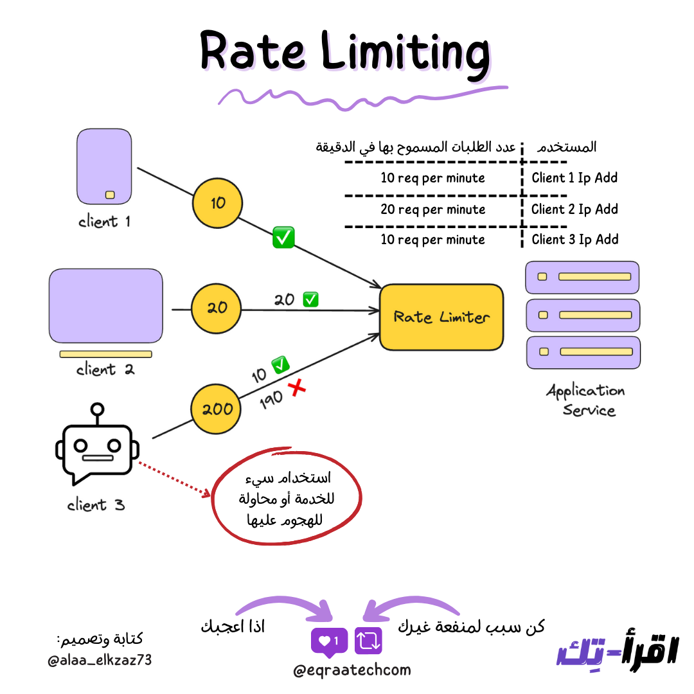
</p>

ال Rate Limiting هي واحدة من أهم الطرق الأساسية عشان نحقق الـ Robustness في الـ Service اللي بنبنيها وده من خلال تحديد عدد Requests معينة مسموح للمستخدم يطلبها في فترة زمنية محددة.

ومش بس كده، ده كمان بتساعد في تحقيق الـ Security وده من خلال انها بتساعد في صد بعض الـ Attacks المهمة.

الـ Rate Limiting عامل زي ظابط المرور اللي بيوقف السواق ويديله مخالفة لو تجاوز السرعة المسموح بيها.

**أشهر استخدامات الـ Rate Limiting**

من أشهر الأماكن اللي بتشوف فيها ال Rate Limiting هي صفحات تسجيل الدخول اللي بعد عدد معين من إدخال كلمة مرور غير صحيحة في فترة صغيرة من الزمن بتمنعك تحاول تاني لمدة معينة.

<ins>
تحديد عدد الـ Requests ده بيحمي الـ APIs من الاستخدام السيئ أو من الضغط الزائد عليه واللي ممكن يحصل من خلال: 
</ins>

1. الـ DDoS Attacks

ودي نوع من أنواع الـ Cyber Attacks لو مقدرناش نصدها فغالبًا الـ Server أو الـ Service بتقع، لانها مش قادرة تتحمل ضغط الـ Traffic الزايد واللي بنسبة كبيرة بيقوم بتنفيذها Bots، بالإضافة لإنها بتعمل Resource Starvation وده معناه انها بتستغل كل موارد الـ Server لمستخدم واحد بس وبالتالي بتمنع باقي المستخدمين من الاستفادة بالـ Service ..

2. الـ Brute Force Attacks :

فاكرين صفحة تسجيل الدخول ؟ دا نوع من الهجمات بيستهدف الصفحات دي و يجرب كل الاحتمالات لكلمة مرور معينة, واستخدام ال Rate Limiters بينجح في صد النوع دا بسهولة لأنه بعد عدد محاولات معينة بيقفل استقبال الصفحة للمحاولات من المستخدم دا.

3. الـ Web Scraping 

ال scraping هو عبارة عن استخراج كل المعلومات من موقع ما معين, وممكن يتم استخدامه بشكل جيد أو سئ. وكتير من المواقع بتمنعه أو بتحده زي مواقع الـ Social Media زي Twitter أو Instagram اللي بيعملوا Limit لعدد مرات الـ Home Refresh في الساعة لمنع النوع دا من الاستخدام لمواقعهم.

**طب ازاي الـ Rate Limiting بيشتغل ؟**

فكرة عمله بسيطة جدًا, بيحدد لكل مستخدم بناءًا على الـ IP Address بتاعه عدد Requests معينة لو تجاوزها بيقفل الخدمة للمستخدم ده, مثال على ده لو عندنا API بيسمح بـ 200 Request في الدقيقة للمستخدم، لو المستخدم استهلك الـ 200 كلهم خلال الدقيقة بيقفل الخدمة عليه لبقية الدقيقة ومن الدقيقة الجديدة بيرجع يسمح ليه بـ 200 Request جداد وهكذا. 

**الـ Rate Limiting Algorithms**

طبعًا في Algorithms مختلفة لتنفيذ الفكرة دي ولكنها بتعتمد على نفس المبدأ: عدد معين من الـ Requests هيكون مسموح للـ IP في خلال فترة زمنية وبعدها بيتم رفض أو تأخير الطلب من الـ IP ده. أشهر الـ Algorithms اللي بيتم استخدامها لتنفيذه: 

1. الـ Token Bucket

2. الـ Leaky Bucket

3. الـ Fixed Window Counter

4. الـ Sliding Window Log

5. الـ Sliding Window Counter

الـ Rate Limit ممكن يتنفذ في الـ Application Logic بتاعك من خلال تنفيذ الـ Algorithms دي، أو ممكن تعتمد على Functionality جاهزة بيقدمهالك Component زي الـ API Gateway لو شغال على الـ Cloud، وممكن برضو تستخدم 3rd Party Service جاهزة تقوم بالدور له.

### Database Cheatsheet for System Design
<p>
  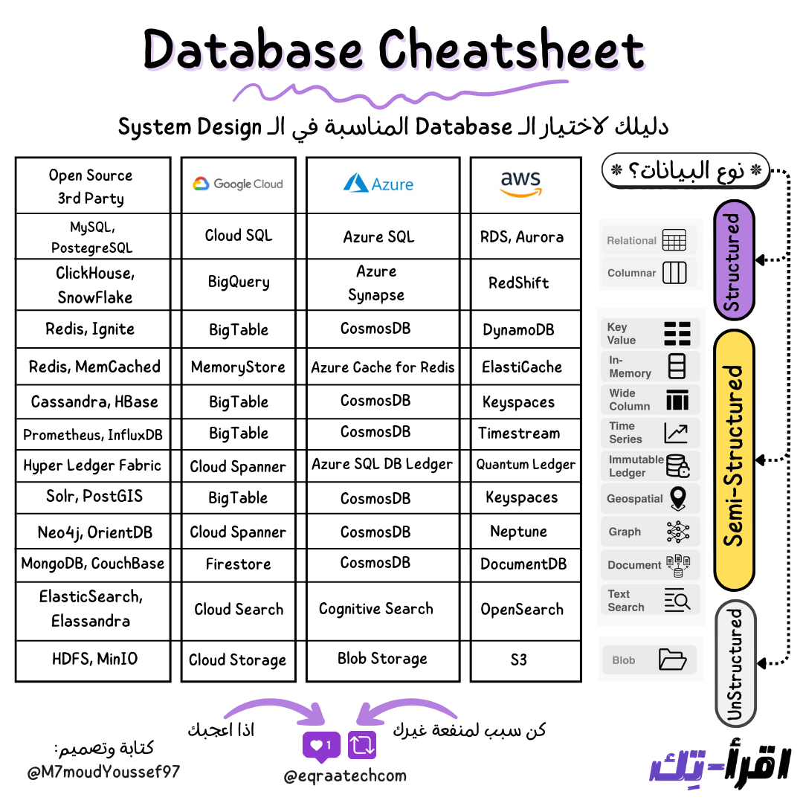
</p>

لازم نكون عارفين ان اختيارنا للـ Database في الـ System اللي بنبنيه، هو قرار مش سهل وقرار هنبقى ملزمين بيه لفترة طويلة فلازم نختارها بعناية خصوصًا لو كمان الموضوع هيتضمن Budget وفلوس هتندفع.

عشان نسهل على نفسنا الاختيار هنحاول الأول نجاوب على السؤال ده: 

**هو ايه نوع الـ Data اللي محتاجين نخزنها في الـ System ؟**

<ins>
والاجابة هتكون حاجة من 3 واللي هنحاول سوا نبني Mind-Map في عقلنا عشان نسهل الاختيار علينا شوية: 
</ins>

1. الـ Structured Data (Standard SQL Table Schema)

2. الـ Semi-Structured Data (JSON, XML, etc..)

3. الـ UnStructured Data (Blob) 

بعد معرفتنا بنوع البيانات اللي هنخزنها، هنكون محتاجين نعرف حاجتين اتنين بس:  

1. ايه هي الـ Use-Case أو هدفنا من تخزين البيانات

2. هل هنروح ناحية الـ Cloud ولا هيبقى اعتمادنا على الـ Open-Source والـ 3rd Party ؟ 

وده لإن تحديد الهدف من التخزين هيفرق في اختيار الـ Database وهيخلينا نروح لنطاق أقل من الاختيار، واعتمادنا على الـ Cloud من عدمه كذلك هيسهل علينا الاختيار وهيضيق نطاق الاختيار. 

**الـ Structured Data**

لو البيانات اللي هنخزنها Structured فوقتها عندنا 2 Use Cases : 

1. الـ Transactions / OLTP (Online Transaction Processing)

2. الـ Analytics / OLAP (Online Analytical Processing)

لو هدفنا كان OLTP فوقتها هنتجه للـ Relational Databases اما لو كان OLAP فوقتها هنروح للـ Columnar Database والاتنين مختلفين عن بعض من ناحية طريقة تخزين البيانات وهيكلتها.

ووقتها نقدر بناء على معرفتنا هل هنروح للـ Cloud ولا لا نختار من الجدول اللي موجود في الصورة ، وطبعا بعد قراءتنا عن الفروقات بينهم وايه اللي هيخدمنا أكتر من ناحية الـ Performance, Pricing Model, وعوامل تانية كتير .. 

**الـ Un-Structured Data**

لو البيانات اللي هنخزنها UnStructuredزي الصور والفيديوهات فوقتها بعد معرفتنا هنروح للـ Cloud ولا لا نقدر نختار من الجدول

**الـ Semi-Structured Data**

ودي اللي بنقول عليها NoSQL Databases وليها أنواع واستخدامات كتيرة جدًا:  

1. الـ In-Memory Databases

لو ناوين نتجه لناحية الـ Key-Value Database ، لو كان الهدف من التخزين اننا يبقى عندنا In-Memory Database فوقتها هنروح للـ Cache Databases.

2. الـ Wide-Column Databases

لو كان الهدف من التخزين الـ Real-Time Analysis أو وجود كميات ضخمة من البيانات أو Concurrent Queries بشكل كبير خصوصا في عمليات الكتابة ومحتاجين High Throughput in Writes وقتها هنتجه للـ Wide-Column Databases.

3. الـ Time-Series Databases

لو كان الهدف اننا محتاجين نركز على بناء Metrics أو Real-Time Dashboards ومعتمدين على البيانات خلال فترات زمنية فهنتجه للـ Time-Series Databases.

4. الـ Immutable Ledger Databases

لو كان الهدف اننا محتاجين Audit Trails أو حاجة بتدعم الـ Supply Chaing والـ Crypto Currency والـ Digital Assets فوقتها هنتجه للـ Immutable Ledger Databases.

5. الـ Geospatial

لو كان الهدف اننا محتاجين نعتمد على الـ Location أو بنبني  Geographic Information Service فوقتها هنتجه للـ Geospatial.

6. الـ  Text Search

لو كان الهدف اننا محتاجين نعمل Full Text Search فهنتجه للـ Text Search واللي أشهرهم Elastic Search من ناحية الـ Open Source.

7. الـ Graph

لو كان الهدف اننا محتاجين يبقى عندنا Entity-Relationship بين البيانات وبعضها وهتكون العلاقات دي معقدة فوقتها هنتجه للـ Graph Databases.


## Security

في عالم التكنولوجيا وأمان المعلومات، تعتبر عملية الـ Authenitcaion مفتاحًا لضمان الحماية والتحقق من هوية المستخدم. عندما يتم تحقيق المصادقة بنجاح، يمكن للنظام التأكيد على هوية الفرد أو الكيان الذي يسعى للوصول، مما يفتح الباب أمام مرحلة مهمة تعرف بالتفويض.

بعد التحقق من هوية المستخدم، يأتي دور التفويض لتحديد نطاق وصوله. هنا، يتم تخصيص الصلاحيات بشكل دقيق لضمان أن يتمكن المستخدمون فقط من الوصول إلى المعلومات والموارد التي يحتاجون إليها. التفويض يسهم في حماية الخصوصية وضمان أمان النظام.

### Json Web Token

<p>
  
</p>

الـ JWT عبارة عن Secure Tokens بيتبعت مع كل Request أو Response عشان نتأكد ان البيانات بين الطرفين متغيرتش، كونها طريقة سهلة وفعالة بيخليها واحدة من أكثر الطرق المستخدمة في الـ User Authentication and Authorization (التحقق من هوية المستخدم و تحديد صلاحياته).

**أجزاء الـ JWT**

<ins>
ال JWT بيتكون من 3 أجزاء :
</ins>


1. الـ Headers
ودي بيتكتب فيها نوع الـ Token و كذلك الـ Algorithm المستخدم.


2. الـ Payload
ودا بيحتوي على معلومات المستخدم زي الـ Email و ممكن بعض صلاحياته وتاريخ اصدار وانتهاء الـ Token.


والجزئين دول بيكونوا Base64 Encoded وتقدر تاخدهم و وتستعملهم في أي Base64 Decoder علي الانترنت و وهيظهرلك القيمة بداخلهم، وعشان كدا مينفعش نحط فيهم أي معلومات سرية زي الـ Passwords.


 3. الـ Signature 

والجزء دا بيكون عبارة عن Hashing للجزئين ( 1 + 2 + Secret )

والـ Secret ده الـ Server بس اللي يعرفه وكل لما كان أصعب كان قوة الـ JWT Token أكبر. وعادة ما بيتخزن في الـ Environment Variables في الـ Server ده.


** طيب بنستفاد منه ازاي في الـ Authentication والـ Authorization؟**

<ins>
زمان عشان نعمل User Authentication كان بيتم بالخطوات دي:
</ins>

المستخدم بيعمل Login من خلال الـ Email والـ Password 
الـ Server بيتحقق منهم ويقوم بتحديد Session ID للمستخدم ويخزنها في الـ Database 
بعد كده الـ Server بيبعتها للمستخدم والمتصفح بيخزنها
 وفي كل Request المستخدم بيبعته للـ Server بيكون معاه الـ Session ID
هنا بنقابل مشكلتين:

 الـ Server كل مرة بيحتاج يتحقق من الـ Session ID بيبعت Request للـ Database ودا بيكلف Time وكمان Resources. 
الـ Sessions معرضة بسهولة لنوع من الـ Cyber Attacks اسمه Cross-Site Attacks 
إنما الـ JWT Token بيتم بنفس الشكل دا مع الفارق ان الـ Server هنا مش هيخزنها عنده (زي ما واضح في الجزء الثاني من الصورة).

**ازاي JWT حلت المشاكل دي ؟**

<ins>
الـ JWT بتحل المشكلة الأولى بكون الـ Server  مبيضطرش يرجع للـ Database مع كل Request، الـ Server  بكل بساطة بيعمل الآتي:
</ins>


1. بيقوم حاسب الـ Hash للجزئين 1 و 2 باستخدام الـ Secret المخزنة عنده في الـ Environment Variables على سبيل المثال، والـ Hashing ده بيتم باستخدام الـ Algorithm المحدد في الـ Token في الـ Headers زي ماوضحنا. 

2. بيقوم بعمل مقارنة للناتج بالـ Signature اللي هي جزء الثالث من الـ JWT واللي المستخدم بعتها مع الـ Request.

وبكدا اتأكدنا من هوية المستخدم لأن أي تغيير في الجزئين الأول والثاني أو أي تلاعب في قيمة الـ Secret هينتج عنه Hash مختلف تمامًا عن الجزء الثالث.

اما بالنسبة المشكلة الثانية

فنقدر نحلها باننا نحط في الـ Payload نوع معين من ال Security Tokens اسمه (CSRF (Cross-Site Request Forgery اللي من خلاله بتأكد أن الـ Request ده اتبعت من نفس المكان مش من مكان تاني واقدر بنفس الطريقة اتأكد انه محصلش تلاعب بقيمة الـ Token دي.

**طب ايه هي عيوب الـ JWT ؟**

<ins>
كعادة أي حاجة في العالم الـ JWT مش مثالي وليه بعض الـ Trade-Offs:
</ins>

من الصعب عمل Revoke للـ JWT بعد ما الـ Server يعملها Generate وعشان كده يفضل يتعملها Expiration Time صغير بعدها يقدر الـ User يسجل دخوله مرة تانية ويتعمله Generate لـ Token جديدة
حيث اننا بنبعت الـ JWT مع كل Request، فلو حجم الـ Payload كان كبير .. حجم الـ Request بالتابعية هيكبر ودا هيأثر بالسلب على الـ Network Latency و Network Bandwidth 
الـ JWT سهلة الاستخدام والتطبيق في الـ Code لأن كل اللي بنعمله اننا بنستخدم Libraries جاهزة ونحدد الـ Secret اللي هنستخدمه. 

وتقدروا تدخلوا على الموقع الرسمي لـ JWT وتجربوا الـ Decoder وتغيروا في القيم اللي في الـ Token.

### How to Store Passwords In Databases

<p>
  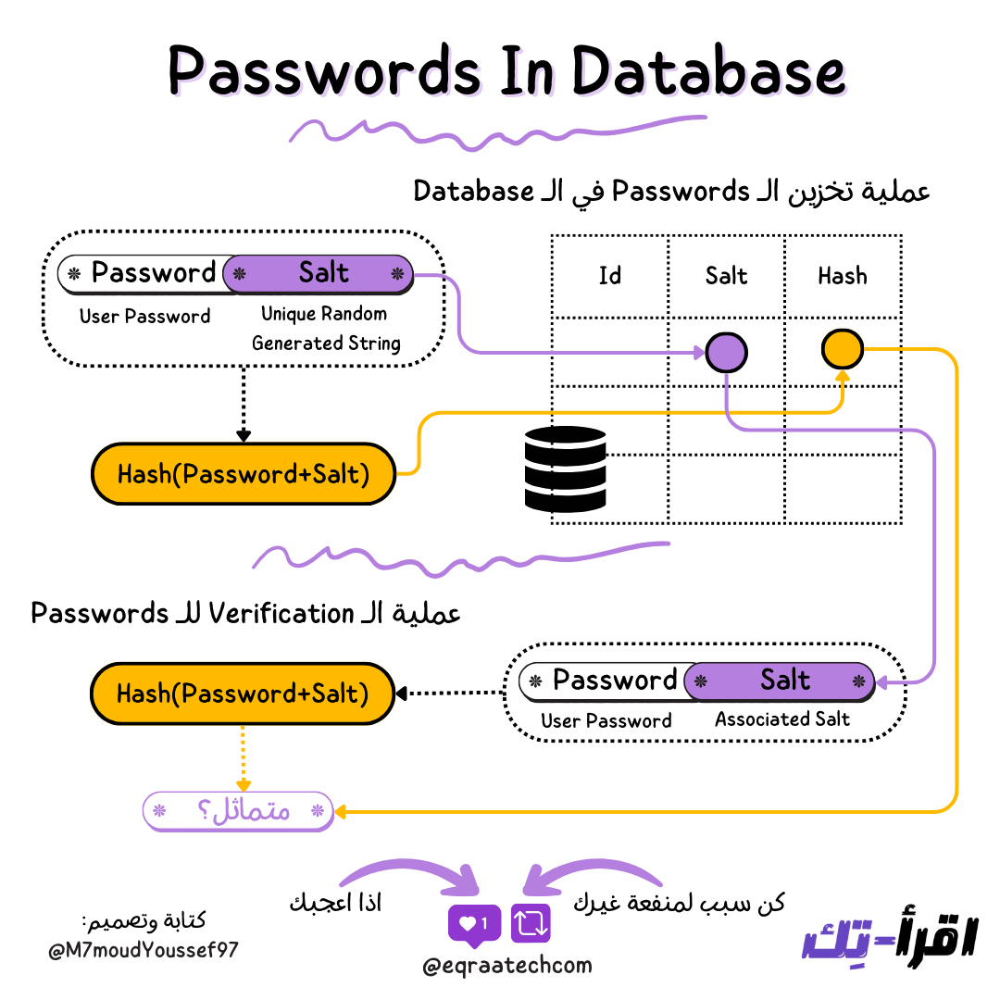
</p>

ازاي الـ Passwords بتتخزن في الـ Database وازاي نقدر نتأكد من الـ Password بتاع الـ User سليم وهو بيعمل Login ؟ 

وقبل ما نبدأ نتكلم عن ده خلونا في البداية نأكد على أهمية الموضوع وأن تخزين الـ Passwords في الـ Database لازم يتم بشكل ميسهلش للـ Hackers أنهم يوصلوا للـ Passwords حتى لو حصل اختراق للـ Database.

 

**طب ايه هي الحاجات اللي بتسهل عملية الوصول للـ Passwords ؟**

فيه بعض الحاجات اللي مفروض نبعد عنها تمامًا عشان بتسهل للـ Hackers انهم يوصلوا للـ Passwords زي: 

 

1. اننا نخزن الـ Passwords كـ Plain Text في الـ Database ، ده هيخلي اي حد Internal شغال في الشركة انه يكون ليه Access على كل الـ Passwords وعارفهم كلهم .. وده برضو هيخلي اختراق الـ Database عملية بتسهل الوصول لكل الـ Passwords اللي موجودة، فالـ Hacker هيكون قدامه الـ Passwords على طبق من ذهب ..
2. اننا نستعمل Legacy Hashing Algorithms زي الـ MD5 و الـ SHA-1 فبالرغم من انهم يعتبروا Algorithms سريعة جدًا، إلا أنهم يعتبروا Not Secured وسهل يتم معرفة الـ Passwords من خلالهم 
 

**طب ازاي نخزن الـ Passwords بشكل آمن ؟**

وفقًا لمشروع الـ OWASP واللي هو اختصار لـ Open Web Application Security Project فهم ادونا شوية Guidelines نقدر نمشي عليها عشان نخزن الـ Passwords بشكل آمن زي:

1. اول حاجة اننا نستعمل Modern Hashing Algorithms والـ Hashing هنا هو عبارة عن طريق واحد رايح مبيرجعش، فهي عبارة عن Function بتديها الـ Password ومينفعش تعمل عكس العملية دي عشان تعرف الـ Password . 

وفي نفس الوقت لو حصل اي اختراق والـ Attacker وصل للـ Passwords فهو مش هيقدر يستعملها في الـ Application لانها Hashed .. ومن أمثلة الـ Modern Hashing Function الـ Bcrypt واللي بعتر بطيء بسبب الـ Resources اللي بيحتاجها عشان يـ Compute الـ Hashed Value ..

2. تاني حاجة هي اننا نضيف شوية ملح على الـ Password منسيبهوش كده .. والـ Salt هنا هو عبارة عن Unique Random Generated String بينضاف على الـ Password قبل ما يتعمل Hashing وبعدين يتعمل Hashing ليهم مع بعض .. 

**طب ليه مينفعش نخزن الـ Passwords كـ Hashed بس ؟**

لان الـ Attacker ممكن من خلال Pre-Computation Attacks يقدر يتغلب على الـ One-Way Hash وفيه Techniques زي الـ Rainbow Table اللي ممكن تساعده في حاجة زي كده ويتعرف على الـ Password .. 

فدلوقتي عشان نخزن أي Password في الـ Database بنزود عليه Salt ونعمل للـ Combination دي Hashing مع بعض ونخزن الـ Hash(Password+Salt) Output في الـ Database بالاضافة للـ Salt وهنعرف ده ليه دلوقتي .. 

**الـ Password Validation**

لما الـ User بيجي يكتب الـ Password ، بنروح نجيب الـ Salt اللي اتزود على الـ Password بتاعه من الـ Database ونزوده على الـ User Password اللي كتبه ونعملهم Hashing مع بعض ونقارن الـ Hashed Combination ده مع اللي موجود في الـ Database لو طلعوا زي بعض ، اذن الـ Password سليم.


## Networks and Communication Protocols

شهدت عالم الاتصالات وشبكات الحاسوب تطورًا هائلاً في العقود الأخيرة، حيث أصبحت الشبكات والبروتوكولات الاتصالية لا غنى عنها في حياتنا اليومية.

تعني مصطلح "Networks" ببساطة توصيل أجهزة الحاسوب والأنظمة معًا لتبادل المعلومات والموارد. يشمل ذلك الاتصال بين الأجهزة في مكتب واحد أو توصيل شبكات متعددة عبر مسافات طويلة باستخدام الإنترنت.

أما عن "Communication Protocols"، فهي مجموعة من القواعد والتسلسلات التي تحدد كيفية تبادل المعلومات بين الأجهزة في الشبكة. تعمل هذه البروتوكولات على توفير تنظيم وتوجيه فعال للبيانات، مما يسمح بتحقيق اتصال فعال وآمن.

تشمل Networks and Communication Protocols تقنيات مثل الشبكات اللاسلكية والسلكية، بروتوكولات الإنترنت، وبروتوكول نقل النصوص (TCP)، وبروتوكول الإنترنت البسيط (IP)، والعديد من البروتوكولات الأخرى التي تشكل الأساس لتوفير التواصل الفعال بين الأجهزة المختلفة.

في هذا السياق، يصبح فهم Networks and Communication Protocols أمرًا حيويًا للمهندسين والمطورين ومحترفي تكنولوجيا المعلومات، حيث يساعد في بناء وصيانة البنية التحتية للشبكات وضمان تبادل البيانات بشكل آمن وفعال في العالم الحديث المتصل.


### URL Explanation

<p>
  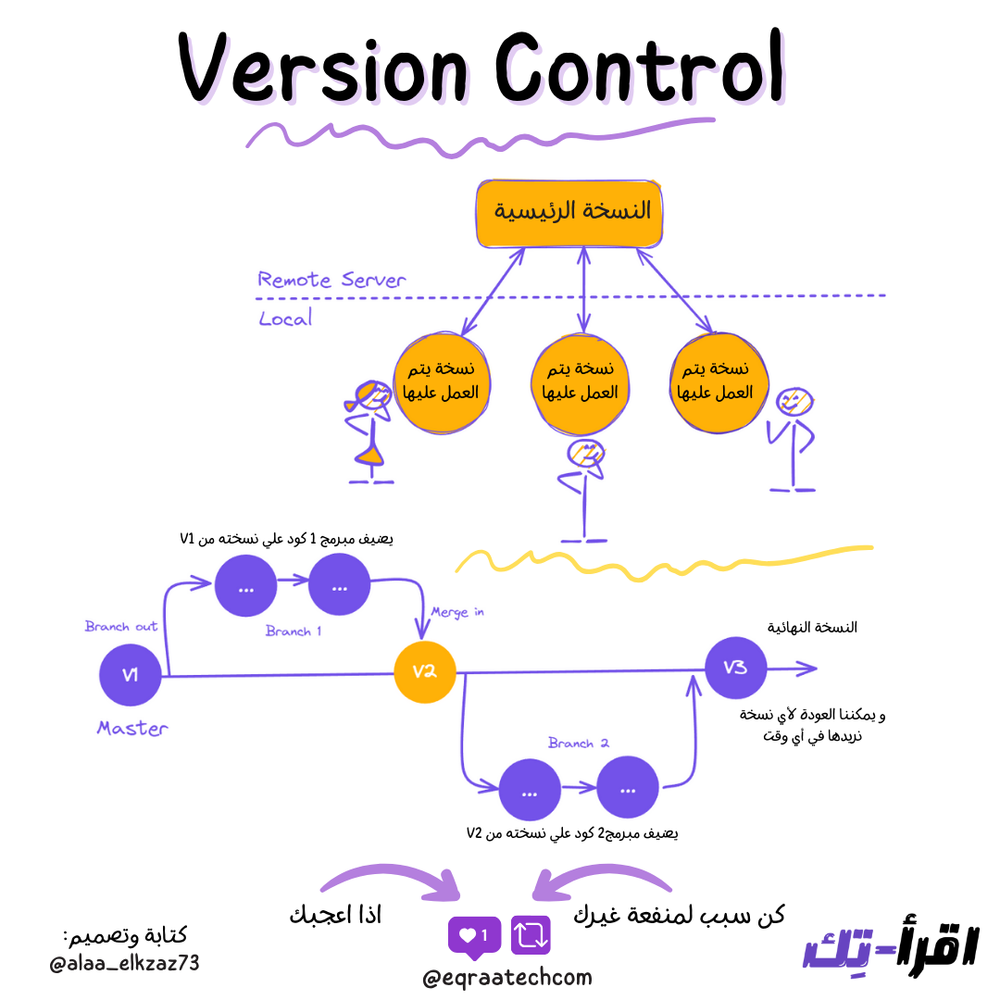
</p>

مش محتاج تبقي مبرمج عشان تشوف url مرة أو اثنين على الأقل في يومك بس لو مبرمج هتشوفه كتير أوي، والنهاردة هنتكلم عن أجزاءه المختلفة اللي مهم نعرفها عشان أكيد هتتعامل مع Endpoint أو Api عن طريق الـ URL هنا ولا هنا 

**ايه هو الـ URL ؟**

الـ URL بنغلط كتير و بنقول عليه عنوان الموقع لكن في الحقيقة هو الطريقة اللي المتصفح بتاعك بيطلب بها الوصول لموقع ما، واللي أكيد هتضمن اني اجيب عنوانه ولكن ممكن يكون في أجزاء أخرى: 

**أجزاء الـ URL**

1. الجزء الأول

بيمثل الـScheme أو البروتوكول اللي السيرفر اللي شايل الموقع هيكلم بيه المتصفح بتاعك والأشهر هما HTTP و HTTPS ولكن في أنواع تانية كثير.

 2. الجزء الثاني
وهو عنوان الموقع نفسه ودا اسم النطاق الي الموقع ساكن فيه، و بما ان الكمبيوتر مش بيفهم انجليزي فبنحتاج DNS Server عشان يترجم الاسم دا لـIP Address عبارة عن أرقام يفهمها الكمبيوتر.

 3. الجزء الثالث
وهو الـ Path او عنوان تفصيلي للمحتوى اللي انت عاوزه داخل الموقع، صفحة معينة أو ملف معين داخل صفحة رئيسية أو فرعية.

دول الثلاث أجزاء المهمين اللي أساسي تواجدهم داخل الـ URL وبتشبيه بسيط: الـ URL هو عنوان البيت + عنوان الغرفة أو الشيء اللي عاوز توصله داخل البيت.

**أجزاء إضافية للـ URL**

في أجزاء إضافية بنزودها لو عايزين نطلب طلب معين، أو عايزينه يعمل حاجة اضافية زي:
المتغيرات Query String أو Variables: بتيجي بعد ‘?’ ممكن نبعتها في طلب الصفحة والسيرفر يستخدمها عشان يختار على أساسها بيانات معينة

**استخدام الـ Variables**

ممكن نبعت ID مقال محدد عشان من كل المقالات يجيب لنا المقال دا او نبعت كود الدولة فالـServer يرد علينا بنسخة الموقع المحلية للدولة اللي احنا اخترناها.
الـ Anchors: وبتيجي بعد علامة ‘#’ ودي زي إشارة لفقرة أو موضع داخل الصفحة اللي احنا بنطلبها، زي أننا ممكن نشاور على مقدمة المقال فأول لما الصفحة تحمل عندنا يوجهنا مباشرة لمكان مقدمة المقال.


### What is DNS

<p>
  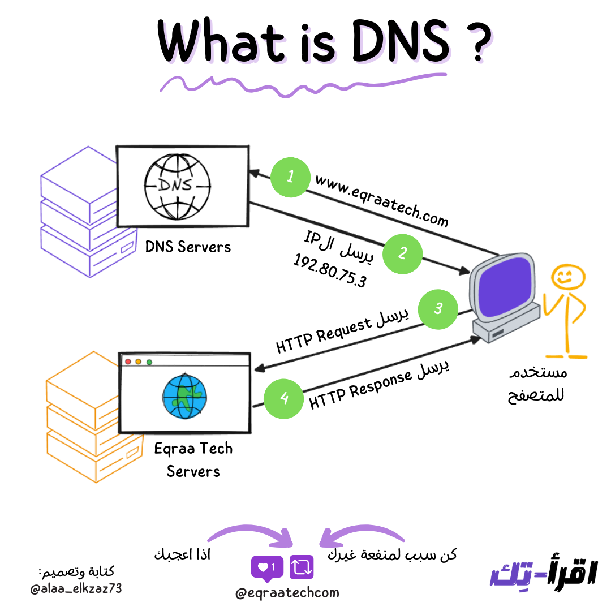
</p>

في كلامنا قبل كده عن الـ URL قلنا إن الـ DNS بيحول عنوان الموقع لـ IP Address يقدر الكمبيوتر يفهمه, لكن ايه هو ال DNS أصلاً؟ 
الكمبيوتر مبيفهمش لغة البشر ومع ذلك لما بتكتبله (eqraatech.com) بيفتحلك الموقع فعلاً، وده بيحصل من خلال مساعدة الـ DNS 

**ايه هو الـ DNS ؟**

الـ DNS هو عبارة عن سيرفر (متقسم شبه دفتر التليفونات) بنخزن فيه اسم الموقع وعنوانه الفعلي ووقت ما بنحب نفتح موقع معين بتحصل الخطوات دي:

 1. بتكتب اسم الـ Website في الـ Browser وتوفيرًا للوقت والجهد بيدور في ال Local Cache الخاصة بيه علي العنوان المقابل للأسم لأنه غالبًا طلبت الصفحة دي قبل كدا
2. لو ملقهاش بيبعت اسم الـ Website للـ DNS Server اللي بيدور في ال Cache بتاعته توفيرًا للوقت والجهد وإذا لقى العنوان المقابل بيبعته للمتصفح
3. لو ملقهوش في الـ Cache بيبتدي يدور عنده في الجدول الكبير على العنوان و بيبعته للـ Browser
4. المتصفح بيستعمل العنوان دا في انه يطلب الـ Website
5. السيرفر المسؤول عن الـ Website بيبعت الصفحات اللي طلبها الموقع وتقدر تتصفحها

الـ 5 خطوات دول بيحصلوا في وقت صغير جدًا فتبان العملية كلها بشكل لحظي (Seamless) كأن الكمبيوتر فهم الـ Request بتاعك لاسم الـ Website مباشرة.


### APIs

<p>
  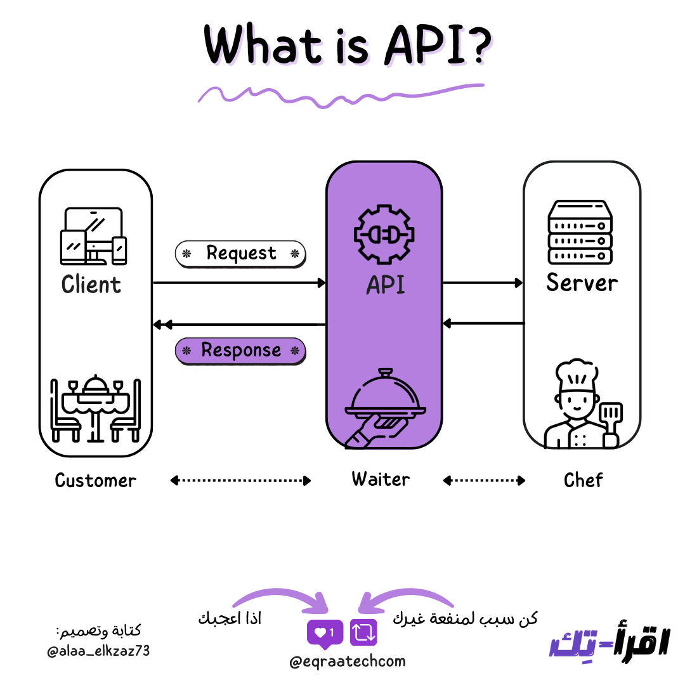
</p>

طبعًا مش هنقول إنها اختصار لـ “واجهة التطبيقات البرمجية” لأنك غالبًا هتنسي الاسم بعد البوست علطول, ولكن هنفهم دورها ايه و بنستخدمها ليه بمثال بسيط ودا عمرك ما هتنساه 
الـ APIs بتلعب دور الجرسون في المطعم, هي ببساطة طريقة محددة لطلب شيء من المطبخ “السيرفر في حالتنا”, الجرسون بياخد طلبك يوصله للشيف اللي هيقوم بتجهيزه وبعد ما يجهز الجرسون يجمعه و يقدمهولك.
 
**طريقة عمل الـ API**

بياخد ال Request من ال Client يوصله لل Server اللي بيجهز الطلب ويقوم ال API بإرجاعه ك Response.
 
**ليه مبيطلبش من الـ Server Direct ؟**

لأكثر من سبب:
1. السيرفر هيكون مشغول بتجهيز طلبك وطلب الزبائن التانين للمطعم فميقدرش يقوم بالمهمتين
2. الـ API هيوصل طلبك بالطريقة المناسبة اللي يفهمها السيرفر, ودي نقطة مهمة لأن الكمبيوترز مبتفهمش غير طريقة واحدة مٌبرمجة عليها أي تغيير في الطريقة دي هيقولك لا والله معرفش دا بيتعمل ازاي وينتج عنه Request Failure فالـ API بيخلي كل الناس تكلم السيرفر بطريقة رسمية ومٌوحدة- وبسيطة- يقدر السيرفر يتعامل معها

التعامل السهل مع ال APIs خلاها من أكثر الطرق الشائعة للدمج بين أكثر من سيستم, فلو عاوز تستفاد بكل مميزات سيستم معين زي ChatGPT مثلاً من غير ما تضطر تبنيه من الصفر, كل اللي عليك تقرأ ال API Documents بتاعته وتقدر توظفه بسهولة في التطبيق أو البرنامج اللي بتبرمجه.
 
بل وقدمت ميزة كمان , إنه لو في شركة بتبني سيستم معين وعاوزه الناس تستخدمه من غير ما يعرفوا هو بيشتغل ازاي سواء حفاظًا على أمن السيستم من أي تغيير أو هجوم أو إن محدش يقلده أو يسرقه, فهتظهر ال API والناس تستفيد منه ومن غير ما المستخدم يعرف سر الوصفة.

**ازاي اقدر استخدمها ؟**

الـ APIs ليها أنواع كتير من حيث تصميم طلبها للموارد أو طريقة التواصل و الأكثر استخدامًا حالياً هو ال REST ولكن الأنواع التانية مهمة كذلك ولها حالات أنسب للاستخدام زي:

1. الـ WebHooks
2. الـ GraphQL
3. الـ gRPC
4. الـ SOAP

كل نوع ليه طريقة عمل معينة نقدر نتكلم عنها في ورقات منفصلة وكلهم مبنيين على أفكار بسيطة جدًا, بعدها بتختار النوع المناسب للمشروع بتاعك وتتعلم استخدامه ,و وجود تشابهات بين كل نوع والتاني زي ال Message Format اللي بتكتبها بتكون JSON or XML في اغلب الانواع بيخلي رحلة التعلم سريعة وممتعة.


### HTTP Status Codes

<p>
  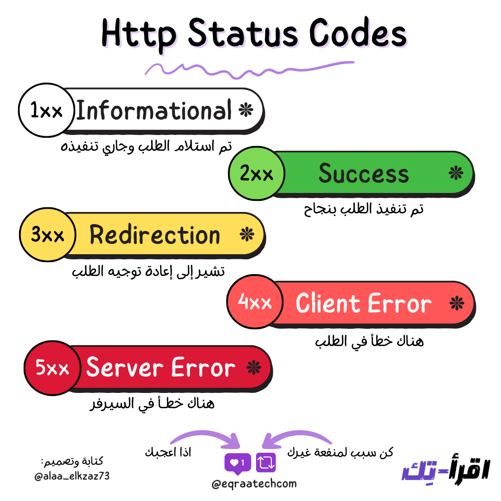
</p>

أثناء تعاملنا أو تطويرنا للـ API Endpoints بنقابل الـ Http Status Code وهو عبارة عن رقم مكون من 3 خانات:
الخانة الأولى بتعبر عن الفئة اللي بينتمي ليها الـ Code 

والاثنين الباقيين بيعبروا عن رقم الـ Code  بحد ذاته, الـ Code دا الـ Server بيبعته كـ Response علي الـ Request اللي اتبعت من الـ Client عشان يوصل معلومة معينة أو يوضح إن في خطأ معين.

**أهمية الـ Status Codes**

- معرفتك بال Status Codes بيساعدك كمبرمج تصمم الـ Endpoints بشكل مضبوط و تتعامل مع كل السيناريوهات المختلفة بأحسن شكل ممكن 
- و بكونها Standard ففي حالة استخدامنا لـ APIs جاهزة بينبهنا للمشكلة وبيعرفنا ازاي نـ Identify الـ Root Cause بتاعها سواء كان من عندنا أو من عند الـ Server ذات نفسه، وبالتالي بتوفر وقت في الـ Troubleshooting

وكمثال لو انت بتبعت GET Request لموقع اقرأ تك عشان تشوف مقال معين والـ Server رد عليك بنجاح فهيبعتلك الكود 200 Status Code: OK, طيب في حالة كتبت اسم المقال غلط  فهيرجعلك الـ Code 404  المشهور واللي معناه Not found لأن مفيش مقال موجود بالاسم دا.


**الـ HTTP Status Codes Categories**

الـ Status Codes دي مٌقسمة لخمس فئات أساسية بيعتمد عليها كل مبرمج في التصميم أو التعامل مع الـ APIs وهي:

**1xx:** ودي غرضها نقل معلومة فقط من الـ Server للـ Client 

**2xx:** ودي بتعبر عن تنفيذ الطلب بنجاحولكن بطرق مختلفة على حسب كل Code

**3xx:** ودي بتشير ان هيتم توجيه الطلب لعنوان تاني سواء كانت اعادة التوجيه دي دائمة زي ان يكون اسم الموقع اتغير مثلا فيبعتلك 

الـ Code 301 أو 308, أو اعادة توجيه مؤقتة و بعد فترة هترجع الـ Endpoint دي تشتغل تاني بنفس العنوان فيبعتلك السيرفر الـ Code رقم 307 

**4xx:** والفئة دي هي الأشهر لأنها بتعبر عن خطأ حصل في الطلب نفسه, الخطأ ممكن يكون على سبيل المثال خطأ في الكتابة أومبعتناش Auth Tokens وإلخ 

وينصح بمراجعة الاكواد في الفئة دي كونها مختلفة عن بعض

**5xx:** والفئة دي بيبعتها الـ Server عشان يوضح لك ان المشكلة من عنده 

**بنشوف الـ Status Codes فين ؟**

<ins>
تقدر تشوف الـ Status Codes في أكثر من مكان:
</ins>

- خانة الـ Network اللي بتظهر في الـ Browser وأنت بتعمل Inspect
- في أي أداة للتعامل مع الـ APIs زي Postman 
- أثناء استخدامك الـ Debugger المرفق بالـ IDE


### RESTful APIs Vs GraphQL

<p>
  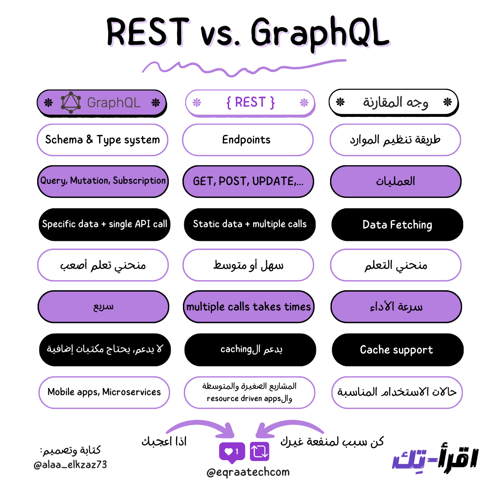
</p>

غالبًا لو عملت APIs قبل كده هتكون استعملت REST وهيبقي عندك زميلك اللي عمال يقولك ما تيجي نشتغل بـ GraphQL زي الناس اللي هناك دي..
فتعالى نعرف الفرق بين اثنين من أشهر أنواع الـ API Architectures 
الأول لازم نعرف أن الاتنين ليهم نفس أساس العمل وهو ان عندي Server ببعتله HTTP Request فيجاوب عليا بالمعلومات اللي طلبتها.
 
**الـ REST APIs**

الـ REST بينظم ال API علي شكل Endpoints وبيقولك تقدر تناديها ب عمليات محددة أشهرهم الـ GET, POST, PUT, DELETE وهيرد عليك بـ Standard Response
 
**الـ GraphQL**

بينما الـ GraphQL بيقولك هي Endpoint واحدة تقدر تكلمها وتوصف انت عاوز ايه بالظبط من خلال استعمال Query وهيرد عليك بـ Standard Response
طب ما والله نفس الشيء ايش استفدت؟ 
الـ GraphQL بيحل مشاكل ظهرت مع استخدامنا للـ REST في كل الأنظمة لسهولته والطبيعي انه مش حل واحد يناسب الكل
 
**المشاكل اللي بيحلها الـ GraphQL**

1. مشكلة الـ Over-Fetching and Under-Fetching

الـ REST بينظم الـ Resources بطريقة ثابتة تناسب العمليات اللى قولنا عليهم فلو انت علي موقع اقرأ تك وطلبت منه قائمة بأسماء الكتاب في المنصة علي الـ Endpoint: eqraatech/authors فهيرد عليك بكل المعلومات عنهم مع انك محتاج أساميهم بس ودا اسمه Over Fetching, مشكلته بقي انه بيستهلك الـ Network Bandwidth في نقل معلومات انت مش محتاجها أصلاً وبيبطأ ال Endpoint علي ما تجيب لك كل المعلومات دي
 
2. نسبح في بحر الـ Endpoints
 
كل Resource انت بتطلبه بـ REST ليه Endpoint أو عنوان مختلف, ففي المواقع المعقدة بينتهي بيك الأمر لآلاف من ال Endpoints
 
3. الـ Multiple Round-Trips
 
ودي المشكلة اللي خلت Facebook تقدم الـ GraphQL كحل لمشكلة الـ Mobile Application بتاعهم لما لقوا ان Screen واحدة بتتحاج أكتر من Call لـ Endpoints مختلفة ومع ذلك بتستخدم جزء بسيط جدًا منها, فتخيل انت عشان تشوف بوست باسم واحد صاحبك الابليكيشن كان محتاج يروح يجيب معلوماته كلها عشان يعرض لك الاسم وصورته الشخصية!
 
وعشان نحل المشاكل دي قدمنا حل مميز وهو الـ GraphQL واللي بيقسم ال API على شكل Schema كبيرة عاملة شبه الـ Graph وبيقولك اكتبلي Query باللي انت محتاجه بس وانا اجيبهولك, بكدا حلينا مشكلة الـ Over-Fetching وكمان بغض النظر انت محتاج ايه فأنت بتكلم Endpoint واحدة وهو بيقدر يوصل للمعلومة من خلال العلاقات بين الـ Resources في الـ Graph .
 
**طب هل مانقدرش نحقق ده من خلال الـ REST ؟**

في الواقع هو ممكن ولكنه هيتطلب الكثير من التعقيدات اللي ممكن نكون في غنى عنها والمهارة اللازمة لتحقيق ده !
 
طبعًا الناس مش هتبطل تستخدم الـ REST كون تعلمه أسهل من GraphQL وكذلك مناسب لحالات كتير وبالأخص المشاريع الصغيرة والمتوسطة, ولكن ال GraphQL كذلك من أنسب الحلول للـ Mobile Applications Backend وبالتأكيد أسرع.
 
بعد ما فهمنا الفرق الجوهري بينهم هنسيبكم في الصورة مع مقارنة تقنية سريعة ما بينهم.


## Version Control

التحكم في النسخ (Version Control) هو نظام يُستخدم لتتبع التغييرات التي تحدث على ملفات المشروع على مر الوقت. يهدف هذا النظام إلى توفير وسيلة فعالة لإدارة التعديلات وتطوير البرمجيات والمشاريع الضخمة. يتم تحقيق ذلك من خلال تسجيل وتوثيق كل تغيير يطرأ على الملفات، مما يسمح بتتبع تاريخ التعديلات والرجوع إلى أي نسخة سابقة في أي وقت.

تعتمد أنظمة التحكم في النسخ على مفهوم الـ "repository" أو المستودع، وهو مكان يحتفظ بجميع الملفات والتعديلات التي تم إجراؤها على هذه الملفات. يتمكن الفريق من الوصول إلى هذا المستودع والتفاعل معه، مما يسهل التعاون بين أعضاء الفريق ويقلل من احتمال حدوث تعارضات في التعديلات.

تأتي أهمية التحكم في النسخ من القدرة على تحديد الفروق بين إصدارات مختلفة من المشروع، وتتبع من قام بإدخال التعديلات، واسترجاع النسخ السابقة بسهولة في حالة حدوث أخطاء أو مشاكل. يساعد هذا النهج في تعزيز استقرار المشروع وتسهيل عملية التطوير.

أمثلة على أنظمة التحكم في النسخ تشمل Git وMercurial وSubversion، وقد أصبحت هذه الأدوات أساسية في عمليات تطوير البرمجيات وإدارة المشاريع الضخمة.


### Introduction Into Version Control

<p>
  
</p>

كمبرمج واعد بدأت تشتغل على مشروع بسيط وجربت تشغله واشتغل، دلوقتي أنت عايز تكبر المشروع وتخلي مبرمجين تانين يشاركوا فيه، هيقابلك هنا مشكلتين: 

1. هتتشاركوا الكود مع بعض إزاي؟ ولما حد يعدل هنشوف تعديلاته إزاي؟

2. لو حصل تعديلات كبيرة، وطلع فيها مشكلة.. إزاي هترجع لما قبل التعديلات دي؟

**بداية الـ Version Control**

وعشان نحل المشكلتين دول المبرمجين اخترعوا فكرة “إدارة النُسخ” واللي بيها بتحتفظ بنسخة من البرنامج وتضيف الكود الجديد عليها وتشوف بيشتغل ولا لأ:

اشتغل؟ خير وبركة وكدا ندمجه مع النسخة الأساسية للكود، مشتغلش؟ متقلقش، النسخة القديمة موجودة وتقدر ترجع لها.

أشهر نظام لإدارة النُسخ هو Git وأكيد سمعت عنه ولكن في أنظمة تانية كتير..

طيب تعمل إيه لو حبيت تكبّر الفريق وتخلي مبرمجين تانين يشاركوا في كتابة كود البرنامج؟ 

**الـ Version Control in Cloud**

هتضيف نسخة البرنامج بتاعك على خدمة استضافة للمشاريع علي ال Cloud واللي من أشهرها GitHub، وأي حد حابب يشارك في كتابة الكود، هياخد نسخة من المشروع ويعدل عليها على جهازه الشخصي وبعدين يرفع التغييرات على GitHub عشان يشاركها معاكم وبعد مراجعتها تقدروا تضيفوها لنسخة المشروع الرئيسية.

**مميزات الـ Version Control**

1. بتحتفظ بكل التعديلات كاملة ومين صاحب التعديل ده.

2. بتسمحلنا نرجع لإصدارات قديمة من المشروع لو كان في مشكلة في الإصدار الحالي.

3. بتسهل التعاون بين المبرمجين بأدوات كتيرة زي خاصية المراجعة والتعليق على الأكواد.

**ازاي نستخدم الـ Version Control**

1. بنفهم إزاي النظام ده بيحتفظ بالنسخ المختلفة.

2. بنستخدم أوامر بسيطة للتحكم في العملية دي.

نظم إدارة النسخ “جوكر” في حياتك كمبرمج ولا غنى عنها فبنشجعكم على فهمها بشكل عميق.

### Git Comit Message Cheatsheet

<p>
  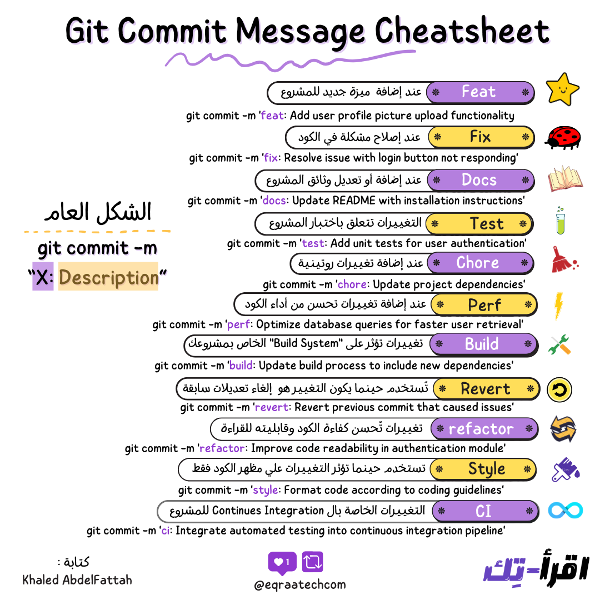
</p>

بعد كل تغيير بتحب تسجله علي ال Version Control اللي عليه المشروع الخاص بيك بتحتاج تكتب رسالة , الرسالة دي بتوضح ايه التغيير اللي أنت عملته في الكود  اللي أنت حاليا بترفعه علي Version Controlو كتير مننا بيتجاهل إنه يكتب الرسالة بشكل واضح يسهل عليه وعلي اللي بعده إنه يفهم من عنوان الرساله إيه اللي اتغير في الكود.

خلينا نقولك بسرعة على كلمات تقدر تبتدي بيها رسالتك، علشان تسهل عليك وتفهم اللي بعدك إيه اللي اتغير:

**الـ Git Commit Messages**

1. الـ Feat:

بمعني”ميزة”، هي اختصار لكلمة “Feature”. من اسمها، استخدمها إذا كنت قد قمت بإضافة ميزة جديدة للمشروع.

```bash
git commit -m 'feat: Add user profile picture upload functionality'
```

2. الـ Fix
بمعني”إصلاح”. ابدأ رسالتك بها إذا كانت التغييرات التي قمت بها تحل مشكلة في الكود.

```bash
git commit -m 'fix: Resolve issue with login button not responding'
```

3. الـ Chore
ومعناها عمل روتيني , و دي  ابدأ بيها إذا كانت التغييرات غير أساسية، مثل التحديثات الروتينية.

```bash
git commit -m 'chore: Update project dependencies'
```

4. الـ Refactor
استخدمها إذا كنت قد قمت بتحسين الكود بدون إضافة ميزة جديدة أو حل مشكلة.

```bash
git commit -m 'refactor: Improve code readability in authentication module'
```

5. الـ Docs
استخدمها إذا قمت بتحديث وثائق المشروع، مثل تعديل ملف readme.

```bash
git commit -m 'docs: Update README with installation instructions'
```

6. الـ Style
إذا كانت التغييرات تؤثر على مظهر الكود، مثل تنسيقه (Formatting)

```bash
git commit -m 'style: Format code according to coding guidelines'
```

7. الـ Test
إذا كانت التغييرات تتعلق باختبار وتجربة المشروع سواءً باضافة أو تعديل اي Test لمشروعك

```bash
git commit -m 'test: Add unit tests for user authentication'
```

8. الـ Perf
اختصار لكلمة “performance”  استخدمها إذا كانت التغييرات بتحسن من أداء الكود.

```bash
git commit -m 'perf: Optimize database queries for faster user retrieval'
```

9. الـ Build
التغييرات تؤثر على “Build System” الخاص بمشروعك.

```bash
git commit -m 'build: Update build process to include new dependencies'
```

10. الـ Revert
استخدمها لو تغييرك هو مجرد رجوع إلى نسخة سابقة من الكود.

```bash
git commit -m 'revert: Revert previous commit that caused issues'
```

11. الـ CI
إذا كانت التغييرات تتعلق “Continues Integration” الخاص بمشروعك.

```bash
git commit -m 'ci: Integrate automated testing into continuous integration pipeline'
```

كتابة Commit Messages هي واحده من المهارات الحيويه لأي مطور برمجيات , هي أكثر من مجرد تعليق , وإنما هي سجل للتغييرات في مشروعك اللي بتخليك تقدر تتابع تقدم المشروع  وتسهل عليك وعلي باقي الفريق مراجعة الكود ومراجعة التعديلات 


### 5 Takeaways for README File

<p>
  
</p>

واحدة من اهم الحاجات اللي المبرمج المفروض يعملها وقت لما يجي يرفع مشروع كان شغال عليه على GitHub كـ Version Control.. هو الـ README File الخاص بالمشروع. 
الجزء ده مهم جدًا لإنه بيعرف أي حد داخل على المشروع دا هو بيعمل إيه، فهو بيقع موقع الغلاف من الكتاب.

<ins>
وبالتالي عشان تكتب الـ README بطريقة كويسة لازم تخلي بالك وتهتم بالنقط دي:
</ins>

**العنوان Title**

وده بيكون اسم المشروع اللي انت شغال عليه.


**المقدمة Introduction**

وفيه بتكتب نبذة عن المشروع توضح فيها المشروع بيعمل إيه في حدود من سطرين لـ ٣ اسطر.

**الـ Technologies**

وهنا بتكتب ايه هي الـ Technologies اللي أنت استخدمتها في المشروع، مثلا NodeJs, Sequlizer، بالإضافة لرقم الاصدار بتاع الـ Technology اللي أنت استخدمته.

**المميزات Features**

فيه بتكتب كل الخدمات والمميزات اللي المشروع بيقدمها، سواء حاليًا أو في الإصدارات المستقبلية.

**الـ Setup**

وهنا إنت بتشرح خطوات تشغيل المشروع بدايه من المكتبات التابعة للمشروع، إللي محتاج تنزلها وال commands إللي محتاج تشغلها، وكمان ال db scripts اللي محتاج تشغلها عشان المشروع كله يشتغل.

**ده هيفيد بإيه ؟**

بتبين انك أولاً إنك شخص محترف ومبرمج منظم جدًا ومستقبلًا لو رجعت للمشروع هتبقي فاهم هو بيعمل إيه، ومستخدم إيه بالظبط وأي version مستخدم كمان ده بيكون واجهة كويسه جدًا ليك لما بتعرض شغلك علي ال github بالنسبه للشركات.

## Agile

الـ Agile هو نهج تطوير يستخدم في مجال إدارة المشاريع وتطوير البرمجيات. يتميز Agile بالمرونة والتكامل المستمر مع تحفيز التفاعل الدائم بين الفرق العاملة. يتم تطبيق Agile لتحسين جودة المنتجات وزيادة قدرة الفرق على التكيف مع التغييرات بشكل فعال.

تمثل Agile ثورة في مفهوم تطوير البرمجيات حيث يتم التركيز على التفاعل بين الفرق والعملاء بدلاً من اتباع خطط ثابتة. يتم تحقيق هذا من خلال تقسيم المشروع إلى فترات زمنية قصيرة تسمى "Sprints"، حيث يتم تقييم النتائج وتحسينها بناءً على الـ Feedbacks.

المفهوم الأساسي للـ Agile هو تعزيز التفاعل السريع والتكيف المستمر، مما يساعد الفرق على تلبية احتياجات العملاء بشكل أفضل وتحسين جودة المنتجات. يعتبر Agile أسلوبًا مبتكرًا يساعد في تحسين كفاءة فرق العمل وضمان تقديم منتجات عالية الجودة بشكل أكثر فعالية وفاعلية.


### Agile Method

<p>
  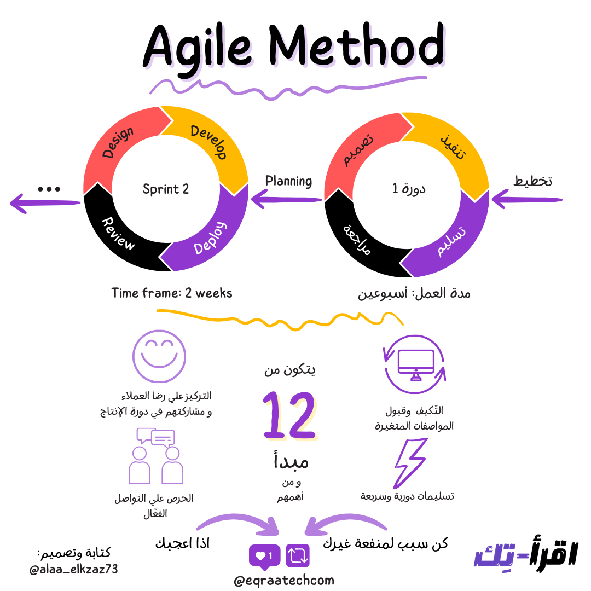
</p>

كلنا سمعنا عن الـ Agile وممكن نكون درسناه في الكلية أو حتى شوفنا ميمز عنه، بس ليه مهم و ليه بنستخدمه؟
الـAgile Approach هي طريقة في الشغل على المشاريع بتتبع مبادئ معينة، معني الكلمة الحرفي هو “التحرك بسرعة ومرونة” ودا فعلًا الهدف الرئيسي منه! 

**ايه هي طرق تنفيذ المشاريع؟**

لما بيطلب منك أي مشروع، في طريقتين لتنفيذه:

1. الطريقة الأولى

 تاخد المواصفات اللي العميل محتاجها وتصمم وتنفذ وبعدين تسلم.

**المشكلة فين؟**

الطريقة دي مشكلتها إن العميل بيكون متخيل حاجة وبنسبة كبيرة مش بيلاقيها وقت التسليم.

**ايه هو سبب المشكلة؟**

يمكن لأنه مشرحش الفكرة ليك كويس أو إن تخيله عن مشروعه تطور مع الوقت وأنت طبعًا كنت صممت وبتنفذ أو حتى خلصت ومش هتعيد من الأول.. فالنتيجة هو مشروع مش متناسب مع المطلوب، ودي بالمناسبة اسمها Waterfall Model لأنها بتمشي في إتجاه واحد زي الشلال.

2. الطريقة الثانية

 طريقة الـAgile بتحل المشكلة الكبيرة دي بإنها بتجزئ المشروع وتسليمه على أكثر من مرة، وتاخد رأي العميل على كل جزء ولو حابب يغير حاجة، بل لكل جزء بنشتغل عليه بنعمل دورة إنتاج كاملة:

بناخد المواصفات من العميل >> نصمم المطلوب .. ننفذ .. نسلم الجزء ده ونعمله Deploy


**مميزات الـ Agile**

1. المرونة لسهولة التكيف مع التعديلات في المواصفات المطلوب إنها تتنفذ

2. رضا العملاء والشفافية وسرعة التسليم لإنهم بيشاركوا في كل جزء ويشوفوا تسليمات دورية لطلباتهم

3. جودة التواصل لأن مبادئ الطريقة بتشجع على التواصل المستمر في اجتماعات مختلفة زي الـStandups و الـKnowledge share و الـRetrospectives

<ins>
ولكن برضوا لها تحدياتها اللي محتاج تاخد بالك منها وأنت بتنفذها زي:
</ins>

1. المرونة مع التغييرات المستمرة في المواصفات ميزة، ولكنها برضو تعتبر تحدي؛ لأن بسهولة النظام ممكن يكون غير متناسق وتظهر فيه مشاكل وتستهلك وقت أكبر للتعامل معها

2. مُنحني التعلم للطريقة دي أصعب شوية لأنه بيحتاج اجتماعات وأدوار معينة الفريق ممكن ياخد وقت على ما يتعلمها ويستفاد منها

3. الطريقة دي الأولوية فيها التواصل الفعلي بين الفريق عن التوثيق، وده ممكن يعمل نقص في توثيق عملية الإنتاج وبالتالي بيكون عندنا برنامج بعملية توثيق جودتها ضعيفة.

الـAgile فكرة مُتبناه من أغلبية فرق صناعة البرمجيات وليها طرق تنفيذ مختلفة زي Scrum و Kanban، بس هي مش “حل سحري” يمشي مع كل المشاريع. في حالات زي المشاريع متناهية الصغر، تَبني الطريقة دي فيها ممكن يكون تضييع للوقت والجهد.


### Estimated Time for Task

<p>
  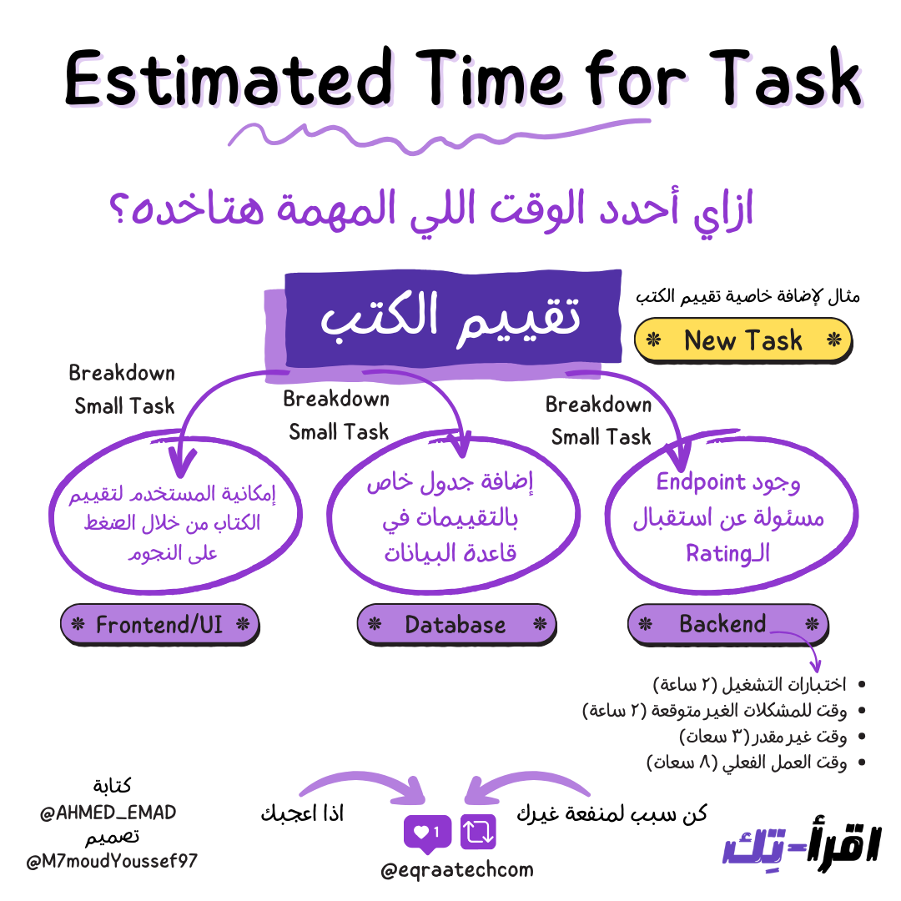
</p>

واحدة من المهارات الأساسية المهمة هي تقدير الوقت اللي مهمة ممكن تاخده، أغلبنا وإحنا بنشتغل فى تطوير البرمجيات بنوقع فى مشكلة تقدير الوقت دا، وهي عاملة كأنك بتدور في حلقة مفرغة، مش بتنتهي تمامًا، لكن من الممارسة الفعلية والتطبيق والخبرة بتاعتك تقدر إنك تتغلب عليها. 

**ايه اللي مفروض تعمله لما تاخد Task جديدة**

1. تحليل الـ Task وتعرف المتطلبات بتاعتها.

2. كم function محتاجة اعملها؟

3. ايه التعديلات اللى ممكن اعملها فى الداتا بيز؟

4. ايه هى الحاجات اللى هتتاثر بالمهمة دى؟

5. اخيرًا هتعمل إختبار لقياس كفاءة المهمة ازاى؟

**الـ Work Breakdown Structure**

 من أهم النصائح اللي بتقدم حاجة اسمها WBS اللي هو Work Breakdown Structure، الملف ده هتحلل فيه المهمة، وتقسم المهمة الكبيرة دي إلى مجموعة مهام صغيرة جدًا، وبجانب كل مهمة تكتب التصنيف بتاعها إذا كان جزء خاص بالداتا بيز أو خاص بواجهة التطبيق أو اختبار لكفاءة المهمة نفسها. 

1. جنب كل مهمة بتكتب الوقت المتوقع انك تخلصها فيه. برضوا حساب وقت الإختبار مهم جدًا، لان مهم جدًا تخلى بالك أن وقت إختبارات التشغيل لا يقل عن نسبة ما بين 20% إلى 30% من الوقت الكلي للمهمة.

2. برضوا متنساش تحسب وقت للمخاطر اللي ممكن تحصل، ممكن تكون حسبت وقت أحد المهام الفرعية غلط وليكن 3 ساعات وهو أخذ منك 5 ساعات. طب تحسبه ازاى؟ ده يتراوح بين 5% إلى 15% على المهمة كلها.

3. كمان لازم ناخد بالنا من حاجة مهمة جدًا وهى الحاجات اللي ممكن تسبب التسويف -زي الاجتماعات-، ده وقت ضايع كده زى ماتشات الكورة مش بتبقى فى الحسبان تمامًا ومتقدرش تعرفه ولا تتوقعه طب تحسبه ازاى؟ ده يتراوح بين 5% الى 10% على المهمة كلها. 


## License

<p xmlns:cc="http://creativecommons.org/ns#" >This work is licensed under <a href="http://creativecommons.org/licenses/by-nc-nd/4.0/?ref=chooser-v1" target="_blank" rel="license noopener noreferrer" style="display:inline-block;">CC BY-NC-ND 4.0</a></p>

</div>
