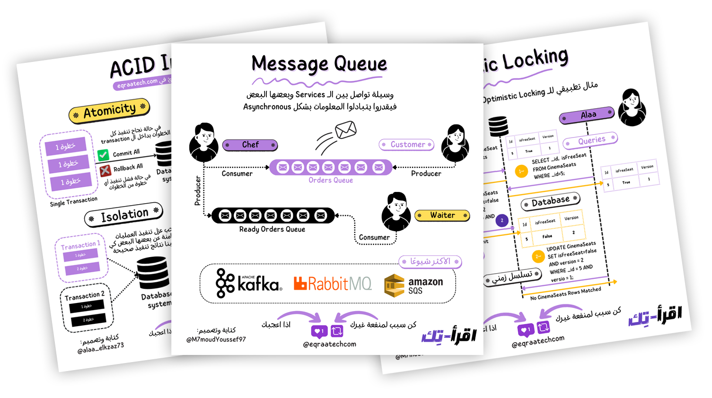
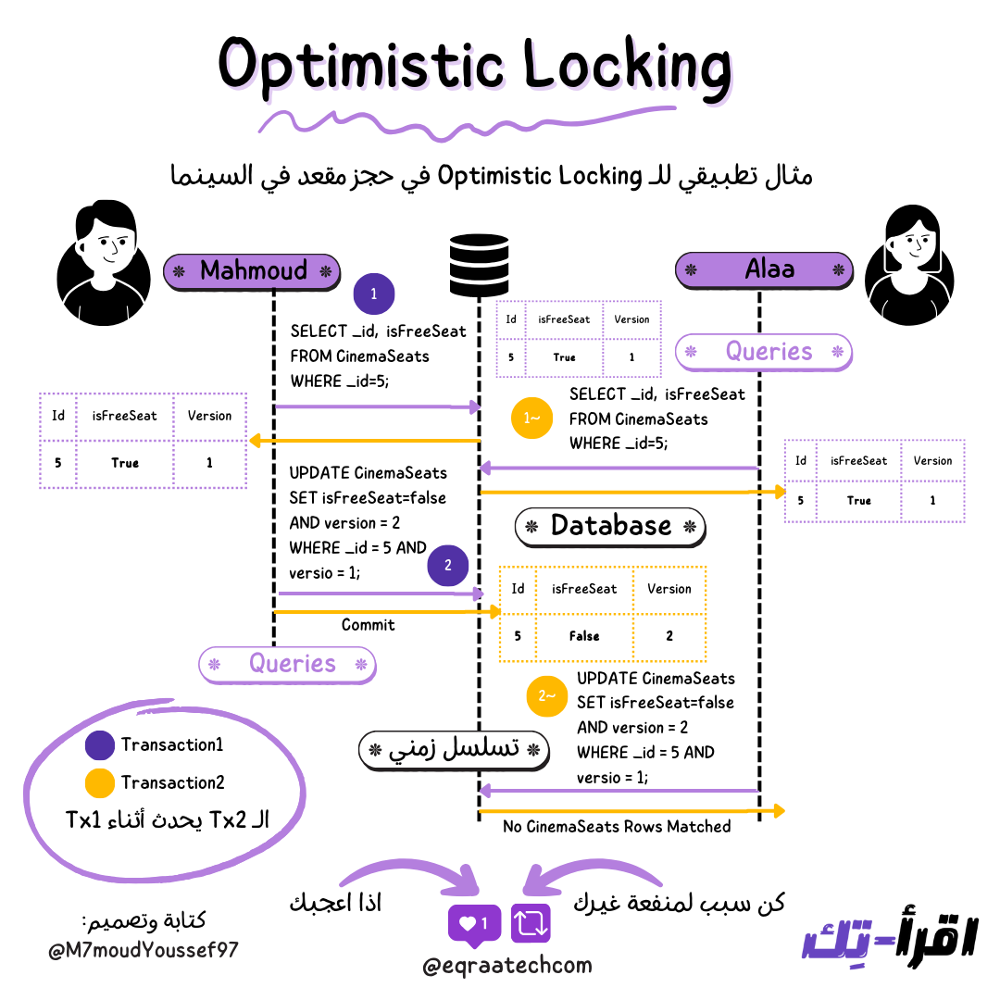
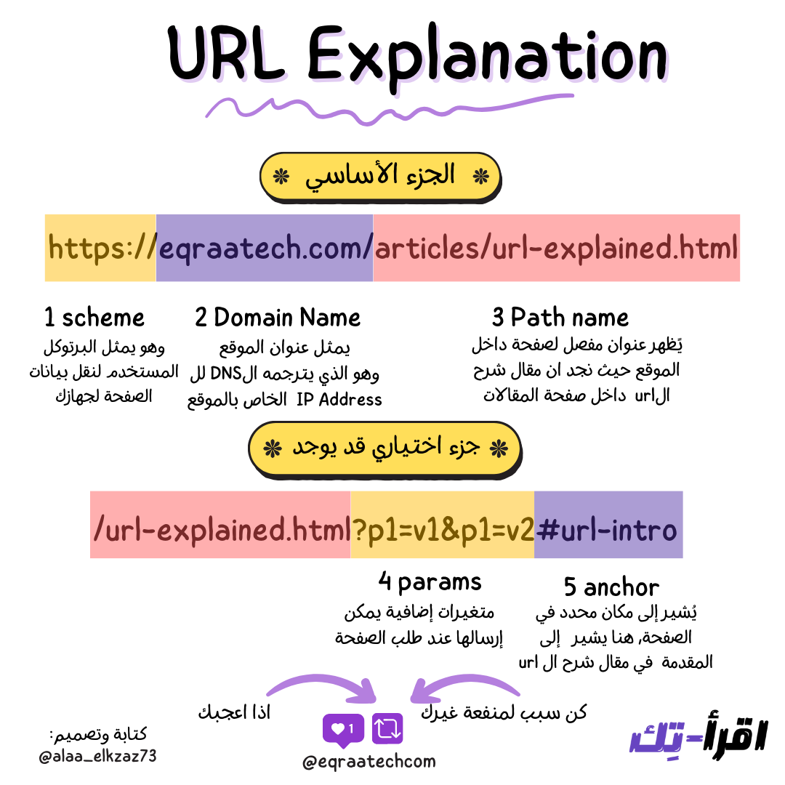
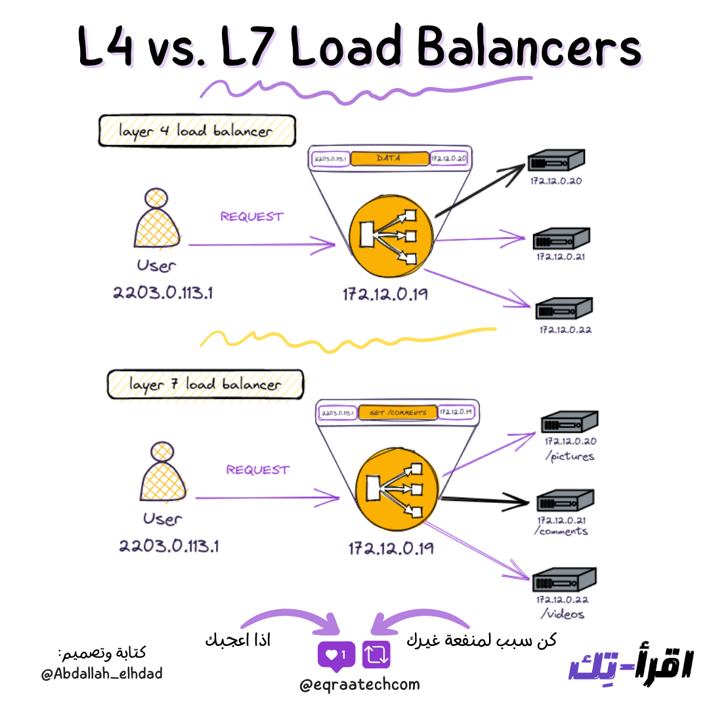
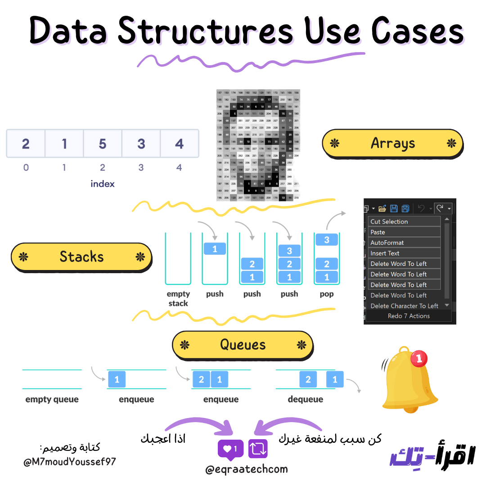
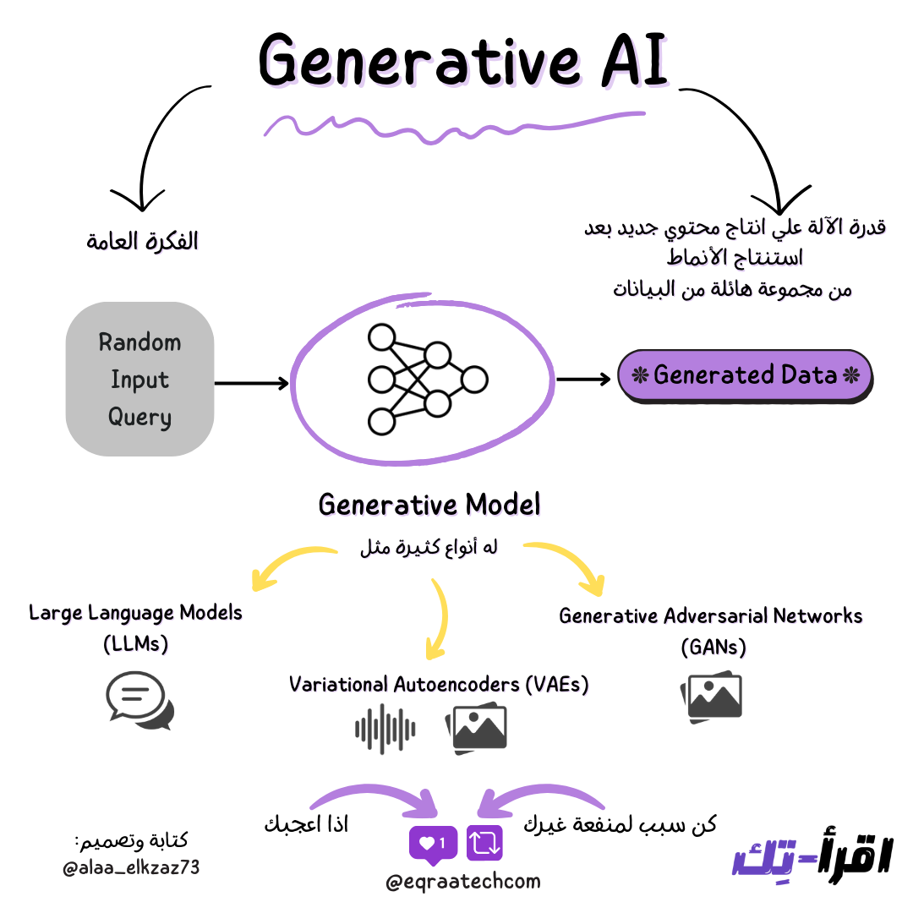
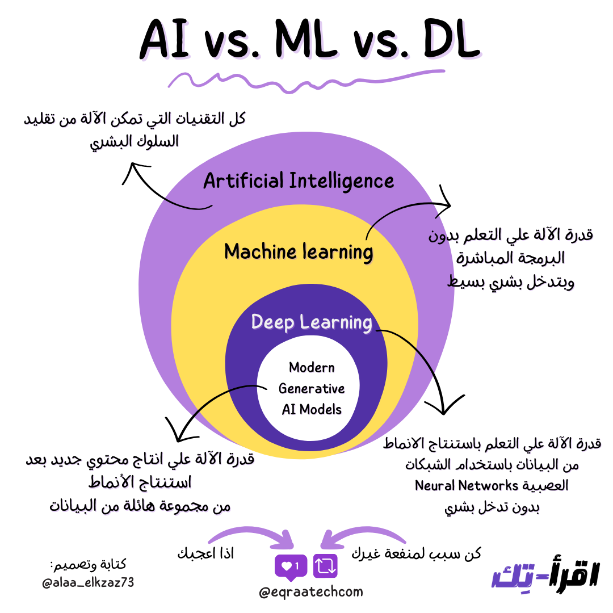

  

  
  
  
  

  
  
  

  
# ورقة وقلم 🚀
محتوى تقني متميز في مختلف مجالات هندسة البرمجيات عن طريق تبسيط المفاهيم البرمجية المعقدة بشكل سلس وباستخدام صور توضيحية مذهلة

  

# فهرس المواضيع 🌠
- [AI Machine Learning](#ai-machine-learning)
  - [AI vs. Machine Learning vs. Deep Learning](#ai-vs-machine-learning-vs-deep-learning)
  - [Generative AI](#generative-ai)
  - [Model Context Protocol](#model-context-protocol)
  - [Overfitting vs. Underfitting in ML](#overfitting-vs-underfitting-in-ml)
  - [Top 5 Prompting Techniques](#top-5-prompting-techniques)
- [Caching Performance](#caching-performance)
  - [Redis Beyond In-Memory Database](#redis-beyond-in-memory-database)
  - [Redis Persistence Strategies](#redis-persistence-strategies)
  - [Top 6 Caching Strategies](#top-6-caching-strategies)
- [Computer Science Fundamentals](#computer-science-fundamentals)
  - [Data Structures Use Cases](#data-structures-use-cases)
  - [Java Collections Cheatsheet](#java-collections-cheatsheet)
  - [Java Exceptions Cheatsheet](#java-exceptions-cheatsheet)
- [Databases Storage](#databases-storage)
  - [ACID Properties in DBMS](#acid-properties-in-dbms)
  - [Database Cheatsheet for System Design](#database-cheatsheet-for-system-design)
  - [Database Connection Pool](#database-connection-pool)
  - [Database Indexing](#database-indexing)
  - [Database Normalization](#database-normalization)
  - [Database Replication](#database-replication)
  - [How to Store Passwords In Database](#how-to-store-passwords-in-database)
  - [Materialized View](#materialized-view)
  - [N+1 Problem](#n1-problem)
  - [Optimistic Locking](#optimistic-locking)
  - [Pessimistic Locking](#pessimistic-locking)
- [Devops CI/CD](#devops-ci-cd)
  - [Continuous Integration](#continuous-integration)
  - [Docker Cheatsheet](#docker-cheatsheet)
  - [Git Aliases](#git-aliases)
  - [Git Commit Message Cheatsheet](#git-commit-message-cheatsheet)
  - [Infrastructure As a Code](#infrastructure-as-a-code)
  - [Linux Commands Cheatsheet](#linux-commands-cheatsheet)
  - [Top 16 Kubernetes Essential Components](#top-16-kubernetes-essential-components)
  - [Top 6 Deployment Strategies](#top-6-deployment-strategies)
  - [Version Control](#version-control)
- [How It Works](#how-it-works)
  - [Date and Time Best Practices](#date-and-time-best-practices)
  - [How QR Codes Work](#how-qr-codes-work)
- [Network Security](#network-security)
  - [API Authentication Methods](#api-authentication-methods)
  - [Domain Name System (DNS)](#domain-name-system-dns)
  - [Json Web Token](#json-web-token)
  - [OAuth2](#oauth2)
  - [OpenID Connect](#openid-connect)
  - [Proxy vs. Reverse Proxy](#proxy-vs-reverse-proxy)
  - [SQL Injection](#sql-injection)
  - [URL Explanation](#url-explanation)
- [Operating Systems](#operating-systems)
  - [Concurrency vs Parallelism](#concurrency-vs-parallelism)
  - [Deadlock vs. Starvation](#deadlock-vs-starvation)
  - [Process Management](#process-management)
  - [Process Scheduling](#process-scheduling)
  - [Program vs Process vs Thread](#program-vs-process-vs-thread)
- [Payment Fintech](#payment-fintech)
  - [How to Avoid Double Payments](#how-to-avoid-double-payments)
- [Software Architecture](#software-architecture)
  - [CQRS Architecture Pattern](#cqrs-architecture-pattern)
  - [Layered Architecture](#layered-architecture)
- [Software Development](#software-development)
  - [Agile Approach](#agile-approach)
  - [Code Comments](#code-comments)
  - [Estimated Time For Task](#estimated-time-for-task)
  - [How to Write Better Logs](#how-to-write-better-logs)
  - [Object Relational Mappers](#object-relational-mappers)
  - [Software Testing](#software-testing)
  - [Top 5 Takeaways for README.MD](#top-5-takeaways-for-readmemd)
- [System Design Distributed Systems](#system-design-distributed-systems)
  - [API Gateway](#api-gateway)
  - [CAP Theorem](#cap-theorem)
  - [CQRS Architecture Pattern](#cqrs-architecture-pattern)
  - [Cloud Computing Models](#cloud-computing-models)
  - [Database Cheatsheet for System Design](#database-cheatsheet-for-system-design)
  - [Database Replication](#database-replication)
  - [Distributed Tracing](#distributed-tracing)
  - [GitHub Code Push Processing](#github-code-push-processing)
  - [Horizontal vs. Vertical Scaling](#horizontal-vs-vertical-scaling)
  - [Load Balancer](#load-balancer)
  - [Load Balancer Algorithms](#load-balancer-algorithms)
  - [Message Queue](#message-queue)
  - [Observability Pillars](#observability-pillars)
  - [Protocol Buffer (ProtoBuf)](#protocol-buffer-protobuf)
  - [Proxy vs. Reverse Proxy](#proxy-vs-reverse-proxy)
  - [Rate Limiting](#rate-limiting)
  - [Serverless Architecture](#serverless-architecture)
  - [Strategies for Read Heavy Systems](#strategies-for-read-heavy-systems)
  - [Top 24 System Design Terminologies](#top-24-system-design-terminologies)
  - [Uber's Docstore Architecture](#ubers-docstore-architecture)
  - [gRPC](#grpc)
- [Technical Behavioral Interviews](#technical-behavioral-interviews)
  - [Star Method for Behavioral Interviews](#star-method-for-behavioral-interviews)
  - [Tackling Technical Interview](#tackling-technical-interview)
- [Technologies Frameworks](#technologies-frameworks)
  - [API Testing with Hoppscotch](#api-testing-with-hoppscotch)
  - [Big Data with Apache Spark](#big-data-with-apache-spark)
  - [CI/CD with Jenkins](#ci-cd-with-jenkins)
  - [CSS With Tailwind](#css-with-tailwind)
  - [Code Editing with Cursor](#code-editing-with-cursor)
  - [Code Quality with Sonarqube](#code-quality-with-sonarqube)
  - [Insights With Grafana](#insights-with-grafana)
  - [LLMs With LM Studio](#llms-with-lm-studio)
  - [LLMs With Ollama](#llms-with-ollama)
  - [Logs With ElasticSearch](#logs-with-elasticsearch)
  - [Message Queue With Kafka](#message-queue-with-kafka)
  - [PWA vs. Native Mobile Applications](#pwa-vs-native-mobile-applications)
  - [Package Managers](#package-managers)
  - [Redis Beyond In-Memory Database](#redis-beyond-in-memory-database)
  - [Software Versioning](#software-versioning)
- [Web Development APIs](#web-development-apis)
  - [API Authentication Methods](#api-authentication-methods)
  - [HTTP Short Polling vs. Long Polling vs. SSE](#http-short-polling-vs-long-polling-vs-sse)
  - [HTTP Status Codes](#http-status-codes)
  - [HTTP Status Codes Cheat Sheet](#http-status-codes-cheat-sheet)
  - [Json Web Token](#json-web-token)
  - [OAuth2](#oauth2)
  - [REST Vs. GraphQL](#rest-vs-graphql)
  - [RESTful APIs Design Principles](#restful-apis-design-principles)
  - [Sessions vs Cookies](#sessions-vs-cookies)
  - [Single vs. Multi Page Web Application](#single-vs-multi-page-web-application)
  - [WebSockets](#websockets)
  - [What is API](#what-is-api)

### AI vs. Machine Learning vs. Deep Learning
لسه بنقول فهمنا ChatGPT بيشتغل ازاي طلع لنا Google بـ Gemini, فخلونا نسيب كل ده على جمب ونرجع للأساسيات ونسأل ايه هو الفرق بين الـ AI vs Machine Learning vs Deep Learning ؟

تلك الأنظمة من الممكن أن تكون Hardware كالهاتف أو Software Process كالمتصفح، ومن أهم مميزات الأنظمة الموزعة هي أنها تظهر للمستخدم كوحدة واحدة متكاملة أو كجهاز واحد.

وهذا لإن هدفها الرئيسي هو تحقيق أقصى استفادة ممكنة من الموارد المتاحة والمتنوعة المتواجدة في الأنظمة ومنع وتقليل حدوث أي خطأ قد يتسبب في فشل النظام ككل، وهذا لإنه إن حدث خطأ في أحد تلك الأنظمة فلن يقف حائلًا في إتاحة وعمل النظام ككل وذلك لإنه جزء من الأنظمة وليس النظام قائمًا عليه بمفرده.

### CAP Theorem

  

الـCAP Theorem واحدة من أهم النظريات الأساسية والمهمة في علوم الحاسب عامةً وفي النظم الموزعة خاصةً وبتنص على:
إن في النظم الموزعة ما ينفعش الـSystem يوفر إلا ضمانين أو خاصيتين اتنين بس في نفس ذات الوقت. 

**ايه اللي بتمثله الـ CAP والضمانات اللي بتقدمها ؟**

الـ C بتمثل الـ Consistency، والـ A بتمثل الـ Availability، والـ P بتمثل الـ Partition Tolerance..

**طب كل واحدة من دول معناها إيه؟**

1. الـ Consistency: معناها إن كل الـClients يقدروا يشوفوا نفس البيانات في أي وقت من غير أي اختلافات، فبنقول على البيانات أنها متسقة أو Consistent

2. الـ Availability: معناها إن كل Request الـSystem هيستقبله مفروض يكون ليه Response والنظام يقدر يكمل شغله من غير مشاكل حتى في وجود Nodes أو Servers واقعة وفيها مشاكل.

3. الـ Partition Tolerance: معناه قدرة الـSystem على إنه يكمل شغله بدون مشاكل حتى في وجود مشاكل في الـNetwork Communication بين الـNodes وبعضها.

وبما إن النظرية دي بتنص على وجود ضمانين اتنين بس يتحققوا في نفس الوقت فممكن يكون عندنا الـSystem حاجة من (3)

**الـ Consistency & Partition Tolerance**

 الـCP وده معناه إن في وجود الـParition Tolerance، الـSystem محتاج يضحي بالـAvailbility في سبيل توفر الـConsistency بين البيانات وبعضها.

وممكن نشوف مثال على ده مثلا في البنوك، اللي بنسبة كبيرة بتحتاج إن البيانات تكون متسقة ومفيهاش أي اختلاف في أي وقت الـClient هيطلب فيه ده، وده لإن الـClient مش هيحب إنه كل شوية يشوف حسابه فيه أرقام مختلفة ومتغيرة..

**الـ Availability & Partition Tolerance**

 الـAP وده معناه إن في وجود الـParition Tolerance، الـSystem محتاج يضحي بالـConsistency في سبيل توفر الـAvailability وده معناه إن مش لازم البيانات تكون متسقة في نفس ذات الوقت ممكن يكون فيه تغيير وتأخير لحد ما يحصل الاتساق وده يسمى بالـEventual Consistency، بس الأهم إن أي Request الـClient هيعمله لازم النظام يفضل شغال وبيرد عليه بدون مشاكل.

وممكن نشوف مثال على ده في مواقع التواصل الإجتماعي، فالـClient هيسمح بوجود تأخير على ما يحصل إن البيانات تبقى موحدة أو مستقرة زي عدد الـLikes والـNewsfeed Updates بس مش هيبقى مبسوط إن الـSystem مش متاح اصلًا.

**الـ Consistency & Availability**

 الـCA وده معناه إن الـSystem هيضحي بالـPartition Tolerance في سبيل تحقيق الـConsistency والـAvailability لكن ده غير منطقي في النظم الموزعة لإن مستحيل يكون فيه نظام متأكد بنسبة ١٠٠٪ من عدم غياب مشاكل في الـNetwork لإي سبب، وصعب تحقيق الـAvailability والـConsistency في نفس الوقت مع وجود Partition Tolerance..

وممكن نشوف مثال على ده في الـRDBMS الـSingle Node اللي مش بتحتاج لـNetwork Communication مع Nodes تانية.

وعشان كده ممكن نغير في نص النظرية ونقول إن في حالة وجود Partition Tolerance إما إن النظام يفضل الـConsistency أو الـAvailability كـTrade-Offs ويضحي بالتانية.

و وجب التنويه برضو إن تحقيق الـAvailability أو الـConsistency بنسبة ١٠٠٪ مستحيل، وإن النظرية دي بتفيدنا في التفكير بشكل مختلف أثناء تصميم النظام وإننا نسأل نفسنا إيه الـTrade-Offs اللي بنتعامل معاها. ✨

### Scalability

  

التوسع أو ما يعرف بالـ Scaling هو ببساطة قدرة النظام على تحمل أي حمل زائد أثناء استخدامه، فمثلا:
لو فيه نظام بيخدم 20 مستخدم في نفس الوقت، وفجأة العدد ارتفع لـ2000 مستخدم مرة واحدة والنظام قدر يتعامل مع الزيادة دي ويخدمهم من غير أعطال أو مشاكل، فده معناه إن النظام Scalable 

**إزاي نحقق الـ Scaling؟**

<ins>
 في طريقتين لتحقيق الـ Scaling في النظام اللي بنحاول نبنيه: 
</ins>

 1. التوسع الرأسي أو ما يعرف بالـ Vertical Scaling أو Scaling-Up
 
 2. التوسع الأفقي أو ما يعرف بالـ Horizontal Scaling أو Scaling-Out

 **ايه هو الـ Vertical Scaling؟**
 
هو زيادة قدرة وإمكانية النظام الواحد من خلال زيادة عدد الـ Resources في الـ Machine اللي بيكون فيها الـ Server، أو استبدال الـ Machine بواحدة تانية أقوى منها عشان تتحمل الحمل الزائد.

<ins>
وده بيتم بأكثر من شكل زي:
</ins>

1. زيادة الـ CPU/RAM عشان التطبيق يتحمل خدمة عدد أكبر من المستخدمين.

2. زيادة الـ Storage عشان قاعدة البيانات تقدر تخزن عدد أكبر من البيانات.

**ايه هو الـ Horizontal Scaling؟**

هو زيادة عدد الـ Nodes أو الـ Machines اللي بيكون فيها الـ Server، فبدل ما يكون فيه Node واحدة بس نعتمد عليها، بنعتمد على أكثر من Node.

<ins>
وده بيتم بأكثر من شكل زي:
</ins>

1. زيادة عدد الـNodes فلو كانت الـNode الواحدة قادرة على خدمة 20 مستخدم في وقت واحد، هيكون عندنا No.Nodes * 20 مستخدم نقدر نخدمهم في وقت واحد.

2. زيادة عدد الـNodes وزيادة سعة التخزين، فلو كانت قاعدة البيانات الواحدة تقدر تخزن 1TB، فنقدر دلوقتي نخزن No.Nodes * 1TB من البيانات.

تحقيق الـ Scalability مش حاجة سهلة زي ما يبان ولكن الموضوع محتاج لدراسة وفهم لطبيعة النظام والمتطلبات اللي مفروض يحققها في نطاق العمل أو ما يعرف بالـ Business Domain

### Replication

  

خلونا نتخيل كده مع بعض على سبيل المثال ان عندنا Service دورها بكل بساطة انك لما تيجي تكتب Post أو Tweet وتيجي تعمله Publish فالـ Service بتاخد الكلام ده وتحطه في الـ Database .. ولما تيجي تفتح الـ Profile بتاعك أو لحد من الناس فانت بتكون مستني انك تشوف الـ Posts أو الـ Tweets اللي في الـ Profile ده .. 

الـ Service دي بتتعامل مع الـ Database بشكل أساسي عشان تقدر تـ Fetch الـ Data لما تيجي تشوف الـ Posts أو الـ Tweets وبتـ Write Data لما الناس تيجي تعمل Publish .. 

الدنيا كانت ماشية كويس لحد ما في لحظة معينة ولسبب ما .. حصل مشكلة في الـ Database .. السبب هنا ليه احتمالات كتيرة مش هنتطرق ليها .. بس نتيجة ده ايه الي هيحصل ؟ 

**الـ Single Point of Failure**

الـ Service هتقع .. وده لانها اصبحت مش عارفة تـ Fetch البيانات ولا انها تـ Write في الـ Database .. ودي بنسميها عندنا في الـ Distributed Systems .. مشكلة في الـ Availability بتاعة الـ Systems وبالأخص الـ Single Point of Failure .. وده معناه انك عندك جزء في الـ System لو وقع .. النظام ككل هيقع ومش هيقدر يؤدي دوره بالشكل المطلوب .. يعني مش Highly Available

**طب كان حل المشكلة دي ايه ؟**

الناس قالوا بدل ما يكون عندنا Database واحدة شايلة البيانات كلها .. خلونا ناخد “نسخ متماثلة” من الـ Database دي .. فيكون عندنا أكتر من واحدة وليكن (3) .. والـ 3 نسخ دول هيكونوا متماثلين وشايلين نفس البيانات بالظبط .. بحيث لو حصل مشكلة في واحدة .. فيكون لسه عندنا 2 .. وبكده نضمن ان لو حصل اي مشكلة في اي وقت للـ Database الـ System هيفضل مكمل شغل وبيؤدي دوره بشكل كويس .. 

**الـ Replication**

وهو ده الـ Replication .. اني اعمل نسخة متماثلة واكررها فيكون عندي اكتر من نسخة بدل نسخة واحدة .. وده طبعا فادنا كتير في الـ Distributed Systems من حيث الـ Availability وكمان الـ Scalability .. فلو عندنا الـ Service بيحصل عليها عمليات قراءة كتير فبدل ما اكون عندي Database واحدة بتاحد كل الـ Requests دي وترجع نفس الـ Data .. أصبح ممكن يبقى عندي الحمل متوزع على X Numbers of Database Instances شايلين نفس البيانات .. 

**أنواع الـ Replication**

<ins>
عندنا نوعين من الـ Replication , وهم : 
</ins>

1. الـ Pessimistic Replication

2. الـ Optimistic Replication 

**الـ Pessimistic Replication**

الـ Pessimistic Replication ده هدفه الاساسي انه يضمن الـ Consistency بين الـ Database Instances وبعضها في اي لحظة زمنية , وعشان كده من اسمها فهي متشائمة .. فلما الـ Service هتيجي تكتب في الـ Database اي حاجة .. النوع ده من الـ Replication عشان متشائم .. هيكون دايما خايف ان البيانات متكونش زي بعض في اي وقت من الأوقات ..

وهيعمل ايه ؟ 

كل اما الـ Service تيجي تكتب في الـ Database .. مش هيـ Acknowledge ان الـ Write تم بشكل سليم وان الـ Operation Succeeded .. الا لما يتاكد ان عملية الـ Write حصلت على باقي الـ Database Instances وان البيانات اتكتبت فيهم كلهم .. ولو حصل مشكلة في واحدة منهم بس .. هيعتبر العملية كلها انها Failure .. ( يا نعيش عيشة فل ، يا نموت احنا الكل ) 

**الـ Optimistic Replication**

الـ Optimistic Replication هو نوع متكاسل شوية وهو ده الشائع في الـ Distributed Systems .. بيعتمد انه عارف ان في نفس اللحظة الزمنية هيكون فيه اختلاف في البيانات وانها مش كلها متسقة ومش كلهم شبه بعض .. بس متأكد ان في النهاية البيانات كلها هتبقى زي بعض .. وده بيكون اسمه Eventual Consistency .. طب امتة ده هيحصل ؟ ممكن بعد ثواني او بعد دقائق .. مش مشكلة .. بس المهم ان في النهاية كل البيانات هتبقى زي بعض .. 

أي النوعين اختاره وأعتمد عليه؟
ده بيكون على حسب الـ Requirements بتاعة الـ System اللي بتبنيه .. وكل نوع ليه الـ Trade-offs الخاصة بيه .. على سبيل المثال الـ Pessimistic بيكون كويس في ضمان الـ Consistency ولكن هيأثر في الـ Write Throughput وعلى النقيض الـ Optimistic كويس جدا انه يديك Write Throughput عالي زي تطبيقات الـ Social Media اللي بيكون فيها ملايين الناس بتكتب في نفس الوقت .. بس في نفس الوقت انت بتضحي هنا بالـ Consistency .. فمش كل الناس هتشوف نفس الـ Posts او الـ Tweets في نفس الوقت .. ممكن حد يشوفها قبل كده بس في النهاية الكل هيشوفها .. 

 

طب الـ Replication بيشتغل ازاي ؟ وايه الخورازميات اللي قايمة عليه ؟ ده ممكن نكلم عنه في ورقة تانية 

### Load Balancer

  

اتكلمنا عن الـ Scaling المرة اللي فاتت بالورقة والقلم، ومن أهم الحاجات اللي بتساعدنا نحقق الـ Scaling هو ظابط المرور!

الـ load balancer أو “مُوزع الأحمال” هو بكل بساطة ضابط مرور بيوجه الطلبات اللي جاية من الـ clients إلى الـ server المناسب في النظام.

زمان كنت بتعمل application ويشتغل على سيرفر لكن مع تزايد عدد الطلبات، السيرفر مش بيقدر يخدم كل دا وبيقع. فبنتجه للـ Scaling: 

 1. تشغل أكثر من نسخة من التطبيق على أكتر من server
 
 2. تقسم التطبيق لأجزاء مستقلة ونحط كل جزء علي server مختلف
 
 بس في الحالتين الـ client هيعرف هيكلم انهي سيرفر بالظبط ازاي؟ 

**ازاي الـ Client هيعرف الـ Server اللي مفروض يكلمه ؟**

هنا بيجي دور الـload balancer اللي بيكون عنده جدول فيه كل السيرفرات المتاحة، وعنده معلومات عن كل واحد عليه service ايه بالظبط؟ هل الـ Server شغال ولا واقع؟ ولو شغال فمشغول اد ايه؟ وباستخدام خوارزمية معينة بيوجه الـ client لل server المناسب.

**خوارزميات الـ Load Balancer**

 الخوارزميات اللي بيشتغل بيها موزع الأحمال بسيطة في فكرتها ولكن فعالة ومن أهمهم: 

1. الـ Round Robin

2. الـ Least Connections

3. الـ Least Response Time

4. الـ Hash

وهنعرف كل واحد بيشتغل ازاي في ورقة تانية بإذن الله.

**مميزات الـ Load Balancer**

<ins>
 الـ load balancer بفكرته البسيطة بيقدم مميزات كتير منها: 
</ins>

1. بيقلل الوقت اللي بيكون فيه النظام مش متاح؛ لأنه ببساطة لو سيرفر وقع الـload balancer مش هيبعت له أي طلبات من الـclients.

2. بيخلي النظام ككل، أكثر كفاءة ومرونة، ويقدر يتعامل مع عدد أكبر من الطلبات في وقت أسرع.

الـload balancer من الأفكار السهلة ولكن الأساسية في تصميم النظم، وليه نوعين: نوع hardware ونوع software ودا الأكثر استخدامًا؛ لأنه بالتأكيد أكثر مرونة من الـhardware

### Load Balancer Algorithms

  

اتكلمنا قبل كده عن الـ Load Balancer وعرفنا قد ايه هو مهم في عالم الـ Distributed Systems والـ System Design، ودلوقتي جه الدور اللي نتكلم فيه عن الـ Algorithms اللي بيشتغل بيها والمتنوعة.

بتنقسم الـ Algorithms لنوعين أساسين وهم Static و Dynamic.

**الـ Load Balancer Static Algorithms**

<ins>
1. الـ Round Robin :
</ins>

وهو من أبسطهم وفيه الـ Requests اللي الـ Client بيبعتها ويستقبلها الـ LB بتتبعت لـ Service Instance مختلفة عن اللي قبلها بشكل Sequential. الـ LB بيكون عنده List بالـ Available Servers وبيبدأ يـ Route كل Request للـ Server المقابل .. فالـ Request No.1 يروح للـ Server No.1 وهكذا ..

<ins>
2. الـ Sticky Round Robin :
</ins>

وهو عبارة عن تحسين بسيط للـ Round Robin واللي فيه مثلا لو “محمود” بعت Request للـ Service Instance No.1 فالـ Requests الجاية هتتبعت برضو لنفس الـ Service Instance. وهنا بتكمن قوة الـ Sticky Round Robin وده مهم جدًا خصوصًا للـ Sessions فمفيش حد هيحب كل شوية يلاقي الـ Shopping Cart بتاعته فاضية عشان Service تانية غير اللي قبلها اللي استقبلت الـ Request

<ins>
3. الـ Weighted Round-Robin :
</ins>

وده برضو تحسين بسيط للـ Round Robin بس هنا بنحط Weight أو نسبة على كل Service واللي عليها نسبة أعلى أو Weight أكبر بيـ Handle Requests أكتر.

<ins>
4. الـ Hash :
</ins>

وهنا بنتطبق Hashing Function على الـ IP مثلًا أو الـ URL وبناءًا على نتيجة الـ Hash Function الـ Request بيوصل للـ Service Instance المطلوبة. في الطريقة دي مثلا كل الـ Requests اللي بتروح لنفس الـ URL هتتـ Handle من خلال نفس الـ Service Instance

**الـ Load Balancer Dynamic Algorithms**

<ins>
1. الـ Least Connections :
</ins>

وهنا الـ Request اللي الـ Client بيبعته بيتـ Handle من خلال الـ Service Instance اللي عندها أقل عدد من الـ Concurrent Connection.

<ins>
2. الـ Least Response Time :
</ins>

وهنا الـ Request اللي الـ Client بيبعته بيتـ Handle من خلال الـ Service Instance اللي عندها اسرع Response Time.

دول كانوا أشهر الـ Algorithms وأكترها شيوعًا وكل واحد منهم ليه الـ Trade-Offs الخاصة بيه واللي تحديده بيفرق من Application للتاني على حسب الـ use-cases واحتياجات التصميم.

### Caching Strategies

  

الـ Caching من المفاهيم المهمة جدًا اللي منقدرش نستغنى عنها في صناعة البرمجيات، وجوكر في مواقف كتير لتحسين الـ Performance. وفيه أكتر من تكنيك بيتم الـ Caching من خلاله وده بيعتمد بنسبة كبيرة على الـ Data Access Patterns، وكل تكنيك ليه الـ Trade-offs اللي لازم تكون مُلم بيها.

**الـ Cache Hit Vs Cache Miss**

قبل ما نتكلم عن الـ Caching Strategies فلازم نكون عارفين إن الـ Application لما بيلاقي الـ Data موجودة في الـ Cache فده معناه Cache Hit ولو ملقهاش فبيكون اسمه Cache Miss. 

**الـ Cache Reading Strategies**

1. الـ Read Aside

2. الـ Read Through

<ins>
الـ Read Aside
</ins>

الـ Cache Aside لو الـ Application حصله Cache Miss، فبيروح يجيب الـ Data من الـ Database وبعدين يعمل Update للـ Cache بالـ Data اللي عملها Fetch.

<ins>
الـ Read Through
</ins>

الـ Read Through لو الـ Application حصله Cache Miss، الـ Cache ذات نفسه بيروح يجيب الـ Data من الـ Database ويعمل لنفسه Update بحيث الـ Data تبقى عنده.

**الـ Cache Writing Strategies**

1. الـ Write Around

2. الـ Write Through

3. الـ Write Back

<ins>
الـ Write Around
</ins>

 الـ Write Around الـ Application بيكتب الـ Data في الـ Database الأول، ولو جه يعملها Fetch بيروح للـ Cache الأول، ولو حصل Cache Miss بيروح يقرأها من الـ Database ويعمل Update للـ Cache.

<ins>
الـ Write Through
</ins>

 الـ Write Through الـ Application بيكتب الـ Data في الـ Cache وبعدين بيكتبها على طول في الـDatabase.

<ins>
الـ Write Back
</ins>

 الـ Write Back الـ Application بيكتب الـ Data في الـ Caching وتفضل الـData تتكتب في الـ Caching وكل فترة من وقت للتاني الـ Cache ياخد الـ Data دي ويحطها في الـ Database مرة واحدة.

كل طريقة من دول ليها الـ Trade-offs بتاعتها وممكن نعمل مزيج بينهم ونستفاد من أكتر من طريقة.

### Proxy Vs Reverse Proxy

  

كتير من الشركات دلوقتي بتستعمل الـ Proxy عشان تـ Route وتـ Secure الـ Traffic بين الـ Networks وبعضها بالاضافة لفوايد تانية كتير هنعرفها سوا.

**ايه هو الـ Proxy ؟**

الـ Proxy بكل بساطة بيتمثل دوره في كونه عبارة عن وسيط بين الـ Clients والـ Servers، وفيه نوعين ليه وهم الـ Forward Proxy والـ Reverse Proxy

**الـ Forward Proxy**

وعادة بيتم الاشارة ليه بكلمة Proxy بس .. فلو قابلت اسم Proxy المفترض ان يكون المقصد هو الـ Forward Proxy .. والنوع ده من الـ Proxy بيكون شغله ناحية الـ Clients وبيشتغل كوسيط بين الـ Clients والـ Servers

**استخدامات الـ Forward Proxy**

1. وأحد أهم استخداماته هو انه بيعمل Processing للـ Requests الخارجة من الـ Clients ورايحة للـ Outgoing Resources أو للـ Internet

2. الـ Forward Proxy برضو بيتم استعماله في الشركات بشكل كبير عشان يحمي الـ Clients اللي موجودين في Private Network من أنهم يعملوا Access للـ Internet Resources

3. الـ Client Anonymity يعني بيخفي هوية الـ Client وده لإن الـ Outgoing Requests اللي خارجة من الـ Clients ورايحة للـ Servers أو للانترنت عمومًا .. بيكون المسئول عنها دلوقتي هو الـ Proxy لانه بيستقبل الـ Request ويبعته بالنيابة عنهم .. وبالتالي الـ Servers مش عارفة هوية الـ Clients الحقيقية .. (ودي احدى اهم استخداماته واللي بنشوفها في الـ VPN )

4. الـ Content Filtering وده لإن زي ما عرفنا انه هو بيستقبل الـ Requests من الـ Client فيقدر يعمل عليها Filtration قبل ميبعتها وبالتالي ممكن هنا يعمل URL Blocking لكتير من الـ Websites اللي ممكن تمثل Threats.

5. الـ Performance Improvement وده من خلال انه يقدر باستعمال Caching Mechanisms يطور ويحسن من الأداء ويبقى بمثابة Boost لكتير من الـ Client Requests.

**الـ Reverse Proxy**

النوع ده من الـ Proxy بيكون شغله ناحية الـ Server-Side Infrastructure أكتر، فالـ Reverse Proxy هنا دوره أنه بيضمن أن الـ Clients ميقدروش يتواصلوا بشكل Direct مع الـ Web Servers ولكن بيتواصلوا معاهم بشكل غير مباشر من خلال الـ Reverse Proxy اللي بيستقبل الـ Client Requests دي قبل ميبعتها للـ Web Servers.

**استخدامات الـ Reverse Proxy**

وعشان كده أحد أهم استخدامات الـ Reverse Proxy هو انه بنسبة كبيرة بيتم الاعتماد عليه كـ Load Balancer في انه بيوزع الـ Incoming Requests من الـ Clients على الـ Web Servers.

1. الـ Server Anonymity يعني بيخفي هوية الـ Server وده لإن الـ Client دلوقتي أصبح بيبعت الـ Request واللي بيستقبله هو الـ Reverse Proxy

2. الـ DDos Mitigation وده معناه انه يقدر يخفف من الـ DDos من خلال عملية الـ Throttling اللي ممكن يعملها للـ Incoming Requests

### Rate Limiting

  

ال Rate Limiting هي واحدة من أهم الطرق الأساسية عشان نحقق الـ Robustness في الـ Service اللي بنبنيها وده من خلال تحديد عدد Requests معينة مسموح للمستخدم يطلبها في فترة زمنية محددة.

ومش بس كده، ده كمان بتساعد في تحقيق الـ Security وده من خلال انها بتساعد في صد بعض الـ Attacks المهمة.

الـ Rate Limiting عامل زي ظابط المرور اللي بيوقف السواق ويديله مخالفة لو تجاوز السرعة المسموح بيها.

**أشهر استخدامات الـ Rate Limiting**

من أشهر الأماكن اللي بتشوف فيها ال Rate Limiting هي صفحات تسجيل الدخول اللي بعد عدد معين من إدخال كلمة مرور غير صحيحة في فترة صغيرة من الزمن بتمنعك تحاول تاني لمدة معينة.

<ins>
تحديد عدد الـ Requests ده بيحمي الـ APIs من الاستخدام السيئ أو من الضغط الزائد عليه واللي ممكن يحصل من خلال: 
</ins>

1. الـ DDoS Attacks

ودي نوع من أنواع الـ Cyber Attacks لو مقدرناش نصدها فغالبًا الـ Server أو الـ Service بتقع، لانها مش قادرة تتحمل ضغط الـ Traffic الزايد واللي بنسبة كبيرة بيقوم بتنفيذها Bots، بالإضافة لإنها بتعمل Resource Starvation وده معناه انها بتستغل كل موارد الـ Server لمستخدم واحد بس وبالتالي بتمنع باقي المستخدمين من الاستفادة بالـ Service ..

2. الـ Brute Force Attacks :

فاكرين صفحة تسجيل الدخول ؟ دا نوع من الهجمات بيستهدف الصفحات دي و يجرب كل الاحتمالات لكلمة مرور معينة, واستخدام ال Rate Limiters بينجح في صد النوع دا بسهولة لأنه بعد عدد محاولات معينة بيقفل استقبال الصفحة للمحاولات من المستخدم دا.

3. الـ Web Scraping 

ال scraping هو عبارة عن استخراج كل المعلومات من موقع ما معين, وممكن يتم استخدامه بشكل جيد أو سئ. وكتير من المواقع بتمنعه أو بتحده زي مواقع الـ Social Media زي Twitter أو Instagram اللي بيعملوا Limit لعدد مرات الـ Home Refresh في الساعة لمنع النوع دا من الاستخدام لمواقعهم.

**طب ازاي الـ Rate Limiting بيشتغل ؟**

فكرة عمله بسيطة جدًا, بيحدد لكل مستخدم بناءًا على الـ IP Address بتاعه عدد Requests معينة لو تجاوزها بيقفل الخدمة للمستخدم ده, مثال على ده لو عندنا API بيسمح بـ 200 Request في الدقيقة للمستخدم، لو المستخدم استهلك الـ 200 كلهم خلال الدقيقة بيقفل الخدمة عليه لبقية الدقيقة ومن الدقيقة الجديدة بيرجع يسمح ليه بـ 200 Request جداد وهكذا. 

**الـ Rate Limiting Algorithms**

طبعًا في Algorithms مختلفة لتنفيذ الفكرة دي ولكنها بتعتمد على نفس المبدأ: عدد معين من الـ Requests هيكون مسموح للـ IP في خلال فترة زمنية وبعدها بيتم رفض أو تأخير الطلب من الـ IP ده. أشهر الـ Algorithms اللي بيتم استخدامها لتنفيذه: 

1. الـ Token Bucket

2. الـ Leaky Bucket

3. الـ Fixed Window Counter

4. الـ Sliding Window Log

5. الـ Sliding Window Counter

الـ Rate Limit ممكن يتنفذ في الـ Application Logic بتاعك من خلال تنفيذ الـ Algorithms دي، أو ممكن تعتمد على Functionality جاهزة بيقدمهالك Component زي الـ API Gateway لو شغال على الـ Cloud، وممكن برضو تستخدم 3rd Party Service جاهزة تقوم بالدور له.

### Database Cheatsheet for System Design

  

لازم نكون عارفين ان اختيارنا للـ Database في الـ System اللي بنبنيه، هو قرار مش سهل وقرار هنبقى ملزمين بيه لفترة طويلة فلازم نختارها بعناية خصوصًا لو كمان الموضوع هيتضمن Budget وفلوس هتندفع.

عشان نسهل على نفسنا الاختيار هنحاول الأول نجاوب على السؤال ده: 

**هو ايه نوع الـ Data اللي محتاجين نخزنها في الـ System ؟**

<ins>
والاجابة هتكون حاجة من 3 واللي هنحاول سوا نبني Mind-Map في عقلنا عشان نسهل الاختيار علينا شوية: 
</ins>

1. الـ Structured Data (Standard SQL Table Schema)

2. الـ Semi-Structured Data (JSON, XML, etc..)

3. الـ UnStructured Data (Blob) 

بعد معرفتنا بنوع البيانات اللي هنخزنها، هنكون محتاجين نعرف حاجتين اتنين بس:  

1. ايه هي الـ Use-Case أو هدفنا من تخزين البيانات

2. هل هنروح ناحية الـ Cloud ولا هيبقى اعتمادنا على الـ Open-Source والـ 3rd Party ؟ 

وده لإن تحديد الهدف من التخزين هيفرق في اختيار الـ Database وهيخلينا نروح لنطاق أقل من الاختيار، واعتمادنا على الـ Cloud من عدمه كذلك هيسهل علينا الاختيار وهيضيق نطاق الاختيار. 

**الـ Structured Data**

لو البيانات اللي هنخزنها Structured فوقتها عندنا 2 Use Cases : 

1. الـ Transactions / OLTP (Online Transaction Processing)

2. الـ Analytics / OLAP (Online Analytical Processing)

لو هدفنا كان OLTP فوقتها هنتجه للـ Relational Databases اما لو كان OLAP فوقتها هنروح للـ Columnar Database والاتنين مختلفين عن بعض من ناحية طريقة تخزين البيانات وهيكلتها.

ووقتها نقدر بناء على معرفتنا هل هنروح للـ Cloud ولا لا نختار من الجدول اللي موجود في الصورة ، وطبعا بعد قراءتنا عن الفروقات بينهم وايه اللي هيخدمنا أكتر من ناحية الـ Performance, Pricing Model, وعوامل تانية كتير .. 

**الـ Un-Structured Data**

لو البيانات اللي هنخزنها UnStructuredزي الصور والفيديوهات فوقتها بعد معرفتنا هنروح للـ Cloud ولا لا نقدر نختار من الجدول

**الـ Semi-Structured Data**

ودي اللي بنقول عليها NoSQL Databases وليها أنواع واستخدامات كتيرة جدًا:  

1. الـ In-Memory Databases

لو ناوين نتجه لناحية الـ Key-Value Database ، لو كان الهدف من التخزين اننا يبقى عندنا In-Memory Database فوقتها هنروح للـ Cache Databases.

2. الـ Wide-Column Databases

لو كان الهدف من التخزين الـ Real-Time Analysis أو وجود كميات ضخمة من البيانات أو Concurrent Queries بشكل كبير خصوصا في عمليات الكتابة ومحتاجين High Throughput in Writes وقتها هنتجه للـ Wide-Column Databases.

3. الـ Time-Series Databases

لو كان الهدف اننا محتاجين نركز على بناء Metrics أو Real-Time Dashboards ومعتمدين على البيانات خلال فترات زمنية فهنتجه للـ Time-Series Databases.

4. الـ Immutable Ledger Databases

لو كان الهدف اننا محتاجين Audit Trails أو حاجة بتدعم الـ Supply Chaing والـ Crypto Currency والـ Digital Assets فوقتها هنتجه للـ Immutable Ledger Databases.

5. الـ Geospatial

لو كان الهدف اننا محتاجين نعتمد على الـ Location أو بنبني  Geographic Information Service فوقتها هنتجه للـ Geospatial.

6. الـ  Text Search

لو كان الهدف اننا محتاجين نعمل Full Text Search فهنتجه للـ Text Search واللي أشهرهم Elastic Search من ناحية الـ Open Source.

7. الـ Graph

لو كان الهدف اننا محتاجين يبقى عندنا Entity-Relationship بين البيانات وبعضها وهتكون العلاقات دي معقدة فوقتها هنتجه للـ Graph Databases.

## Security

في عالم التكنولوجيا وأمان المعلومات، تعتبر عملية الـ Authenitcaion مفتاحًا لضمان الحماية والتحقق من هوية المستخدم. عندما يتم تحقيق المصادقة بنجاح، يمكن للنظام التأكيد على هوية الفرد أو الكيان الذي يسعى للوصول، مما يفتح الباب أمام مرحلة مهمة تعرف بالتفويض.

بعد التحقق من هوية المستخدم، يأتي دور التفويض لتحديد نطاق وصوله. هنا، يتم تخصيص الصلاحيات بشكل دقيق لضمان أن يتمكن المستخدمون فقط من الوصول إلى المعلومات والموارد التي يحتاجون إليها. التفويض يسهم في حماية الخصوصية وضمان أمان النظام.

### Json Web Token

  

الـ JWT عبارة عن Secure Tokens بيتبعت مع كل Request أو Response عشان نتأكد ان البيانات بين الطرفين متغيرتش، كونها طريقة سهلة وفعالة بيخليها واحدة من أكثر الطرق المستخدمة في الـ User Authentication and Authorization (التحقق من هوية المستخدم و تحديد صلاحياته).

**أجزاء الـ JWT**

<ins>
ال JWT بيتكون من 3 أجزاء :
</ins>

1. الـ Headers
ودي بيتكتب فيها نوع الـ Token و كذلك الـ Algorithm المستخدم.

2. الـ Payload
ودا بيحتوي على معلومات المستخدم زي الـ Email و ممكن بعض صلاحياته وتاريخ اصدار وانتهاء الـ Token.

والجزئين دول بيكونوا Base64 Encoded وتقدر تاخدهم و وتستعملهم في أي Base64 Decoder علي الانترنت و وهيظهرلك القيمة بداخلهم، وعشان كدا مينفعش نحط فيهم أي معلومات سرية زي الـ Passwords.

 3. الـ Signature 

والجزء دا بيكون عبارة عن Hashing للجزئين ( 1 + 2 + Secret )

والـ Secret ده الـ Server بس اللي يعرفه وكل لما كان أصعب كان قوة الـ JWT Token أكبر. وعادة ما بيتخزن في الـ Environment Variables في الـ Server ده.

** طيب بنستفاد منه ازاي في الـ Authentication والـ Authorization؟**

<ins>
زمان عشان نعمل User Authentication كان بيتم بالخطوات دي:
</ins>

المستخدم بيعمل Login من خلال الـ Email والـ Password 
الـ Server بيتحقق منهم ويقوم بتحديد Session ID للمستخدم ويخزنها في الـ Database 
بعد كده الـ Server بيبعتها للمستخدم والمتصفح بيخزنها
 وفي كل Request المستخدم بيبعته للـ Server بيكون معاه الـ Session ID
هنا بنقابل مشكلتين:

 الـ Server كل مرة بيحتاج يتحقق من الـ Session ID بيبعت Request للـ Database ودا بيكلف Time وكمان Resources. 
الـ Sessions معرضة بسهولة لنوع من الـ Cyber Attacks اسمه Cross-Site Attacks 
إنما الـ JWT Token بيتم بنفس الشكل دا مع الفارق ان الـ Server هنا مش هيخزنها عنده (زي ما واضح في الجزء الثاني من الصورة).

**ازاي JWT حلت المشاكل دي ؟**

<ins>
الـ JWT بتحل المشكلة الأولى بكون الـ Server  مبيضطرش يرجع للـ Database مع كل Request، الـ Server  بكل بساطة بيعمل الآتي:
</ins>

1. بيقوم حاسب الـ Hash للجزئين 1 و 2 باستخدام الـ Secret المخزنة عنده في الـ Environment Variables على سبيل المثال، والـ Hashing ده بيتم باستخدام الـ Algorithm المحدد في الـ Token في الـ Headers زي ماوضحنا. 

2. بيقوم بعمل مقارنة للناتج بالـ Signature اللي هي الجزء الثالث من الـ JWT واللي المستخدم بعتها مع الـ Request.

وبكدا اتأكدنا من هوية المستخدم لأن أي تغيير في الجزئين الأول والثاني أو أي تلاعب في قيمة الـ Secret هينتج عنه Hash مختلف تمامًا عن الجزء الثالث.

اما بالنسبة المشكلة الثانية

فنقدر نحلها باننا نحط في الـ Payload نوع معين من ال Security Tokens اسمه (CSRF (Cross-Site Request Forgery اللي من خلاله بتأكد أن الـ Request ده اتبعت من نفس المكان مش من مكان تاني واقدر بنفس الطريقة اتأكد انه محصلش تلاعب بقيمة الـ Token دي.

**طب ايه هي عيوب الـ JWT ؟**

<ins>
كعادة أي حاجة في العالم الـ JWT مش مثالي وليه بعض الـ Trade-Offs:
</ins>

من الصعب عمل Revoke للـ JWT بعد ما الـ Server يعملها Generate وعشان كده يفضل يتعملها Expiration Time صغير بعدها يقدر الـ User يسجل دخوله مرة تانية ويتعمله Generate لـ Token جديدة
حيث اننا بنبعت الـ JWT مع كل Request، فلو حجم الـ Payload كان كبير .. حجم الـ Request بالتبعية هيكبر ودا هيأثر بالسلب على الـ Network Latency و Network Bandwidth 
الـ JWT سهلة الاستخدام والتطبيق في الـ Code لأن كل اللي بنعمله اننا بنستخدم Libraries جاهزة ونحدد الـ Secret اللي هنستخدمه. 

وتقدروا تدخلوا على الموقع الرسمي لـ JWT وتجربوا الـ Decoder وتغيروا في القيم اللي في الـ Token.

### How to Store Passwords In Databases

  

ازاي الـ Passwords بتتخزن في الـ Database وازاي نقدر نتأكد من الـ Password بتاع الـ User سليم وهو بيعمل Login ؟ 

وقبل ما نبدأ نتكلم عن ده خلونا في البداية نأكد على أهمية الموضوع وأن تخزين الـ Passwords في الـ Database لازم يتم بشكل ميسهلش للـ Hackers أنهم يوصلوا للـ Passwords حتى لو حصل اختراق للـ Database.

 

**طب ايه هي الحاجات اللي بتسهل عملية الوصول للـ Passwords ؟**

فيه بعض الحاجات اللي مفروض نبعد عنها تمامًا عشان بتسهل للـ Hackers انهم يوصلوا للـ Passwords زي: 

 

1. اننا نخزن الـ Passwords كـ Plain Text في الـ Database ، ده هيخلي اي حد Internal شغال في الشركة انه يكون ليه Access على كل الـ Passwords وعارفهم كلهم .. وده برضو هيخلي اختراق الـ Database عملية بتسهل الوصول لكل الـ Passwords اللي موجودة، فالـ Hacker هيكون قدامه الـ Passwords على طبق من ذهب ..
2. اننا نستعمل Legacy Hashing Algorithms زي الـ MD5 و الـ SHA-1 فبالرغم من انهم يعتبروا Algorithms سريعة جدًا، إلا أنهم يعتبروا Not Secured وسهل يتم معرفة الـ Passwords من خلالهم 
 

**طب ازاي نخزن الـ Passwords بشكل آمن ؟**

وفقًا لمشروع الـ OWASP واللي هو اختصار لـ Open Web Application Security Project فهم ادونا شوية Guidelines نقدر نمشي عليها عشان نخزن الـ Passwords بشكل آمن زي:

1. اول حاجة اننا نستعمل Modern Hashing Algorithms والـ Hashing هنا هو عبارة عن طريق واحد رايح مبيرجعش، فهي عبارة عن Function بتديها الـ Password ومينفعش تعمل عكس العملية دي عشان تعرف الـ Password . 

وفي نفس الوقت لو حصل اي اختراق والـ Attacker وصل للـ Passwords فهو مش هيقدر يستعملها في الـ Application لانها Hashed .. ومن أمثلة الـ Modern Hashing Function الـ Bcrypt واللي بعتر بطيء بسبب الـ Resources اللي بيحتاجها عشان يـ Compute الـ Hashed Value ..

2. تاني حاجة هي اننا نضيف شوية ملح على الـ Password منسيبهوش كده .. والـ Salt هنا هو عبارة عن Unique Random Generated String بينضاف على الـ Password قبل ما يتعمل Hashing وبعدين يتعمل Hashing ليهم مع بعض .. 

**طب ليه مينفعش نخزن الـ Passwords كـ Hashed بس ؟**

لان الـ Attacker ممكن من خلال Pre-Computation Attacks يقدر يتغلب على الـ One-Way Hash وفيه Techniques زي الـ Rainbow Table اللي ممكن تساعده في حاجة زي كده ويتعرف على الـ Password .. 

فدلوقتي عشان نخزن أي Password في الـ Database بنزود عليه Salt ونعمل للـ Combination دي Hashing مع بعض ونخزن الـ Hash(Password+Salt) Output في الـ Database بالاضافة للـ Salt وهنعرف ده ليه دلوقتي .. 

**الـ Password Validation**

لما الـ User بيجي يكتب الـ Password ، بنروح نجيب الـ Salt اللي اتزود على الـ Password بتاعه من الـ Database ونزوده على الـ User Password اللي كتبه ونعملهم Hashing مع بعض ونقارن الـ Hashed Combination ده مع اللي موجود في الـ Database لو طلعوا زي بعض ، اذن الـ Password سليم.

## Databases

قواعد البيانات (Databases) تشكل عنصراً أساسياً في عالم تكنولوجيا المعلومات، حيث تلعب دوراً حاسماً في تنظيم وتخزين البيانات بشكل فعّال. تعد البيانات من أهم الموارد في المؤسسات والمشاريع، وباستخدام قواعد البيانات يمكن تحسين إدارة هذه البيانات بشكل متقدم وفعّال.

### Optimistic Locking

  

يعتبر الـ Locking  من أهم الآليات اللي بنعتمد عليها في الـ Databases بشكل أساسي عشان نتحكم في الـ Concurrent Access للبيانات من خلال أكثر من Transactions، فلو كان هناك عدد من الـ Transactions بيحاول يوصل للبيانات دي في نفس الوقت فأكيد هيحصل نتيجة لده تضارب بنسميه Conflicts.

نقدر نتخيل الـ Locking كأنه زي القفل اللي بنقفل بيه على أي حاجة عشان نمنع أي حد من الوصول ليها. فالـ Databases أحيانًا بتحط قفل على الـ Row أو الـ Record لما يكون فيه Transaction شغال عليه عشان تمنع أي حد من الوصول للـ Row ده, اكنه دخل (الحمام وقفل وراه الباب) .. 

**طب هو ليه اصلا بنحتاج للـ Locking ؟**

احنا بنحتاج للـ Locking لإنه بيقدملنا فوايد مهمة زي الـ Data Integrity & Data Consistency ودول من أهم الفوايد اللي بنحصل عليها من الـ Locking .. لإنه من غير Locking ممكن Two Concurrent Transactions يغيروا في قيمة الـ Column الواحد في نفس الوقت وده يسبب مشاكل كتير. 

وعلى الرغم من فوايد الـ Locking الا انه بيجي مع تحديات كبيرة وتعقيدات في التعامل معاه، فلازم نكون فاهمينه عشان نقدر نتعامل معاه بشكل فعال.

<ins>
فيه نوعين من الـ Locking وهم الـ Optimistic Locking والـ Pessimistic Locking بس احنا هنتكلم النهاردة عن الـ Optimistic. 
</ins>

**ايه هو الـ Optimistic Locking ؟**

الـ Optimistic Locking جاي من اسمه انه شخص متفائل، مبيفكرش في المشكلة الا لما تحصل ومبيشغلش باله، ولما تحصل مشكلة يبدأ يشوف هيتصرف ويحلها ازاي. 

الـ Optimistic Locking دوره انه يمنع الـ Conflicts بين الـ Transactions واللي بنسبة كبيرة بتحصل نتيجة عملية الـ Concurrent Update فلما يكون فيه Transaction بيحاول يعمل Update لقيمة Row معين هنا هيجي الـ Optimistic Locking ويزود بعض البيانات الإضافية Metadata زي الـ Version أو الـ Timestamp

**طب ليه بيضيف بيانات اضافية ؟**

 عشان لو فيه Transaction تاني حاول يغير من قيمة نفس الـ Row هيعمل وقتها Check على الـ Version Number أو الـ Timestamp ولو كان مختلف فهيعرف وقتها انه فيه Transaction بيحاول يغير في الـ Row أثناء مالـ Transaction الأول بيغير فيها وده بسبب اختلاف قيم الـ Version Number أو الـ Timestamp. 

فالخلاصة أن الـ Optimistic Locking بيشتغل على فرضية انه مفيش Conflicts هتحصل ، ولما بيحصل Conflict بيبدأ يـ Check ويتعامل معاه. 

**امتة نستخدم الـ Optimistic Locking ؟**

يفضل استخدامه في النظم اللي بطبيعتها مش هيحصل فيها Conflicts بشكل كبير, واللي غالبًا عمليات الـ Update فيها بتحصل بشكل طفيف. 

**مميزات الـ Optimistic Locking  ؟**

1. هو نظام فعال جدًا في الـ Systems اللي بيكون فيها عمليات Concurrent Updates محدودة. 
2. ممكن نتجنب وضع الـ Locking على الـ Row أو الـ Record وده هيساعد بنسبة كبيرة للاستجابة للـ Queries بشكل أسرع
3. بيساعد في تحقيق الـ Scalability بسهولة خصوصًا مع الكميات الكبيرة من البيانات

**عيوب الـ Optimistic Locking ؟**

1. لو الـ System بطبيعته بيحصل فيه Concurrent Updates فده هيسبب مشاكل في الـ Data Consistency وممكن يسبب أخطاء في البيانات. 
2. استخدام تقنية الـ Versioning هيزيد من التعقيدات في التعامل مع البيانات.

بشكل عام، ممكن نقول أن Optimistic Locking يعتبر مناسبًا للـ Systems التي بتتطلب Concurrent Updates محدودة!

## Networks and Communication Protocols

شهدت عالم الاتصالات وشبكات الحاسوب تطورًا هائلاً في العقود الأخيرة، حيث أصبحت الشبكات والبروتوكولات الاتصالية لا غنى عنها في حياتنا اليومية.

تعني مصطلح "Networks" ببساطة توصيل أجهزة الحاسوب والأنظمة معًا لتبادل المعلومات والموارد. يشمل ذلك الاتصال بين الأجهزة في مكتب واحد أو توصيل شبكات متعددة عبر مسافات طويلة باستخدام الإنترنت.

أما عن "Communication Protocols"، فهي مجموعة من القواعد والتسلسلات التي تحدد كيفية تبادل المعلومات بين الأجهزة في الشبكة. تعمل هذه البروتوكولات على توفير تنظيم وتوجيه فعال للبيانات، مما يسمح بتحقيق اتصال فعال وآمن.

تشمل Networks and Communication Protocols تقنيات مثل الشبكات اللاسلكية والسلكية، بروتوكولات الإنترنت، وبروتوكول نقل النصوص (TCP)، وبروتوكول الإنترنت البسيط (IP)، والعديد من البروتوكولات الأخرى التي تشكل الأساس لتوفير التواصل الفعال بين الأجهزة المختلفة.

في هذا السياق، يصبح فهم Networks and Communication Protocols أمرًا حيويًا للمهندسين والمطورين ومحترفي تكنولوجيا المعلومات، حيث يساعد في بناء وصيانة البنية التحتية للشبكات وضمان تبادل البيانات بشكل آمن وفعال في العالم الحديث المتصل.

### URL Explanation

  

مش محتاج تبقي مبرمج عشان تشوف url مرة أو اثنين على الأقل في يومك بس لو مبرمج هتشوفه كتير أوي، والنهاردة هنتكلم عن أجزاءه المختلفة اللي مهم نعرفها عشان أكيد هتتعامل مع Endpoint أو Api عن طريق الـ URL هنا ولا هنا 

**ايه هو الـ URL ؟**

الـ URL بنغلط كتير و بنقول عليه عنوان الموقع لكن في الحقيقة هو الطريقة اللي المتصفح بتاعك بيطلب بها الوصول لموقع ما، واللي أكيد هتضمن اني اجيب عنوانه ولكن ممكن يكون في أجزاء أخرى: 

**أجزاء الـ URL**

1. الجزء الأول

بيمثل الـScheme أو البروتوكول اللي السيرفر اللي شايل الموقع هيكلم بيه المتصفح بتاعك والأشهر هما HTTP و HTTPS ولكن في أنواع تانية كثير.

 2. الجزء الثاني
 
وهو عنوان الموقع نفسه ودا اسم النطاق الي الموقع ساكن فيه، و بما ان الكمبيوتر مش بيفهم انجليزي فبنحتاج DNS Server عشان يترجم الاسم دا لـIP Address عبارة عن أرقام يفهمها الكمبيوتر.

 3. الجزء الثالث

وهو الـ Path او عنوان تفصيلي للمحتوى اللي انت عاوزه داخل الموقع، صفحة معينة أو ملف معين داخل صفحة رئيسية أو فرعية.

دول الثلاث أجزاء المهمين اللي أساسي تواجدهم داخل الـ URL وبتشبيه بسيط: الـ URL هو عنوان البيت + عنوان الغرفة أو الشيء اللي عاوز توصله داخل البيت.

**أجزاء إضافية للـ URL**

في أجزاء إضافية بنزودها لو عايزين نطلب طلب معين، أو عايزينه يعمل حاجة اضافية زي:
المتغيرات Query String أو Variables: بتيجي بعد ‘?’ ممكن نبعتها في طلب الصفحة والسيرفر يستخدمها عشان يختار على أساسها بيانات معينة

**استخدام الـ Variables**

ممكن نبعت ID مقال محدد عشان من كل المقالات يجيب لنا المقال دا او نبعت كود الدولة فالـServer يرد علينا بنسخة الموقع المحلية للدولة اللي احنا اخترناها.
الـ Anchors: وبتيجي بعد علامة ‘#’ ودي زي إشارة لفقرة أو موضع داخل الصفحة اللي احنا بنطلبها، زي أننا ممكن نشاور على مقدمة المقال فأول لما الصفحة تحمل عندنا يوجهنا مباشرة لمكان مقدمة المقال.

### What is DNS

  

في كلامنا قبل كده عن الـ URL قلنا إن الـ DNS بيحول عنوان الموقع لـ IP Address يقدر الكمبيوتر يفهمه, لكن ايه هو ال DNS أصلاً؟ 
الكمبيوتر مبيفهمش لغة البشر ومع ذلك لما بتكتبله (eqraatech.com) بيفتحلك الموقع فعلاً، وده بيحصل من خلال مساعدة الـ DNS 

**ايه هو الـ DNS ؟**

الـ DNS هو عبارة عن سيرفر (متقسم شبه دفتر التليفونات) بنخزن فيه اسم الموقع وعنوانه الفعلي ووقت ما بنحب نفتح موقع معين بتحصل الخطوات دي:

 1. بتكتب اسم الـ Website في الـ Browser وتوفيرًا للوقت والجهد بيدور في ال Local Cache الخاصة بيه علي العنوان المقابل للأسم لأنه غالبًا طلبت الصفحة دي قبل كدا
2. لو ملقهاش بيبعت اسم الـ Website للـ DNS Server اللي بيدور في ال Cache بتاعته توفيرًا للوقت والجهد وإذا لقى العنوان المقابل بيبعته للمتصفح
3. لو ملقهوش في الـ Cache بيبتدي يدور عنده في الجدول الكبير على العنوان و بيبعته للـ Browser
4. المتصفح بيستعمل العنوان دا في انه يطلب الـ Website
5. السيرفر المسؤول عن الـ Website بيبعت الصفحات اللي طلبها الموقع وتقدر تتصفحها

الـ 5 خطوات دول بيحصلوا في وقت صغير جدًا فتبان العملية كلها بشكل لحظي (Seamless) كأن الكمبيوتر فهم الـ Request بتاعك لاسم الـ Website مباشرة.

### APIs

  

طبعًا مش هنقول إنها اختصار لـ “واجهة التطبيقات البرمجية” لأنك غالبًا هتنسي الاسم بعد البوست علطول, ولكن هنفهم دورها ايه و بنستخدمها ليه بمثال بسيط ودا عمرك ما هتنساه 
الـ APIs بتلعب دور الجرسون في المطعم, هي ببساطة طريقة محددة لطلب شيء من المطبخ “السيرفر في حالتنا”, الجرسون بياخد طلبك يوصله للشيف اللي هيقوم بتجهيزه وبعد ما يجهز الجرسون يجمعه و يقدمهولك.
 
**طريقة عمل الـ API**

بياخد ال Request من ال Client يوصله لل Server اللي بيجهز الطلب ويقوم ال API بإرجاعه ك Response.
 
**ليه مبيطلبش من الـ Server Direct ؟**

لأكثر من سبب:
1. السيرفر هيكون مشغول بتجهيز طلبك وطلب الزبائن التانين للمطعم فميقدرش يقوم بالمهمتين
2. الـ API هيوصل طلبك بالطريقة المناسبة اللي يفهمها السيرفر, ودي نقطة مهمة لأن الكمبيوترز مبتفهمش غير طريقة واحدة مٌبرمجة عليها أي تغيير في الطريقة دي هيقولك لا والله معرفش دا بيتعمل ازاي وينتج عنه Request Failure فالـ API بيخلي كل الناس تكلم السيرفر بطريقة رسمية ومٌوحدة- وبسيطة- يقدر السيرفر يتعامل معها

التعامل السهل مع ال APIs خلاها من أكثر الطرق الشائعة للدمج بين أكثر من سيستم, فلو عاوز تستفاد بكل مميزات سيستم معين زي ChatGPT مثلاً من غير ما تضطر تبنيه من الصفر, كل اللي عليك تقرأ ال API Documents بتاعته وتقدر توظفه بسهولة في التطبيق أو البرنامج اللي بتبرمجه.
 
بل وقدمت ميزة كمان , إنه لو في شركة بتبني سيستم معين وعاوزه الناس تستخدمه من غير ما يعرفوا هو بيشتغل ازاي سواء حفاظًا على أمن السيستم من أي تغيير أو هجوم أو إن محدش يقلده أو يسرقه, فهتظهر ال API والناس تستفيد منه ومن غير ما المستخدم يعرف سر الوصفة.

**ازاي اقدر استخدمها ؟**

الـ APIs ليها أنواع كتير من حيث تصميم طلبها للموارد أو طريقة التواصل و الأكثر استخدامًا حالياً هو ال REST ولكن الأنواع التانية مهمة كذلك ولها حالات أنسب للاستخدام زي:

1. الـ WebHooks
2. الـ GraphQL
3. الـ gRPC
4. الـ SOAP

كل نوع ليه طريقة عمل معينة نقدر نتكلم عنها في ورقات منفصلة وكلهم مبنيين على أفكار بسيطة جدًا, بعدها بتختار النوع المناسب للمشروع بتاعك وتتعلم استخدامه ,و وجود تشابهات بين كل نوع والتاني زي ال Message Format اللي بتكتبها بتكون JSON or XML في اغلب الانواع بيخلي رحلة التعلم سريعة وممتعة.

### HTTP Status Codes

  

أثناء تعاملنا أو تطويرنا للـ API Endpoints بنقابل الـ Http Status Code وهو عبارة عن رقم مكون من 3 خانات:
الخانة الأولى بتعبر عن الفئة اللي بينتمي ليها الـ Code 

والاثنين الباقيين بيعبروا عن رقم الـ Code  بحد ذاته, الـ Code دا الـ Server بيبعته كـ Response علي الـ Request اللي اتبعت من الـ Client عشان يوصل معلومة معينة أو يوضح إن في خطأ معين.

**أهمية الـ Status Codes**

- معرفتك بال Status Codes بيساعدك كمبرمج تصمم الـ Endpoints بشكل مضبوط و تتعامل مع كل السيناريوهات المختلفة بأحسن شكل ممكن 
- و بكونها Standard ففي حالة استخدامنا لـ APIs جاهزة بينبهنا للمشكلة وبيعرفنا ازاي نـ Identify الـ Root Cause بتاعها سواء كان من عندنا أو من عند الـ Server ذات نفسه، وبالتالي بتوفر وقت في الـ Troubleshooting

وكمثال لو انت بتبعت GET Request لموقع اقرأ تك عشان تشوف مقال معين والـ Server رد عليك بنجاح فهيبعتلك الكود 200 Status Code: OK, طيب في حالة كتبت اسم المقال غلط  فهيرجعلك الـ Code 404  المشهور واللي معناه Not found لأن مفيش مقال موجود بالاسم دا.

**الـ HTTP Status Codes Categories**

الـ Status Codes دي مٌقسمة لخمس فئات أساسية بيعتمد عليها كل مبرمج في التصميم أو التعامل مع الـ APIs وهي:

**الـ 1xx:** ودي غرضها نقل معلومة فقط من الـ Server للـ Client 

**الـ 2xx:** ودي بتعبر عن تنفيذ الطلب بنجاحولكن بطرق مختلفة على حسب كل Code

**الـ 3xx:** ودي بتشير ان هيتم توجيه الطلب لعنوان تاني سواء كانت اعادة التوجيه دي دائمة زي ان يكون اسم الموقع اتغير مثلا فيبعتلك 

الـ Code 301 أو 308, أو اعادة توجيه مؤقتة و بعد فترة هترجع الـ Endpoint دي تشتغل تاني بنفس العنوان فيبعتلك السيرفر الـ Code رقم 307 

**الـ 4xx:** والفئة دي هي الأشهر لأنها بتعبر عن خطأ حصل في الطلب نفسه, الخطأ ممكن يكون على سبيل المثال خطأ في الكتابة أومبعتناش Auth Tokens وإلخ 

وينصح بمراجعة الاكواد في الفئة دي كونها مختلفة عن بعض

**الـ 5xx:** والفئة دي بيبعتها الـ Server عشان يوضح لك ان المشكلة من عنده 

**بنشوف الـ Status Codes فين ؟**

<ins>
تقدر تشوف الـ Status Codes في أكثر من مكان:
</ins>

- خانة الـ Network اللي بتظهر في الـ Browser وأنت بتعمل Inspect
- في أي أداة للتعامل مع الـ APIs زي Postman 
- أثناء استخدامك الـ Debugger المرفق بالـ IDE

### RESTful APIs Vs GraphQL

  

غالبًا لو عملت APIs قبل كده هتكون استعملت REST وهيبقي عندك زميلك اللي عمال يقولك ما تيجي نشتغل بـ GraphQL زي الناس اللي هناك دي..
فتعالى نعرف الفرق بين اثنين من أشهر أنواع الـ API Architectures 
الأول لازم نعرف أن الاتنين ليهم نفس أساس العمل وهو ان عندي Server ببعتله HTTP Request فيجاوب عليا بالمعلومات اللي طلبتها.
 
**الـ REST APIs**

الـ REST بينظم ال API علي شكل Endpoints وبيقولك تقدر تناديها ب عمليات محددة أشهرهم الـ GET, POST, PUT, DELETE وهيرد عليك بـ Standard Response
 
**الـ GraphQL**

بينما الـ GraphQL بيقولك هي Endpoint واحدة تقدر تكلمها وتوصف انت عاوز ايه بالظبط من خلال استعمال Query وهيرد عليك بـ Standard Response
طب ما والله نفس الشيء ايش استفدت؟ 
الـ GraphQL بيحل مشاكل ظهرت مع استخدامنا للـ REST في كل الأنظمة لسهولته والطبيعي انه مش حل واحد يناسب الكل
 
**المشاكل اللي بيحلها الـ GraphQL**

1. مشكلة الـ Over-Fetching and Under-Fetching

الـ REST بينظم الـ Resources بطريقة ثابتة تناسب العمليات اللى قولنا عليهم فلو انت علي موقع اقرأ تك وطلبت منه قائمة بأسماء الكتاب في المنصة علي الـ Endpoint: eqraatech/authors فهيرد عليك بكل المعلومات عنهم مع انك محتاج أساميهم بس ودا اسمه Over Fetching, مشكلته بقي انه بيستهلك الـ Network Bandwidth في نقل معلومات انت مش محتاجها أصلاً وبيبطأ ال Endpoint علي ما تجيب لك كل المعلومات دي
 
2. نسبح في بحر الـ Endpoints
 
كل Resource انت بتطلبه بـ REST ليه Endpoint أو عنوان مختلف, ففي المواقع المعقدة بينتهي بيك الأمر لآلاف من ال Endpoints
 
3. الـ Multiple Round-Trips
 
ودي المشكلة اللي خلت Facebook تقدم الـ GraphQL كحل لمشكلة الـ Mobile Application بتاعهم لما لقوا ان Screen واحدة بتتحاج أكتر من Call لـ Endpoints مختلفة ومع ذلك بتستخدم جزء بسيط جدًا منها, فتخيل انت عشان تشوف بوست باسم واحد صاحبك الابليكيشن كان محتاج يروح يجيب معلوماته كلها عشان يعرض لك الاسم وصورته الشخصية!
 
وعشان نحل المشاكل دي قدمنا حل مميز وهو الـ GraphQL واللي بيقسم ال API على شكل Schema كبيرة عاملة شبه الـ Graph وبيقولك اكتبلي Query باللي انت محتاجه بس وانا اجيبهولك, بكدا حلينا مشكلة الـ Over-Fetching وكمان بغض النظر انت محتاج ايه فأنت بتكلم Endpoint واحدة وهو بيقدر يوصل للمعلومة من خلال العلاقات بين الـ Resources في الـ Graph .
 
**طب هل مانقدرش نحقق ده من خلال الـ REST ؟**

في الواقع هو ممكن ولكنه هيتطلب الكثير من التعقيدات اللي ممكن نكون في غنى عنها والمهارة اللازمة لتحقيق ده !
 
طبعًا الناس مش هتبطل تستخدم الـ REST كون تعلمه أسهل من GraphQL وكذلك مناسب لحالات كتير وبالأخص المشاريع الصغيرة والمتوسطة, ولكن ال GraphQL كذلك من أنسب الحلول للـ Mobile Applications Backend وبالتأكيد أسرع.
 
بعد ما فهمنا الفرق الجوهري بينهم هنسيبكم في الصورة مع مقارنة تقنية سريعة ما بينهم.

### Layer 4 Vs Layer 7 Load Balancers

  

زي ما اتكلمنا قبل كدا في ورقة وقلم عن ايه هي Load Balancer كظابط مرور للـ Requests اللي جاية للسيرفر بحيث ميحصلش زحمة على سيرفر واحد والسيرفر الثاني معليهوش طلبات كثير تعالوا نتكلم أكثر على الفئتين الموجودة من الـ Load Balancer. ✌️

 **أول حاجة معانا هو الـlayer 4 load balancer، بس ايه هي layer 4؟**

- هي الـlayer الرابعة من الموديل الخاص بالاتصالات بين الشبكات OSI وبيكون فيها البيانات اللي ليها علاقة بالمكان اللي رايحه ليه كمان طبيعة نقل البيانات للطرف الثاني سواء كانت بالـTCP او UDP.

- في الطبقة الرابعة الLB مش بيunpack الداتا اللي واصلة لحد لما يعرف ايه المحتوى بتاعها، ولكن بيبص بس على الـIPوعلى اساسه أو على اساس الprotocol بيبتدي يحول الـrequest دا للسيرفر اللي هيتعامل معاه.

أمتى بستخدمه؟ لما أكون محتاج أعمل LB على اساس الـprotocol زي الـhttp/s ومش محتاج اعمل LB في الـapp-level 👌

**طيب ايه مشاكل النوع دا من الـLB؟**

1. مش بيبص على المحتوى الفعلي الـrequest؛ فبالتالي ميقدرش ياخد قرارات أحسن بناءًا على المحتوى اللي جواه.
2. بيستخدم خوارزميات بسيطة زي round-robin واللي مش بتاخد في الحسبان عوامل زي الـresponse time.

**ايه مميزاته؟**

1. مش بضطر ا unpack الداتا واللي بيكون اسرع.
2. مش ملزم اني افك تشفير الداتا اللي في الـrequest في مكان غير السيرفر النهائي اللي هيستقبل الـrequest دا.

خلونا نبص على الـlayer 7 load balancer، في الـlayer السابعة منه بيكون الداتا بالفعل اتجمعت لو كان اتعملها segmentation واتفك تشفيرها وبالتالي هو يقدر يشوف الـheaders والـrequest ويشوف الـcookies وغيرها من الحاجات اللي تقدر تاعده في عملية الـrouting فهو عنده وعي أكثر بالـcontext بتاع الـrequest

**أمتى بستخدمه؟**

لما بكون محتاج اعمل LB على الـapp-level زي لو عندي web application

**ايه مشاكل النوع دا من الLB؟**

بياخد وقت اطول في عملية انه يـprocess الـrequest الاول زي انه يفك التشفير ويشوف الـrequest عامل ازاي، وبعدين ياخد قرار هيبعته لمين.

**ايه مميزاته؟**

1. بقدر اشوف الداتا الفعلية وبالتالي أقدر أخد قرارات احسن في عملية الـbalancing.
2. بيخفف أحمال عملية فك التشفير عن السيرفر النهائي اللي هيخدم الـrequest دا.

بستخدم الـLayer 4 لما بكون عايز اعمل LB بسيط ولكن بستخدم الـLayer 7 لما بكون عايز اعمل routing معقد على اساس اختيارات مختلفة في الريكوست

## Data Structures and Algorithms

تعتبر هياكل البيانات والخوارزميات من العناصر الأساسية في علم الحوسبة، حيث تشكل أساسًا أساسيًا لفهم وحل المشكلات البرمجية بشكل فعال. تُعرف هياكل البيانات على أنها الطريقة التي يتم بها تنظيم وتخزين البيانات، بينما تعتبر الخوارزميات هي الخطوات والطرق التي يتم بها معالجة وحل هذه البيانات.

### Data Structures Use Cases

  

من أوائل المواد اللي أغلبنا درسها واتعلمها في الكلية واللي كان بيتم تنبيهنا ليها لمدى أهميتها هي الـ Data Structures.

انهاردة هنتكلم عن بعض استخدامات الـ Data Structures في الحياة العملية والغرض من ده هو اننا نمرن العقل على استحضارها في تصميم الحلول البرمجية والمشاريع مش بس في حل المسائل والتمارين.

ولو انت عاوز توصل لأقصى استفادة ممكنة، خليك حريص دايمًا على أنك تسأل نفسك .. ليه انا استعملت النوع ده من الـ DS ؟ وايه هي مميزاته عن الأنواع التانية ؟ وهل هو مناسب لطبيعة متطلبات المشروع ولا لا ؟

**الـ Lists & Arrays**

هم من أكتر أنواع الـ DS شيوعًا واستعمالًا وغالبًا ما هتعتمد عليهم في شغلك بشكل كبير .. ومن اشهر استعمالات الـ 2D Arrays :

1. الـ Image Processing
فمن خلال ان الصور بيتم تخزينها في شكل 2D Array of Pixels ده بدأ يسهل من عمليات الـ Image Processing ان يتم التعامل معاها رياضيًا من خلال مثلا اضافة Filters معينة وعمل عمليات عليها ..

 ومن الاستخدامات التانية للـ Lists على سبيل المثال 

2. حفظ جهات الاتصال على الـ Mobile
3. استعمالها في الـ Games عشان الـ Ranking لأفضل اللاعبين والـ Scores

**الـ Stacks**

من الـ DS المهمة جدًا وبتعتمد في طريقة الوصول للـ Data على الـ Last In First Out – LIFO .. وتقدروا تتخيلوها كشوية حاجات محطوطين فوق بعضهم .. واللي ناس كتير بتغفل أهميتها لإنهم بنسبة كبيرة مش بيتعرضوا ليها في شغلهم بشكل دوري.

 1. من استعمالات الـ Stacks خاصية الـ Undo – Redo:

والي كتير من البرامج حاليا مبقاش في غنى عنها .. فالأوامر اللي انت بتنفذها بتترتب في Stack ولو حبيت تعمل Undo بتشيل آخر أمر نفذته من الـ Stack ولو حابب تعمل Redo بترجعه للـ Stack.

**الـ Queues**

من الـ DS المهمة واللي من اسمها فهي بتعامل الـ Data كطابور اللي جه الأول هو اللي هيطلع الأول .. وبتنافس الـ Stack في طريقة الوصول للـ Data من خلال الـ First In First Out – FIFO.

<ins>
 من استعمالات الـ Queues
</ins>

1. خاصية الـ Notifications : أغلب التطبيقات بيهتم بأنه يبعتلك الاشعارات اللي بتجيلك على حسب ترتيبها فالاشعار اللي بيجيلك الأول بيتبعتلك الأول.
2. خاصية الـ Waiting List: بحيث انه لو فضي مكان زي (حاجة عاوز تشتريها خلصانة، أو حجز لتذاكر معينة) تقدر توفر مكان لحد من اللي موجودين في الـ Waiting List على حسب ترتيبهم باللي جه بالدور.

## Artificial Intelligence

### Generative AI

  

من سنة بالضبط وفي وقت ما معلوماتنا كمبرمجين عن الـ AI كانت واقفة انه بيعرف يفرق بين صورة قطة وصورة كلب و شوية استخدامات بسيطة , خرج للنور ChatGPT وتبعه الكثير من ال AI Apps اللي كانت قادرة تنتج داتا جديدة أول مرة نشوفها وترد علينا زي ما الناس بترد علينا.

**الـ Generative AI**

ال Generative AI هو فئة من فئات الـ AI اللي عندها القدرة على إنتاج محتوى جديد, سواء ردود على اسئلة أو صور أو مقاطع صوت أو فيديو  ، وفي الواقع النوع دا من ال AI مش حاجة جديدة بل موجود من 1960 و احنا اتعاملنا معاه كتير قبل ChatGPt في هيئة ال Chat Bots ودي AI Apps قادرة تعمل محادثات زي البشر.

الـ AI Apps دي كانت محدودة المعلومات ومتقدرش تفهم كل الاسئلة اللي بتوجه لها ولا تقدر تفهم سياق المحادثة الكلي لأنها معتمدة علي Rule-Based Models ودي Models بيبرمج فيها الانسان قواعد وشروط ثابتة فتبدو كأنها بتنتج ردود ولكن الردود دي مبرمجة مسبقًا.

بينما ال Apps الجديدة اللي بنشوفها معتمدة على تقنيات مختلفة ومرنة من ال Deep Learning Models واللي محتاجة برمجة أقل ولكن Data Sets اكبر بكتير عشان تتدرب عليها وكل لما البيانات اللي كانت بتتدرب عليها أكتر ومتنوعة أكثر كانت ال Models دي اقوي وبتدينا نتائج أحسن من غير برمجة ثابتة للردود دي.

**أشهر الـ Models**

<ins>
أشهر ال Models اللي بنستخدمها حاليًا في ال Generative AI:
</ins>

- الـ Large Language Models (LLM) ودي اللي بنستخدمها في ChatGPT و محركات الترجمة و التلخيص 
- الـ Generative Adversarial Networks (GANs) و دي اللي بنستخدمها في إنتاج الصور و الفيديوهات

طيب ما برضو ال Deep Learning Models مش حاجة جديدة, امال ايه اللي عمل الطفرة دي؟

**ايه الاختلاف اللي أدى لظهور الـ Generative AI**

<ins>
دا يعود لـ3 أسباب رئيسية:
</ins>

1. اكتشاف الـ Transformers Models 2017
ودي نوع من ال Neural Networks اللي قادرة تتعلم سياق أو مضمون الجملة ودا مهم جدًا لفهم أي لغة بشرية مش بس تربط الكلمات ببعضها وتشوف تكرروا كام مرة زي الموديل العادي وبتستخدم في دا فكرة رياضية بسيطة اسمها ال Self Attention واللي بتحسب ارتباط الكلمة بنفسها وبغيرها في الجملة وبكدا تقدر تربطها بالسياق و تشوف الضمائر العائدة عليها. استخدام ال LLM لل Transformers خلي كفائتها اعلى واسرع بكتير.

2. تواجد كميات هائلة من البيانات على الإنترنت يمكن للـ Model التدرب عليها
جودة النتائج اللي بتنتجها الـ Models بيتناسب مع كمية واختلاف البيانات اللي اتدربت عليها , دلوقتي في Tera-Bytes من البيانات المختلفة في اي مجال متاحة علي الانترنت و نقدر نستخدمها في التدريب واللي حسًن الأداء بشكل كبير جدًا.
 
3. التطور الكبير في الـ Hardware 
الموديل بيتكون من عدد مهول من المتغيرات وعشان يشتغل ويتدرب على الكمية الهائلة دي من البيانات محتاج Hardware قوي جدًا يشتغل باستمرار لساعات طويلة ودا مكلف للغاية, فمع التطور الهائل في ال Electronic Chips دا اصبح ممكن بتكاليف مش قليلة ولكن مقدور عليها.

في صناعة البرمجيات مهم نكون عارفين أسباب التطور في التقنية اللي حوالينا وحصل ازاي عشان نعمل تقييم سليم للتقنية مننبهرش بيها ولا نقلل من حجمها, ونقدر نستغل مميزاتها ونتفادي العيوب الحالية 

من مميزات ال  Generative AI أنه بعد تدريبه تقدر تستخدمه في تطبيقات كثيرة جدًا تقدر تسأل ChatGPT عنها، ولكن من عيوبه انه لو متعملوش Fine Tuning ممكن يطلع داتا فيها مشاكل أخلاقية أو متحيزة لجهة معينة وكلنا عارفين انه ساعات بيفبرك بعض المعلومات ويقدمها كحقائق. 

### AI Vs Machine Learning Vs Deep Learning

  

### AI vs. Machine Learning vs. Deep Learning
لسه بنقول فهمنا ChatGPT بيشتغل ازاي طلع لنا Google بـ Gemini, فخلونا نسيب كل ده على جمب ونرجع للأساسيات ونسأل ايه هو الفرق بين الـ AI vs Machine Learning vs Deep Learning ؟

📄 **[اقرأ المقال](guides/ai-machine-learning/ai-vs-machine-learning-vs-deep-learning.md)**

---

### Generative AI
ال Generative AI هو فئة من فئات الـ AI اللي عندها القدرة على إنتاج محتوى جديد, سواء ردود على اسئلة أو صور أو مقاطع صوت أو فيديو  ، وفي الواقع النوع دا من ال AI مش حاجة جديدة بل موجود من 1960 و احنا اتعاملنا معاه كتير قبل ChatGPt في هيئة ال Chat Bots ودي AI Apps قادرة تعمل محادثات زي البشر.

📄 **[اقرأ المقال](guides/ai-machine-learning/generative-ai.md)**

---

### Model Context Protocol
بروتوكول أو أسلوب تواصل بيخلي نماذج الذكاء الاصطناعي (زي ChatGPT و Claude و Deepseek وغيرها) تقدر تفهم وتتفاعل مع العالم الخارجي زي التعامل مع الملفات، والـ APIs، والأدوات المختلفة، وقواعد البيانات.

📄 **[اقرأ المقال](guides/ai-machine-learning/model-context-protocol.md)**

---

### Overfitting vs. Underfitting in ML
الـ Overfitting والـ Underfitting من أهم المواضيع المرتبطة بتدريب الـ Model في الـ Machine Learning وعشان نفهم الفرق بينهم بشكل كويس هنتناول الموضوع بشكل مختلف وبسيط.

📄 **[اقرأ المقال](guides/ai-machine-learning/overfitting-vs-underfitting-in-machine-learning.md)**

---

### Top 5 Prompting Techniques
الكلام مع ال LLMs بقى جزء من حياتنا اليومية والنهارده في ورقة وقلم وهنتكلم عن أكثر من طريقة لتحسين ال Prompts وطريقة كلامك مع ال Models عشان تطلع لك نتائج أحسن وأكثر دقة.

📄 **[اقرأ المقال](guides/ai-machine-learning/top-5-prompting-techniques.md)**

---

## Caching Performance

### Redis Beyond In-Memory Database
قاعدة بيانات مفتوحة المصدر تعمل في ال Memory , بنستخدمها بشكل أساسي ك Cache أو Quick-Response Database في التطبيقات التي تحتاج زمن إستجابة منخفض والسرعة فيها مهمة.

📄 **[اقرأ المقال](guides/caching-performance/redis-beyond-in-memory-database.md)**

---

### Redis Persistence Strategies
كلنا عارفين إن Redis واحدة من أسرع الـ Key-Value Stores اللي موجودة في الساحة، وأكتر استعمالتها بيكون في الـ Caching وعشان كده أكيد جه في دماغ أي حد بيستخدمها سؤال مهم: لو حصل crash للسيرفر، إيه اللي هيحصل للداتا؟

📄 **[اقرأ المقال](guides/caching-performance/redis-persistence-strategies.md)**

---

### Top 6 Caching Strategies
الـ caching يعتبر من التقنيات الأساسية اللي بتحسن أداء التطبيقات والأنظمة من خلال تخزين البيانات اللي بنحتاجها كتير في مكان قريب زي الـ Memory للوصول السريع ليها بدل ما نعمل عمليات مكلفة على الـ database أو الـ API.

📄 **[اقرأ المقال](guides/caching-performance/top-6-caching-strategies.md)**

---

## Computer Science Fundamentals

### Data Structures Use Cases
هنتكلم عن بعض استخدامات الـ Data Structures في الحياة العملية والغرض من ده هو اننا نمرن العقل على استحضارها في تصميم الحلول البرمجية والمشاريع مش بس في حل المسائل والتمارين.

📄 **[اقرأ المقال](guides/computer-science-fundamentals/data-structure-algorithms-use-cases-part-1.md)**

---

### Java Collections Cheatsheet
الـكلنا عارفين مدى أهمية هياكل البيانات في التطبيقات بتاعتنا ، وقد ايه معرفتنا بنوع المشكلة اللي بنحاول نحلها هو اللي بيحدد نوع هياكل البيانات اللي هنستعملها ، لإن كل واحدة بتتميز بعدة خصائص بتميزها عن الباقيين.

📄 **[اقرأ المقال](guides/computer-science-fundamentals/java-collections-cheatsheet.md)**

---

### Java Exceptions Cheatsheet
الـ Exception Handling من الأساسيات في تعلم أي لغة ، وده لانك وانت شغال أكيد هيقابلك سيناريوهات هتضطر تـ Throw فيها Exceptions ، واحيانًا هتلاقيهم في وشك وأنت مش عارف ليه ، فلازم تكون فاهمهم كويس وعارف تتعامل معاهم ازاي.

📄 **[اقرأ المقال](guides/computer-science-fundamentals/java-exceptions-cheatsheet.md)**

---

## Databases Storage

### ACID Properties in DBMS
ال ACID ببساطة عبارة عن اختصار ل 4 قواعد لازم تحققهم قاعدة البيانات و العمليات اللي بتتم عليها بغض النظر عن أي Software or Hardware Failure أو حتى Power Failure. و ال 4 قواعد دي هي الضمان إن ال Database دي والبيانات اللي فيها صحيحة وموثوق فيها و دا عامل أساسي في مجال البرمجيات ككل صحة البيانات.

📄 **[اقرأ المقال](guides/databases-storage/acid-properties-in-dbms.md)**

---

### Database Cheatsheet for System Design
لازم نكون عارفين ان اختيارنا للـ Database في الـ System اللي بنبنيه، هو قرار مش سهل وقرار هنبقى ملزمين بيه لفترة طويلة فلازم نختارها بعناية خصوصًا لو كمان الموضوع هيتضمن Budget وفلوس هتندفع.

📄 **[اقرأ المقال](guides/databases-storage/database-cheatsheet-for-system-design.md)**

---

### Database Connection Pool
في كل مرة تطبيقك بيحتاج يتعامل مع قاعدة البيانات، بيحتاج يفتح اتصال (Connection) — وفتح الاتصال ده عملية تقيلة ومكلفة لو بتحصل بشكل متكرر. علشان كده بنستخدم Database Connection Pooling: تقنية ذكية بتوفر مجموعة جاهزة من الاتصالات (Connections) بيتشاركها التطبيق بدل ما يفتح ويقفل في كل مرة.

📄 **[اقرأ المقال](guides/databases-storage/database-connection-pool.md)**

---

### Database Indexing
سرعة استعلامات قاعدة البيانات ممكن تكون الفرق بين تطبيق سريع ومريح… أو بطيء ومتعب ، وهنا بييجي دور Database Indexing — طريقة ذكية بتنظم البيانات بحيث تقدر توصل للمعلومة المطلوبة بسرعة من غير ما تحتاج تشوف الجدول كله.

📄 **[اقرأ المقال](guides/databases-storage/database-indexing.md)**

---

### Database Normalization
لما تيجي تصمّم قاعدة بيانات، الهدف مش بس تخزن البيانات، لكن تخزنها بشكل منظم وفعّال. هنا بييجي دور Database Normalization — وهي عملية ترتيب البيانات داخل الجداول لتقليل التكرار، وتجنب التعارض، وتحسين الاتساق.

📄 **[اقرأ المقال](guides/databases-storage/database-normalization.md)**

---

### Database Replication
في الأنظمة اللي بتخدم عدد كبير من المستخدمين، الأداء العالي وتوفّر البيانات بشكل دائم بيبقوا أولوية. هنا بييجي دور Database Replication — عملية نسخ البيانات من قاعدة بيانات رئيسية إلى واحدة أو أكثر من النسخ الاحتياطية (replicas) بشكل آلي.

📄 **[اقرأ المقال](guides/databases-storage/database-replication.md)**

---

### How to Store Passwords In Database
تخزين كلمات المرور بشكل آمن مش مجرد خطوة تقنية، دي مسؤولية أساسية لحماية بيانات المستخدمين. فتعالوا نتعلّم **إزاي تخزن الباسوردات بطريقة صحيحة وآمنة** بعيدًا عن الممارسات الخطيرة زي التخزين النصي العادي (plaintext).

📄 **[اقرأ المقال](guides/databases-storage/how-to-store-passwords-in-database.md)**

---

### Materialized View
الـ Materialized View مش مجرد Query بتتنفذ كل مرة زي الـ Views العادية. ولكن هي بتنفذ الـ Query مرة واحدة بس وتخزن النتيجة فعليًا في جدول جديد جوا الـ Database.

📄 **[اقرأ المقال](guides/databases-storage/materialized-view.md)**

---

### N+1 Problem
الـ N+1 Problem هي مشكلة في طريقة تعاملنا مع قواعد البيانات ، ومن المشاكل اللي لازم احنا كمطورين ناخد بالنا منها لانها ليها ضريبة كبيرة أوي خصوصا في التعامل مع البيانات الكبيرة.

📄 **[اقرأ المقال](guides/databases-storage/n-plus-one-problem.md)**

---

### Optimistic Locking
يعتبر الـ Locking من أهم الآليات اللي بنعتمد عليها في الـ Databases بشكل أساسي عشان نتحكم في الـ Concurrent Access للبيانات من خلال أكثر من Transactions، فلو كان هناك عدد من الـ Transactions بيحاول يوصل للبيانات دي في نفس الوقت فأكيد هيحصل نتيجة لده تضارب بنسميه Conflicts.

📄 **[اقرأ المقال](guides/databases-storage/optimistic-locking.md)**

---

### Pessimistic Locking
الـ Pessimistic Locking في قواعد البيانات بيمنع الـ Conflicts الناتجة من الـ Concurrent Updates واللي بتحصل بشكل Frequent أو متكرر. فلما بنيجي نعمل عملية تحديث لـ Row أو Record معين، فالـPessimistic Locking بتحط قفل

📄 **[اقرأ المقال](guides/databases-storage/pessimistic-locking.md)**

---

## Devops CI/CD

### Continuous Integration
في فرق البرمجيات الحديثة، التغيير المستمر في الكود شيء طبيعي… لكن الدمج اليدوي للتغييرات ممكن يكون كابوس ، وهنا بييجي دور الـ Continuous Integration — أسلوب تطوير بيخلي كل مبرمج يدمج شغله بشكل متكرر وآمن في الكود الأساسي، مع تشغيل اختبارات أوتوماتيكية لضمان إن كل حاجة شغالة.

📄 **[اقرأ المقال](guides/devops-cicd/continuous-integration.md)**

---

### Docker Cheatsheet
تشغيل التطبيقات بسرعة وسهولة من أولوياتنا كمبرمجين لأنه بيسهل علينا يوم العمل ، وعشان كدا Docker أصبح من أهم أدوات المبرمج في السنين اللي فاتت.

📄 **[اقرأ المقال](guides/devops-cicd/docker-cheatsheet.md)**

---

### Git Aliases
بنستخدم Git للتعامل مع النسخ المختلفة من المشروع، لكن بعض أوامر Git ممكن تكون طويلة ومعقدة شوية. هنا بيجي دور Git Aliases، اللي هي أسماء مستعارة بتكون من إنشائك علشان تخلي استخدام Git أسرع وأكثر كفاءة.

📄 **[اقرأ المقال](guides/devops-cicd/git-aliases.md)**

---

### Git Commit Message Cheatsheet
بعد كل تغيير بتحب تسجله علي ال Version Control اللي عليه المشروع الخاص بيك بتحتاج تكتب رسالة , الرسالة دي بتوضح ايه التغيير اللي أنت عملته في الكود  اللي أنت حاليا بترفعه علي Version Control.

📄 **[اقرأ المقال](guides/devops-cicd/git-commit-message-cheatsheet.md)**

---

### Infrastructure As a Code
عملية إدارة البنية التحتية زي Servers الموجودة بتحتاج وقت ومجهود طويل لان كل تعديل على السيرفر كان بيتم بشكل منفرد، فلو هحتاج اغير اعدادات كل Servers اللي عندي هخش على كل جهاز بشكل منفرد واغير فيه.

📄 **[اقرأ المقال](guides/devops-cicd/infrastructure-as-a-code.md)**

---

### Linux Commands Cheatsheet
لما نتعلم أوامر Linux، هنقدر اننا نـ Automate أغلب مهام الشغل اليومي بتاعتنا ونسهل حاجات كتير في شغلنا، وكمان هنقدر نتحكم في كل حاجة في النظام بتاعنا بسهولة.

📄 **[اقرأ المقال](guides/devops-cicd/linux-commands-cheatsheet.md)**

---

### Top 16 Kubernetes Essential Components
أهم مكونات Kubernetes وهو  نظام مفتوح المصدر لإدارة ونشر وتشغيل التطبيقات داخل حاويات (Containers) بشكل آلي وفعّال.

📄 **[اقرأ المقال](guides/devops-cicd/top-16-kubernetes-essential-components.md)**

---

### Top 6 Deployment Strategies
لما نيجي نتكلم عن الـ Deployment Strategies اللي بتستخدمها الشركات الكبيرة، الهدف الأساسي بيبقى إننا ننقل التحديثات الجديدة للـ Production Environment بأقل تأثير سلبي ممكن على المستخدمين.

📄 **[اقرأ المقال](guides/devops-cicd/top-6-deployment-strategies.md)**

---

### Version Control
الـ Version Control هو النظام اللي بيساعدك تتتبع تغييرات الكود، ترجع لنسخ سابقة، وتشتغل بأمان بدون ما يحصل تضارب أو فقدان للتعديلات.

📄 **[اقرأ المقال](guides/devops-cicd/version-control.md)**

---

## How It Works

### Date and Time Best Practices
مشاكل التعامل مع التاريخ والوقت في صناعة البرمجيات غنية عن التعريف لأن الموضوع فعلاً معقد فورقة وقلم وتعالوا نتعرف على أفضل الطرق للتعامل معها.

📄 **[اقرأ المقال](guides/how-it-works/date-and-time-best-practices.md)**

---

### How QR Codes Work
ال QR Codes من الأشياء اللي بنشوفها بشكل شبه يومي في كل مكان فورقة وقلم و تعالوا نفهم هما إيه ونعرف إزاي ال Quick-Response Codes بتتحول ل URLs و إزاي كمبرمج تقدر تعمل تطبيق بسيط بيعمل generation ل QR Codes.

📄 **[اقرأ المقال](guides/how-it-works/how-qr-codes-work.md)**

---

## Network Security

### API Authentication Methods
أثناء تعاملنا مع ال APIs بنحتاج نعمل User Authentication واللي هي عبارة عن عملية التحقق من هوية المستخدم اللي باعت ال Request, ودا جانب هام جدُا في حماية الـ API وكذلك خصوصية وأمان المستخدمين.

📄 **[اقرأ المقال](guides/network-security/api-authentication-methods.md)**

---

### Domain Name System (DNS)
الـ DNS بيحول عنوان الموقع لـ IP Address يقدر الكمبيوتر يفهمه, لكن ايه هو ال DNS أصلاً؟ الكمبيوتر مبيفهمش لغة البشر ومع ذلك لما بتكتبله (eqraatech.com) بيفتحلك الموقع فعلاً، وده بيحصل من خلال مساعدة الـ DNS.

📄 **[اقرأ المقال](guides/network-security/dns.md)**

---

### Json Web Token
الـ JWT عبارة عن Secure Tokens بيتبعت مع كل Request أو Response عشان نتأكد ان البيانات بين الطرفين متغيرتش، كونها طريقة سهلة وفعالة بيخليها واحدة من أكثر الطرق المستخدمة في الـ User Authentication and Authorization.

📄 **[اقرأ المقال](guides/network-security/json-web-token.md)**

---

### OAuth2
ال Open authorization هو Standard أو authorization framework أو طريقة متفق عليها بنستخدمها في ال Delegated third party access وليه اصدارين الاول والثاني, الفرق بينهم كبير و هنا هنتكلم عن طريقة عمل Oauth 2 بما أنه الأسهل والأكثر انتشارًا حاليًا.

📄 **[اقرأ المقال](guides/network-security/oauth2.md)**

---

### OpenID Connect
ال OpenID Connect هو واحد من أشهر طرق الـ User Authentication وأكثرها فعالية ومع ذلك فكرة عمله بسيطة جدًا فورقة وقلم وتعالوا نتعرف إزاي  ال OpenID Connect بيشتغل و إيه الفرق بينه وبين الـ OAuth

📄 **[اقرأ المقال](guides/network-security/openid-connect.md)**

---

### Proxy vs. Reverse Proxy
الـ Proxy والـ Reverse Proxy بيشتغلوا كـ وسيط بين طرفين الـ Client والـ Server، لكن كل واحد فيهم بيخدم هدف مختلف.

📄 **[اقرأ المقال](guides/network-security/proxy-vs-reverse-proxy.md)**

---

### SQL Injection
أكيد سمعنا كتير عن ال SQL Injection وقرأنا عنه كتير ، فاحنا هنقدملكم انهاردة دليلكم المختصر والوافي عنه  فورقة وقلم وتعالوا نتكلم عن ايه هو وليه بنسمع عنه كتير وازاي كمبرمج احمي التطبيقات بتاعتي تجاه النوع دا من الهجمات.

📄 **[اقرأ المقال](guides/network-security/sql-injection.md)**

---

### URL Explanation
الـ URL هو العنوان اللي بيوصلنا لأي حاجة على الإنترنت، من صفحات لميديا لـ APIs. فخلونا نفكك مكونات الـ URL ونعرف دور كل جزء فيه — من البروتوكول لحد الـ Parameteres.

📄 **[اقرأ المقال](guides/network-security/url-explanation.md)**

---

## Operating Systems

### Concurrency vs Parallelism
الـ Concurrency والـ Parallelism اتنين من المصطلحات المهمة جدًا واللي أغلبنا حصله لبس وماقدرش انه يستوعبهم من أول مرة بشكل كويس. ولكن هم من أهم المصطلحات اللي تهمنا في الـ Software.

📄 **[اقرأ المقال](guides/operating-systems/concurrency-vs-parallelism.md)**

---

### Deadlock vs. Starvation
فيه مصطلحين مهمين جدًا في نظم التشغيل لازم نفهمهم كويس وهما Deadlock و Starvation. وعلى الرغم من إنهم بيبدوا مشابهين لبعض، إلا إن كل واحد فيهم ليه سبب مختلف ونتيجة مختلفة تمامًا عن التاني. فورقة وقلم وتعالوا نشوف الفرق بينهم.

📄 **[اقرأ المقال](guides/operating-systems/deadlock-vs-starvation.md)**

---

### Process Management
في عالم أنظمة التشغيل، إدارة العمليات هي واحدة من الأساسيات اللي بتضمن تشغيل البرامج بشكل سليم واستخدام موارد النظام بكفاءة. العملية هي ببساطة برنامج بيشتغل، وإدارة العمليات دي مهمة جدًا عشان تضمن استقرار وأداء النظام.

📄 **[اقرأ المقال](guides/operating-systems/process-management.md)**

---

### Process Scheduling
الـ Scheduler في أنظمة التشغيل هو عبارة عن العنصر اللي بيحدد إزاي وإمتى المعالجات (CPUs) تستغل وقتها في تنفيذ البرامج المختلفة. يعني لو عندنا أكتر من برنامج شغال في نفس الوقت، الـ Scheduler هو اللي بيتحكم في توزيع وقت الـ CPU على البرامج دي.

📄 **[اقرأ المقال](guides/operating-systems/process-scheduling.md)**

---

### Program vs Process vs Thread
في البرمجة ونظم التشغيل، بتستخدم مصطلحات زي الـ Program والـ Process والـ Thread بشكل متكرر. فخلونا نفهم الفرق بين المصطلحات دي بطريقة مبسطة وسهلة.

📄 **[اقرأ المقال](guides/operating-systems/program-vs-process-vs-thread.md)**

---

## Payment Fintech

### How to Avoid Double Payments
أحد أكبر المشاكل اللي ممكن نواجهها في تصميم الأنظمة الخاصة بالدفع , والمعاملات المالية هي أنك تدفع العميل أكتر من مرة, وعشان كده واحنا بنصمم Payment System محتاجين ناخد في الاعتبار ان عملية الدفع لازم نضمن انها هتتم مرة واحدة فقط لا غير.

📄 **[اقرأ المقال](guides/payment-fintech/how-to-avoid-double-payments.md)**

---

## Software Architecture

### CQRS Architecture Pattern
 بناء البرمجيات زي بناء المباني بالظبط محتاج ترتب أجزاء المبني وعلاقتهم ببعض بطريقة مناسبة لوظيفة المبني والمستخدمين, فالبيت مبني وكذلك الجامعة مبني ولكن الحجم, والوظيفة والمستخدمين مختلفين ومن هنا بتيجي فكرة ال Architectural Patterns في البرمجيات.

📄 **[اقرأ المقال](guides/software-architecture/cqrs-architecture-pattern.md)**

---

### Layered Architecture
الـ Layered Architecture طريقة شائعة جدًا بنستخدمها علشان نرتب بيها الكود في أي software system. الفكرة ببساطة إننا بنقسم المشروع بتاعنا لكذا layer، وكل layer بيكون ليه وظيفة محددة.

📄 **[اقرأ المقال](guides/software-architecture/layered-architecture.md)**

---

## Software Development

### Agile Approach
الـAgile Approach هي طريقة في الشغل على المشاريع بتتبع مبادئ معينة، معني الكلمة الحرفي هو “التحرك بسرعة ومرونة” ودا فعلًا الهدف الرئيسي منه!

📄 **[اقرأ المقال](guides/software-development/agile-approach.md)**

---

### Code Comments
الكود الكويس بيشرح نفسه… لكن أحيانًا، الـ Comment الصح هو اللي بيفرق بين كود مفهوم، وكود يخليك محتار لمدة ساعة. فخلونا نعرف إزاي نكتب Comments تضيف قيمة، من غير ما نكرر اللي الكود بيقوله، ولا نسيب ملاحظات مبهمة مالهاش معنى.

📄 **[اقرأ المقال](guides/software-development/code-comments.md)**

---

### Estimated Time For Task
واحدة من المهارات الأساسية المهمة هي تقدير الوقت اللي مهمة ممكن تاخده، أغلبنا وإحنا بنشتغل فى تطوير البرمجيات بنوقع فى مشكلة تقدير الوقت دا، وهي عاملة كأنك بتدور في حلقة مفرغة، مش بتنتهي تمامًا، لكن من الممارسة الفعلية والتطبيق والخبرة بتاعتك تقدر إنك تتغلب عليها.

📄 **[اقرأ المقال](guides/software-development/estimated-time-for-task.md)**

---

### How to Write Better Logs
الـ Logs مش مجرد سطور بتتطبع في الكونسول — دي شريان الحياة لأي نظام في الـ Production ، فلما تحصل مشكلة، أو الأداء يبقى بطيء، أو حد يسأل (إيه اللي حصل؟)، أول حاجة بنرجعلها هي الـ Logs. لكن… مش أي Log ينفع.

📄 **[اقرأ المقال](guides/software-development/how-to-write-better-logs.md)**

---

### Object Relational Mappers
ورقة وقلم وتعالوا نتكلم عن واحدة من أهم المفاهيم في عالم صناعة البرمجيات واللي مبسطة علينا حياتنا اليومية كمبرمجين  ألا وهي الـ ORMs - Object Relational Mappers.

📄 **[اقرأ المقال](guides/software-development/object-relational-mappers.md)**

---

### Software Testing
أنت بتبقى مبسوط أوي وأنت بتكتب الكود, لحد ما تيجي لحظة الحقيقة وتبتدي في الـ Testing الحقيقة أنت ممكن تختبر أداء الكود اللي كتبته بأنواع كثيرة جدًا من الاختبارات, فتعالوا نتكلم عن خطوات اختبار البرمجيات بشكل عام وايه أهم الأنواع ليك كمبرمج.

📄 **[اقرأ المقال](guides/software-development/software-testing.md)**

---

### Top 5 Takeaways for README.MD
واحدة من اهم الحاجات اللي المبرمج المفروض يعملها وقت لما يجي يرفع مشروع كان شغال عليه على GitHub كـ Version Control هو الـ README File الخاص بالمشروع.

📄 **[اقرأ المقال](guides/software-development/5-takeaways-for-readme.md)**

---

## System Design Distributed Systems

### API Gateway
نقطة دخول واحدة لكل الـ requests اللي جايه من الـ clients للـ backend. فبدل ما الـ client يتعامل مع كل service بشكل مباشر، هو بيتعامل بس مع الـ Gateway، والـ Gateway يتولى الباقي.

📄 **[اقرأ المقال](guides/system-design-distributed-systems/api-gateway.md)**

---

### CAP Theorem
الـCAP Theorem واحدة من أهم النظريات الأساسية والمهمة في علوم الحاسب عامةً وفي النظم الموزعة خاصةً وبتنص على: إن في النظم الموزعة ما ينفعش الـSystem يوفر إلا ضمانين أو خاصيتين اتنين بس في نفس ذات الوقت.

📄 **[اقرأ المقال](guides/system-design-distributed-systems/cap-theorem.md)**

---

### CQRS Architecture Pattern
 بناء البرمجيات زي بناء المباني بالظبط محتاج ترتب أجزاء المبني وعلاقتهم ببعض بطريقة مناسبة لوظيفة المبني والمستخدمين, فالبيت مبني وكذلك الجامعة مبني ولكن الحجم, والوظيفة والمستخدمين مختلفين ومن هنا بتيجي فكرة ال Architectural Patterns في البرمجيات.

📄 **[اقرأ المقال](guides/system-design-distributed-systems/cqrs-architecture-pattern.md)**

---

### Cloud Computing Models
فيه بعض الـ Cloud Computing Models الشهيرة اللي بقينا بنشوفها كتير بعد توجه كتير من الشركات والناس لاستعمال الـ Cloud وهي الـ IaaS والـ PaaS والـ SaaS .. طب ايه هي المصطلحات دي ؟.

📄 **[اقرأ المقال](guides/system-design-distributed-systems/cloud-computing-models.md)**

---

### Database Cheatsheet for System Design
لازم نكون عارفين ان اختيارنا للـ Database في الـ System اللي بنبنيه، هو قرار مش سهل وقرار هنبقى ملزمين بيه لفترة طويلة فلازم نختارها بعناية خصوصًا لو كمان الموضوع هيتضمن Budget وفلوس هتندفع.

📄 **[اقرأ المقال](guides/system-design-distributed-systems/database-cheatsheet-for-system-design.md)**

---

### Database Replication
في الأنظمة اللي بتخدم عدد كبير من المستخدمين، الأداء العالي وتوفّر البيانات بشكل دائم بيبقوا أولوية. هنا بييجي دور Database Replication — عملية نسخ البيانات من قاعدة بيانات رئيسية إلى واحدة أو أكثر من النسخ الاحتياطية (replicas) بشكل آلي.

📄 **[اقرأ المقال](guides/system-design-distributed-systems/database-replication.md)**

---

### Distributed Tracing
الهدف الأساسي من الـ Distributed Tracing هو توفير رؤية واضحة لرحلة الطلب (Request) عشان لو فيه مشاكل أو بطء في الأداء نقدر نحدد مصدرها. بنقدر نعرف فين بالتحديد الـ bottleneck أو الخدمة اللي فيها مشكلة.

📄 **[اقرأ المقال](guides/system-design-distributed-systems/distributed-tracing.md)**

---

### GitHub Code Push Processing
الـ Code Pushes هي أكيد واحدة من العمليات الشائعة والمتكررة اللي كلنا بنقوم بيها بشكل دوري. والتغييرات اللي مهندسين GitHub عملوها دي هدفها معالجة أي مشاكل محتملة وانهم يوفروا تجربة أكثر سلاسة لأي حد بيعمل Code Push على GitHub.

📄 **[اقرأ المقال](guides/system-design-distributed-systems/github-code-push-processing.md)**

---

### Horizontal vs. Vertical Scaling
التوسع أو ما يعرف بالـ Scaling هو ببساطة قدرة النظام على تحمل أي حمل زائد أثناء استخدامه، فمثلا: لو فيه نظام بيخدم 20 مستخدم في نفس الوقت، وفجأة العدد ارتفع لـ2000 مستخدم مرة واحدة والنظام قدر يتعامل مع الزيادة دي ويخدمهم من غير أعطال.

📄 **[اقرأ المقال](guides/system-design-distributed-systems/horizontal-vs-vertical-scaling.md)**

---

### Load Balancer
الـ load balancer أو مُوزع الأحمال هو بكل بساطة ضابط مرور بيوجه الطلبات اللي جاية من الـ clients إلى الـ server المناسب في النظام. زمان كنت بتعمل application ويشتغل على سيرفر لكن مع تزايد عدد الطلبات، السيرفر مش بيقدر يخدم كل دا وبيقع. فبنتجه للـ Scaling.

📄 **[اقرأ المقال](guides/system-design-distributed-systems/load-balancer.md)**

---

### Load Balancer Algorithms
في الأنظمة اللي بتخدم آلاف أو ملايين المستخدمين، لازم الحمل يتوزّع على السيرفرات بشكل ذكي علشان الأداء يفضل ثابت وسريع. هنا بييجي دور Load Balancer Algorithms — خوارزميات بتحدد إزاي الطلبات تتوزع على السيرفرات.

📄 **[اقرأ المقال](guides/system-design-distributed-systems/load-balancer-algorithms.md)**

---

### Message Queue
الـ Message Queue هو عبارة عن وسيلة تواصل بين الـ Services وبعضها البعض فيقدروا يتبادلوا المعلومات بشكل Asynchronous وعشان كده النوع ده من التواصل بنسميه Asynchronous Communication.

📄 **[اقرأ المقال](guides/system-design-distributed-systems/message-queue.md)**

---

### Observability Pillars
علشان تقدر تتابع نظامك وتفهم إيه اللي بيحصل جواه، لازم يكون عندك Observability واللي بيعتمد على 3 أعمدة رئيسية: Logs، Metrics، وTraces. فتعالوا نتعرف على دور كل واحد منهم في مراقبة الأنظمة

📄 **[اقرأ المقال](guides/system-design-distributed-systems/observability-pillars.md)**

---

### Protocol Buffer (ProtoBuf)
اختيار الـ Format المناسب للـ Data Serialization أصبح موضوع حيوي حاليًا خصوصًا في التعامل مع الأنظمة اللي بتتميز بكونها Large-Scale واللي الأداء فيها حيوي ومهم جدًا. ومن أشهر الـ Formats اللي فضلت موجودة على مر السنين

📄 **[اقرأ المقال](guides/system-design-distributed-systems/protocol-buffer-protobuf.md)**

---

### Proxy vs. Reverse Proxy
الـ Proxy والـ Reverse Proxy بيشتغلوا كـ وسيط بين طرفين الـ Client والـ Server، لكن كل واحد فيهم بيخدم هدف مختلف.

📄 **[اقرأ المقال](guides/system-design-distributed-systems/proxy-vs-reverse-proxy.md)**

---

### Rate Limiting
ال Rate Limiting هي واحدة من أهم الطرق الأساسية عشان نحقق الـ Robustness في الـ Service اللي بنبنيها وده من خلال تحديد عدد Requests معينة مسموح للمستخدم يطلبها في فترة زمنية محددة.

📄 **[اقرأ المقال](guides/system-design-distributed-systems/rate-limiting.md)**

---

### Serverless Architecture
ظهر الـ Serverless Architecture كطريقة أو نمط للتصميم يسمح للـ Developers بتحقيق الأمنية دي , وإن هم يبقوا قادرين على بناء الـ Software بدون الاهتمام بالبنية التحتية واداراتها.

📄 **[اقرأ المقال](guides/system-design-distributed-systems/serverless-architecture.md)**

---

### Strategies for Read Heavy Systems
لما نيجي نتكلم عن الأنظمة اللي بتركز على عمليات القراءة أكتر من الكتابة، يعني الـ Systems اللي بيكون فيها نسبة قراءة للبيانات أكبر بكتير من نسبة الكتابة، ففيه شوية استراتيجيات ممكن نستخدمها عشان نحسن من الأداء.

📄 **[اقرأ المقال](guides/system-design-distributed-systems/strategies-for-read-heavy-systems.md)**

---

### Top 24 System Design Terminologies
تعالوا نشوف مع بعض شوية من أهم المصطلحات المستخدمة في تصميم الأنظمة والـ (System Design) في مجال هندسة البرمجيات باللغة العربية ، مع شرح مبسط لكل مصطلح.

📄 **[اقرأ المقال](guides/system-design-distributed-systems/top-24-system-design-terminologies.md)**

---

### Uber's Docstore Architecture
قاعدة البيانات دي بتتميز بعدة مميزات من ضمنها انها بتوفر الـ Strict Serializability Consistency Model على مستوى الـ Partition وده كان من ضمن المتطلبات اللي Uber عاوزة تحققها وبالتالي نقدر نستنج هنا ان Uber بتضحي بالـ Availability في سبيل الـ Consistency.

📄 **[اقرأ المقال](guides/system-design-distributed-systems/uber's-docstore-architecture.md)**

---

### gRPC
الـ gRPC هي اختصار لـ Google Remote Procedure Call وهي تكنولوجيا بتخلي الـ Service تقدر تنادي الـ function اللي موجودة في Service تانية كأنها بتناديها عادي كـ Function Call.

📄 **[اقرأ المقال](guides/system-design-distributed-systems/grpc.md)**

---

## Technical Behavioral Interviews

### Star Method for Behavioral Interviews
الـ Star Method هي واحدة من أكثر الطرق الفعالة في تحسين التواصل خلال الانترفيو خصوصًا الـ Behavioral Interviews.

📄 **[اقرأ المقال](guides/technical-behavioral-interviews/star-method-for-behavioral-interviews.md)**

---

### Tackling Technical Interview
محطة ال Technical interview تعتبر الأهم في عملية الانترفيوهات, وفي ال Problem solving interview كتير مننا بيكون مركز علي حل المسألة وبينسي إن الانترفيور همه الأول والأخير مش إنه يعرف إنك عارف الحل ولكن يقيم ازاي وصلت للحل.

📄 **[اقرأ المقال](guides/technical-behavioral-interviews/tackling-technical-interview.md)**

---

## Technologies Frameworks

### API Testing with Hoppscotch
بديل مفتوح المصدر ومجاني تمامًا بدا كمشروع بسيط اسمه Postwoman وسهل تشتغل عليه سواء من المتصفح أو حتى تنزله Self-host على جهازك أو سيرفرك الخاص، عشان تحافظ على بياناتك وتشتغل براحتك.

📄 **[اقرأ المقال](guides/technologies-frameworks/api-testing-with-hoppscotch.md)**

---

### Big Data with Apache Spark
منصة معالجة بيانات مفتوحة المصدر تُستخدم لمعالجة وتحليل البيانات الكبيرة (Big Data) بسرعة وفعالية.

📄 **[اقرأ المقال](guides/technologies-frameworks/big-data-with-apache-spark.md)**

---

### CI/CD with Jenkins
أداة مفتوحة المصدر بتساعدك تبني Pipelines عشان تختبر وتبني الكود بشكل مستمر مع كل إضافة وتتأكد من عمله بطريقة صحيحة ودي بتسمي بعملية CI/CD.

📄 **[اقرأ المقال](guides/technologies-frameworks/ci-cd-with-jenkins.md)**

---

### CSS With Tailwind
إطار عمل CSS مفتوح المصدر CSS Open-source Framework بنستخدمه في تصميم ال Frontend للمواقع بسرعة وسهولة.

📄 **[اقرأ المقال](guides/technologies-frameworks/css-with-tailwind.md)**

---

### Code Editing with Cursor
محرر أكواد حديث مدعوم بالذكاء الاصطناعي، بيقدر يتعرف على ال codebase الخاصة بالمشروع ويفهمها ويقترح عليك إضافات وتعديلات. بل ويقدر يكتب أكواد مشروع كامل من البداية للنهاية وما عليك إلا إنك توجه باستخدام ال Prompts واللي ممكن كمان تكون بالعربي!

📄 **[اقرأ المقال](guides/technologies-frameworks/code-editing-with-cursor.md)**

---

### Code Quality with Sonarqube
أداة مفتوحة المصدر بتحلل جودة الكود في مشروعك وبتظهرلك المشاكل الموجودة فيه في أكثر من جهة مهمة.

📄 **[اقرأ المقال](guides/technologies-frameworks/code-quality-with-sonarqube.md)**

---

### Insights With Grafana
أداة مفتوحة المصدر بتخليك تراقب وتعرض البيانات من مصادر مختلفة بشكل متقدم وعرضها في لوحات تحكم تفاعلية.

📄 **[اقرأ المقال](guides/technologies-frameworks/insights-with-grafana.md)**

---

### LLMs With LM Studio
منصة متكاملة لتطوير وتدريب النماذج اللغوية الضخمة (Large Language Models - LLMs) بيتيح للمستخدمين بناء نماذج ذكاء اصطناعي قادرة على فهم اللغة الطبيعية، توليد النصوص، وتحليل البيانات النصية باستخدام GUI.

📄 **[اقرأ المقال](guides/technologies-frameworks/llms-with-lm-studio.md)**

---

### LLMs With Ollama
مشروع مفتوح المصدر هدفه الأساسي أنه يسهل عليك تشغيل الـ AI Models الكبيرة مثل ال LLMs (Large Language Models) علي جهازك الشخصي بدون إنترنت بدلاً من تشغيلها على الـ Cloud.

📄 **[اقرأ المقال](guides/technologies-frameworks/llms-with-ollama.md)**

---

### Logs With ElasticSearch
محرك بحث مفتوح المصدر, يستخدم لتخزين، وبحث، وتحليل كميات كبيرة من البيانات في وقت شبه حقيقي (Realtime).

📄 **[اقرأ المقال](guides/technologies-frameworks/logs-with-elasticsearch.md)**

---

### Message Queue With Kafka
نظام مفتوح المصدر لمعالجة البيانات بشكل موزع وفعال، مصمم للتعامل مع كميات ضخمة من البيانات. بيتم استخدامه بشكل أساسي ك Message broker ولكنه يتميز بقدرته على التعامل مع ال Streaming data بشكل سلس.

📄 **[اقرأ المقال](guides/technologies-frameworks/message-queue-with-kafka.md)**

---

### PWA vs. Native Mobile Applications
كلنا عارفين انه في عالم التطبيقات في Web Apps وفي Mobile Apps ، بس في Web Apps عاملة نفسهاMobile Apps وهي دي ال PWA فلو بتفكر تطوّر تطبيق للمستخدمين، فيه سؤال بيظهر دايمًا: تبني PWA ولا Native App؟ كل اختيار ليه مميزاته وتحدياته، وقرارك بيعتمد على تجربة المستخدم اللي عايز تقدمها، والموارد اللي عندك.

📄 **[اقرأ المقال](guides/technologies-frameworks/progressive-web-application-vs-native-mobile-applications.md)**

---

### Package Managers
الـ Package manager هو مساعد المبرمج المخلص في كل مشاريعه، فلو شغال Frontend هتلاقيك بتستخدم npm ولو شغال Backend فلكل لغة package manager بردو زي composer في PHP ولو شغال مع الذكاء الاصطناعي

📄 **[اقرأ المقال](guides/technologies-frameworks/package-managers.md)**

---

### Redis Beyond In-Memory Database
قاعدة بيانات مفتوحة المصدر تعمل في ال Memory , بنستخدمها بشكل أساسي ك Cache أو Quick-Response Database في التطبيقات التي تحتاج زمن إستجابة منخفض والسرعة فيها مهمة.

📄 **[اقرأ المقال](guides/technologies-frameworks/redis-beyond-in-memory-database.md)**

---

### Software Versioning
ال Semantic Versioning أو إصدار نسخ البرمجيات هو ببساطة نظام تسمية لإصدارات البرامج, نظام التسمية دا مهم في كل أنواع البرمجيات سواء البرنامج دا تطبيق موبايل أو Web App API أو Library أو لغة برمجة.

📄 **[اقرأ المقال](guides/technologies-frameworks/software-versioning.md)**

---

## Web Development APIs

### API Authentication Methods
أثناء تعاملنا مع ال APIs بنحتاج نعمل User Authentication واللي هي عبارة عن عملية التحقق من هوية المستخدم اللي باعت ال Request, ودا جانب هام جدُا في حماية الـ API وكذلك خصوصية وأمان المستخدمين.

📄 **[اقرأ المقال](guides/web-development-apis/api-authentication-methods.md)**

---

### HTTP Short Polling vs. Long Polling vs. SSE
انهاردة هنتكلم عن 3 من التقنيات المهمة جدًا واللي مهم جدًا نكون عارفين الفرق بينهم اثناء تصميم Realtime Web Applications والـ 3 تقنيات دول هم الـ Long Polling , Short Polling , Server-Sent Events.

📄 **[اقرأ المقال](guides/web-development-apis/http-short-polling-vs-long-polling-vs-sse-in-a-nutshell.md)**

---

### HTTP Status Codes
أثناء تعاملنا أو تطويرنا للـ API Endpoints بنقابل الـ Http Status Code وهو عبارة عن رقم مكون من 3 خانات:الخانة الأولى بتعبر عن الفئة اللي بينتمي ليها الـ Code.

📄 **[اقرأ المقال](guides/web-development-apis/http-status-codes.md)**

---

### HTTP Status Codes Cheat Sheet
اتكلمنا قبل كدا عن ايه هي ال Http status codes وليه مهمة في تصميمنا لـ APIs , النهارده هنتكلم عن أشهر 15 status code منهم وعاملين cheat sheet بيهم تقدر تساعدك في انك تفتكر استخداماتهم سريعًا في وقت الشغل.

📄 **[اقرأ المقال](guides/web-development-apis/http-status-codes-cheat-sheet.md)**

---

### Json Web Token
الـ JWT عبارة عن Secure Tokens بيتبعت مع كل Request أو Response عشان نتأكد ان البيانات بين الطرفين متغيرتش، كونها طريقة سهلة وفعالة بيخليها واحدة من أكثر الطرق المستخدمة في الـ User Authentication and Authorization.

📄 **[اقرأ المقال](guides/web-development-apis/json-web-token.md)**

---

### OAuth2
ال Open authorization هو Standard أو authorization framework أو طريقة متفق عليها بنستخدمها في ال Delegated third party access وليه اصدارين الاول والثاني, الفرق بينهم كبير و هنا هنتكلم عن طريقة عمل Oauth 2 بما أنه الأسهل والأكثر انتشارًا حاليًا.

📄 **[اقرأ المقال](guides/web-development-apis/oauth2.md)**

---

### REST Vs. GraphQL
غالبًا لو عملت APIs قبل كده هتكون استعملت REST وهيبقي عندك زميلك اللي عمال يقولك ما تيجي نشتغل بـ GraphQL زي الناس اللي هناك دي..فتعالى نعرف الفرق بين اثنين من أشهر أنواع الـ API Architectures.

📄 **[اقرأ المقال](guides/web-development-apis/rest-vs-graphql.md)**

---

### RESTful APIs Design Principles
تصميم واجهات برمجية (APIs) بشكل سليم هو جزء أساسي من بناء أنظمة مرنة وسهلة التكامل فتعالوا نتعرف على المبادئ الأساسية لتصميم RESTful APIs بطريقة واضحة، قابلة للتوسع، وسهلة الفهم.

📄 **[اقرأ المقال](guides/web-development-apis/restful-apis-design-principles.md)**

---

### Sessions vs Cookies
في الـ Web Development فيه مشكلة بتقابلنا الا وهي ان الـ HTTP بطبعه بيكون Stateless يعني مش بيحتفظ بأي بيانات , وعشان نعالج المشكلة دي ونخلي فيه State موجودة نقدر من خلالها ندير البيانات ونخزنها , ظهر الـ Cookies والـ Sessions

📄 **[اقرأ المقال](guides/web-development-apis/sessions-vs-cookies.md)**

---

### Single vs. Multi Page Web Application
الـ Web Applications تعد من أهم البرمجيات التي لا يمكن الاستغناء عنها في حياة الإنسان المعاصر وبتثبت كل يوم مدى فعاليتها وتأثيرها, و كمبرمج معاصر محتاج تعرف الفرق بين Single Page Application أو Multiple Page Application لأنه أول قرار بتاخده في برمجتك للموقع.

📄 **[اقرأ المقال](guides/web-development-apis/single-vs-multi-page-web-application.md)**

---

### WebSockets
هي عبارة عن Communication Protocol مزدوجة الاتجاه بنقول عليها Full-Duplex Communication Channels وده كله من خلال TCP Connection واحد بس. وبالتالي بتسمح بعملية الـ Real-time والـ Event-Driven Connections بين الـ Client والـ Server.

📄 **[اقرأ المقال](guides/web-development-apis/websockets-in-a-nutshell.md)**

---

### What is API
طبعًا مش هنقول إنها اختصار لـ واجهة التطبيقات البرمجية لأنك غالبًا هتنسي الاسم علطول, ولكن هنفهم دورها ايه و بنستخدمها ليه بمثال بسيط ودا عمرك ما هتنساه الـ APIs بتلعب دور الجرسون في المطعم

📄 **[اقرأ المقال](guides/web-development-apis/what-is-api.md)**

---

## المساهمة 🤝

نرحب بمساهماتكم في تطوير المحتوى! يمكنكم:
- إضافة مواضيع جديدة
- تحسين المحتوى الموجود
- الإبلاغ عن الأخطاء
- اقتراح تحسينات

## الدعم 💖

إذا أعجبكم المحتوى، يمكنكم دعمنا من خلال:
- ⭐ إعطاء نجمة للمشروع
- 🔄 مشاركة المحتوى
- ☕ شراء قهوة للفريق

## الترخيص 📝

هذا المشروع مرخص تحت رخصة MIT - راجعوا ملف [LICENSE](LICENSE) لمزيد من التفاصيل.

---

  
صنع بـ ❤️ من فريق إقرأ تك

  
<a href="https://eqraatech.com">eqraatech.com</a>

