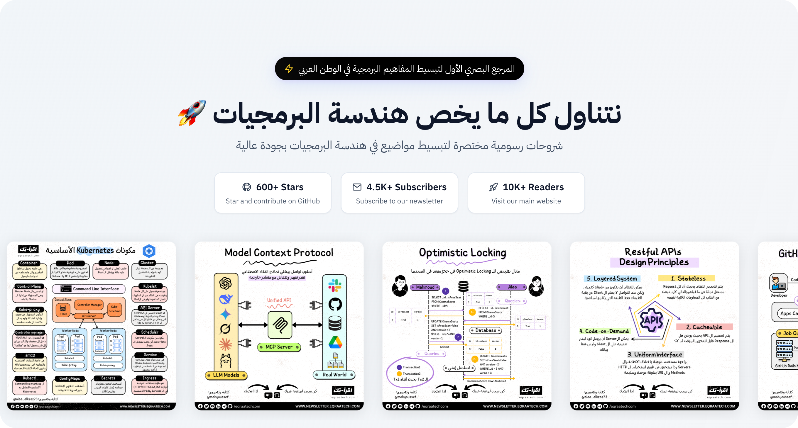

  

  
  
  
  

  
  
  

# فهرس المواضيع 🌠
- [AI Machine Learning](#ai-machine-learning)
  - [AI vs. Machine Learning vs. Deep Learning](#ai-vs-machine-learning-vs-deep-learning)
  - [Generative AI](#generative-ai)
  - [Model Context Protocol](#model-context-protocol)
  - [Overfitting vs. Underfitting in ML](#overfitting-vs-underfitting-in-ml)
  - [Top 5 Prompting Techniques](#top-5-prompting-techniques)
- [Caching Performance](#caching-performance)
  - [Redis Beyond In-Memory Database](#redis-beyond-in-memory-database)
  - [Redis Persistence Strategies](#redis-persistence-strategies)
  - [Top 6 Caching Strategies](#top-6-caching-strategies)
- [Computer Science Fundamentals](#computer-science-fundamentals)
  - [Data Structures Use Cases](#data-structures-use-cases)
  - [Java Collections Cheatsheet](#java-collections-cheatsheet)
  - [Java Exceptions Cheatsheet](#java-exceptions-cheatsheet)
- [Databases Storage](#databases-storage)
  - [ACID Properties in DBMS](#acid-properties-in-dbms)
  - [Database Cheatsheet for System Design](#database-cheatsheet-for-system-design)
  - [Database Connection Pool](#database-connection-pool)
  - [Database Indexing](#database-indexing)
  - [Database Normalization](#database-normalization)
  - [Database Replication](#database-replication)
  - [How to Store Passwords In Database](#how-to-store-passwords-in-database)
  - [Materialized View](#materialized-view)
  - [N+1 Problem](#n1-problem)
  - [Optimistic Locking](#optimistic-locking)
  - [Pessimistic Locking](#pessimistic-locking)
- [Devops CI/CD](#devops-ci-cd)
  - [Continuous Integration](#continuous-integration)
  - [Docker Cheatsheet](#docker-cheatsheet)
  - [Git Aliases](#git-aliases)
  - [Git Commit Message Cheatsheet](#git-commit-message-cheatsheet)
  - [Infrastructure As a Code](#infrastructure-as-a-code)
  - [Linux Commands Cheatsheet](#linux-commands-cheatsheet)
  - [Top 16 Kubernetes Essential Components](#top-16-kubernetes-essential-components)
  - [Top 6 Deployment Strategies](#top-6-deployment-strategies)
  - [Version Control](#version-control)
- [How It Works](#how-it-works)
  - [Date and Time Best Practices](#date-and-time-best-practices)
  - [How QR Codes Work](#how-qr-codes-work)
- [Network Security](#network-security)
  - [API Authentication Methods](#api-authentication-methods)
  - [Domain Name System (DNS)](#domain-name-system-dns)
  - [Json Web Token](#json-web-token)
  - [OAuth2](#oauth2)
  - [OpenID Connect](#openid-connect)
  - [Proxy vs. Reverse Proxy](#proxy-vs-reverse-proxy)
  - [SQL Injection](#sql-injection)
  - [URL Explanation](#url-explanation)
- [Operating Systems](#operating-systems)
  - [Concurrency vs Parallelism](#concurrency-vs-parallelism)
  - [Deadlock vs. Starvation](#deadlock-vs-starvation)
  - [Process Management](#process-management)
  - [Process Scheduling](#process-scheduling)
  - [Program vs Process vs Thread](#program-vs-process-vs-thread)
- [Payment Fintech](#payment-fintech)
  - [How to Avoid Double Payments](#how-to-avoid-double-payments)
- [Software Architecture](#software-architecture)
  - [CQRS Architecture Pattern](#cqrs-architecture-pattern)
  - [Layered Architecture](#layered-architecture)
- [Software Development](#software-development)
  - [Agile Approach](#agile-approach)
  - [Code Comments](#code-comments)
  - [Estimated Time For Task](#estimated-time-for-task)
  - [How to Write Better Logs](#how-to-write-better-logs)
  - [Object Relational Mappers](#object-relational-mappers)
  - [Software Testing](#software-testing)
  - [Top 5 Takeaways for README.MD](#top-5-takeaways-for-readmemd)
- [System Design Distributed Systems](#system-design-distributed-systems)
  - [API Gateway](#api-gateway)
  - [CAP Theorem](#cap-theorem)
  - [CQRS Architecture Pattern](#cqrs-architecture-pattern)
  - [Cloud Computing Models](#cloud-computing-models)
  - [Database Cheatsheet for System Design](#database-cheatsheet-for-system-design)
  - [Database Replication](#database-replication)
  - [Distributed Tracing](#distributed-tracing)
  - [GitHub Code Push Processing](#github-code-push-processing)
  - [Horizontal vs. Vertical Scaling](#horizontal-vs-vertical-scaling)
  - [Load Balancer](#load-balancer)
  - [Load Balancer Algorithms](#load-balancer-algorithms)
  - [Message Queue](#message-queue)
  - [Observability Pillars](#observability-pillars)
  - [Protocol Buffer (ProtoBuf)](#protocol-buffer-protobuf)
  - [Proxy vs. Reverse Proxy](#proxy-vs-reverse-proxy)
  - [Rate Limiting](#rate-limiting)
  - [Serverless Architecture](#serverless-architecture)
  - [Strategies for Read Heavy Systems](#strategies-for-read-heavy-systems)
  - [Top 24 System Design Terminologies](#top-24-system-design-terminologies)
  - [Uber's Docstore Architecture](#ubers-docstore-architecture)
  - [gRPC](#grpc)
- [Technical Behavioral Interviews](#technical-behavioral-interviews)
  - [Star Method for Behavioral Interviews](#star-method-for-behavioral-interviews)
  - [Tackling Technical Interview](#tackling-technical-interview)
- [Technologies Frameworks](#technologies-frameworks)
  - [API Testing with Hoppscotch](#api-testing-with-hoppscotch)
  - [Big Data with Apache Spark](#big-data-with-apache-spark)
  - [CI/CD with Jenkins](#ci-cd-with-jenkins)
  - [CSS With Tailwind](#css-with-tailwind)
  - [Code Editing with Cursor](#code-editing-with-cursor)
  - [Code Quality with Sonarqube](#code-quality-with-sonarqube)
  - [Insights With Grafana](#insights-with-grafana)
  - [LLMs With LM Studio](#llms-with-lm-studio)
  - [LLMs With Ollama](#llms-with-ollama)
  - [Logs With ElasticSearch](#logs-with-elasticsearch)
  - [Message Queue With Kafka](#message-queue-with-kafka)
  - [PWA vs. Native Mobile Applications](#pwa-vs-native-mobile-applications)
  - [Package Managers](#package-managers)
  - [Redis Beyond In-Memory Database](#redis-beyond-in-memory-database)
  - [Software Versioning](#software-versioning)
- [Web Development APIs](#web-development-apis)
  - [API Authentication Methods](#api-authentication-methods)
  - [HTTP Short Polling vs. Long Polling vs. SSE](#http-short-polling-vs-long-polling-vs-sse)
  - [HTTP Status Codes](#http-status-codes)
  - [HTTP Status Codes Cheat Sheet](#http-status-codes-cheat-sheet)
  - [Json Web Token](#json-web-token)
  - [OAuth2](#oauth2)
  - [REST Vs. GraphQL](#rest-vs-graphql)
  - [RESTful APIs Design Principles](#restful-apis-design-principles)
  - [Sessions vs Cookies](#sessions-vs-cookies)
  - [Single vs. Multi Page Web Application](#single-vs-multi-page-web-application)
  - [WebSockets](#websockets)
  - [What is API](#what-is-api)

### AI vs. Machine Learning vs. Deep Learning
لسه بنقول فهمنا ChatGPT بيشتغل ازاي طلع لنا Google بـ Gemini, فخلونا نسيب كل ده على جمب ونرجع للأساسيات ونسأل ايه هو الفرق بين الـ AI vs Machine Learning vs Deep Learning ؟

📄 **[اقرأ المقال](guides/ai-machine-learning/ai-vs-machine-learning-vs-deep-learning.md)**

---

### Generative AI
ال Generative AI هو فئة من فئات الـ AI اللي عندها القدرة على إنتاج محتوى جديد, سواء ردود على اسئلة أو صور أو مقاطع صوت أو فيديو  ، وفي الواقع النوع دا من ال AI مش حاجة جديدة بل موجود من 1960 و احنا اتعاملنا معاه كتير قبل ChatGPt في هيئة ال Chat Bots ودي AI Apps قادرة تعمل محادثات زي البشر.

📄 **[اقرأ المقال](guides/ai-machine-learning/generative-ai.md)**

---

### Model Context Protocol
بروتوكول أو أسلوب تواصل بيخلي نماذج الذكاء الاصطناعي (زي ChatGPT و Claude و Deepseek وغيرها) تقدر تفهم وتتفاعل مع العالم الخارجي زي التعامل مع الملفات، والـ APIs، والأدوات المختلفة، وقواعد البيانات.

📄 **[اقرأ المقال](guides/ai-machine-learning/model-context-protocol.md)**

---

### Overfitting vs. Underfitting in ML
الـ Overfitting والـ Underfitting من أهم المواضيع المرتبطة بتدريب الـ Model في الـ Machine Learning وعشان نفهم الفرق بينهم بشكل كويس هنتناول الموضوع بشكل مختلف وبسيط.

📄 **[اقرأ المقال](guides/ai-machine-learning/overfitting-vs-underfitting-in-machine-learning.md)**

---

### Top 5 Prompting Techniques
الكلام مع ال LLMs بقى جزء من حياتنا اليومية والنهارده في ورقة وقلم وهنتكلم عن أكثر من طريقة لتحسين ال Prompts وطريقة كلامك مع ال Models عشان تطلع لك نتائج أحسن وأكثر دقة.

📄 **[اقرأ المقال](guides/ai-machine-learning/top-5-prompting-techniques.md)**

---

## Caching Performance

### Redis Beyond In-Memory Database
قاعدة بيانات مفتوحة المصدر تعمل في ال Memory , بنستخدمها بشكل أساسي ك Cache أو Quick-Response Database في التطبيقات التي تحتاج زمن إستجابة منخفض والسرعة فيها مهمة.

📄 **[اقرأ المقال](guides/caching-performance/redis-beyond-in-memory-database.md)**

---

### Redis Persistence Strategies
كلنا عارفين إن Redis واحدة من أسرع الـ Key-Value Stores اللي موجودة في الساحة، وأكتر استعمالتها بيكون في الـ Caching وعشان كده أكيد جه في دماغ أي حد بيستخدمها سؤال مهم: لو حصل crash للسيرفر، إيه اللي هيحصل للداتا؟

📄 **[اقرأ المقال](guides/caching-performance/redis-persistence-strategies.md)**

---

### Top 6 Caching Strategies
الـ caching يعتبر من التقنيات الأساسية اللي بتحسن أداء التطبيقات والأنظمة من خلال تخزين البيانات اللي بنحتاجها كتير في مكان قريب زي الـ Memory للوصول السريع ليها بدل ما نعمل عمليات مكلفة على الـ database أو الـ API.

📄 **[اقرأ المقال](guides/caching-performance/top-6-caching-strategies.md)**

---

## Computer Science Fundamentals

### Data Structures Use Cases
هنتكلم عن بعض استخدامات الـ Data Structures في الحياة العملية والغرض من ده هو اننا نمرن العقل على استحضارها في تصميم الحلول البرمجية والمشاريع مش بس في حل المسائل والتمارين.

📄 **[اقرأ المقال](guides/computer-science-fundamentals/data-structure-algorithms-use-cases-part-1.md)**

---

### Java Collections Cheatsheet
الـكلنا عارفين مدى أهمية هياكل البيانات في التطبيقات بتاعتنا ، وقد ايه معرفتنا بنوع المشكلة اللي بنحاول نحلها هو اللي بيحدد نوع هياكل البيانات اللي هنستعملها ، لإن كل واحدة بتتميز بعدة خصائص بتميزها عن الباقيين.

📄 **[اقرأ المقال](guides/computer-science-fundamentals/java-collections-cheatsheet.md)**

---

### Java Exceptions Cheatsheet
الـ Exception Handling من الأساسيات في تعلم أي لغة ، وده لانك وانت شغال أكيد هيقابلك سيناريوهات هتضطر تـ Throw فيها Exceptions ، واحيانًا هتلاقيهم في وشك وأنت مش عارف ليه ، فلازم تكون فاهمهم كويس وعارف تتعامل معاهم ازاي.

📄 **[اقرأ المقال](guides/computer-science-fundamentals/java-exceptions-cheatsheet.md)**

---

## Databases Storage

### ACID Properties in DBMS
ال ACID ببساطة عبارة عن اختصار ل 4 قواعد لازم تحققهم قاعدة البيانات و العمليات اللي بتتم عليها بغض النظر عن أي Software or Hardware Failure أو حتى Power Failure. و ال 4 قواعد دي هي الضمان إن ال Database دي والبيانات اللي فيها صحيحة وموثوق فيها و دا عامل أساسي في مجال البرمجيات ككل صحة البيانات.

📄 **[اقرأ المقال](guides/databases-storage/acid-properties-in-dbms.md)**

---

### Database Cheatsheet for System Design
لازم نكون عارفين ان اختيارنا للـ Database في الـ System اللي بنبنيه، هو قرار مش سهل وقرار هنبقى ملزمين بيه لفترة طويلة فلازم نختارها بعناية خصوصًا لو كمان الموضوع هيتضمن Budget وفلوس هتندفع.

📄 **[اقرأ المقال](guides/databases-storage/database-cheatsheet-for-system-design.md)**

---

### Database Connection Pool
في كل مرة تطبيقك بيحتاج يتعامل مع قاعدة البيانات، بيحتاج يفتح اتصال (Connection) — وفتح الاتصال ده عملية تقيلة ومكلفة لو بتحصل بشكل متكرر. علشان كده بنستخدم Database Connection Pooling: تقنية ذكية بتوفر مجموعة جاهزة من الاتصالات (Connections) بيتشاركها التطبيق بدل ما يفتح ويقفل في كل مرة.

📄 **[اقرأ المقال](guides/databases-storage/database-connection-pool.md)**

---

### Database Indexing
سرعة استعلامات قاعدة البيانات ممكن تكون الفرق بين تطبيق سريع ومريح… أو بطيء ومتعب ، وهنا بييجي دور Database Indexing — طريقة ذكية بتنظم البيانات بحيث تقدر توصل للمعلومة المطلوبة بسرعة من غير ما تحتاج تشوف الجدول كله.

📄 **[اقرأ المقال](guides/databases-storage/database-indexing.md)**

---

### Database Normalization
لما تيجي تصمّم قاعدة بيانات، الهدف مش بس تخزن البيانات، لكن تخزنها بشكل منظم وفعّال. هنا بييجي دور Database Normalization — وهي عملية ترتيب البيانات داخل الجداول لتقليل التكرار، وتجنب التعارض، وتحسين الاتساق.

📄 **[اقرأ المقال](guides/databases-storage/database-normalization.md)**

---

### Database Replication
في الأنظمة اللي بتخدم عدد كبير من المستخدمين، الأداء العالي وتوفّر البيانات بشكل دائم بيبقوا أولوية. هنا بييجي دور Database Replication — عملية نسخ البيانات من قاعدة بيانات رئيسية إلى واحدة أو أكثر من النسخ الاحتياطية (replicas) بشكل آلي.

📄 **[اقرأ المقال](guides/databases-storage/database-replication.md)**

---

### How to Store Passwords In Database
تخزين كلمات المرور بشكل آمن مش مجرد خطوة تقنية، دي مسؤولية أساسية لحماية بيانات المستخدمين. فتعالوا نتعلّم **إزاي تخزن الباسوردات بطريقة صحيحة وآمنة** بعيدًا عن الممارسات الخطيرة زي التخزين النصي العادي (plaintext).

📄 **[اقرأ المقال](guides/databases-storage/how-to-store-passwords-in-database.md)**

---

### Materialized View
الـ Materialized View مش مجرد Query بتتنفذ كل مرة زي الـ Views العادية. ولكن هي بتنفذ الـ Query مرة واحدة بس وتخزن النتيجة فعليًا في جدول جديد جوا الـ Database.

📄 **[اقرأ المقال](guides/databases-storage/materialized-view.md)**

---

### N+1 Problem
الـ N+1 Problem هي مشكلة في طريقة تعاملنا مع قواعد البيانات ، ومن المشاكل اللي لازم احنا كمطورين ناخد بالنا منها لانها ليها ضريبة كبيرة أوي خصوصا في التعامل مع البيانات الكبيرة.

📄 **[اقرأ المقال](guides/databases-storage/n-plus-one-problem.md)**

---

### Optimistic Locking
يعتبر الـ Locking من أهم الآليات اللي بنعتمد عليها في الـ Databases بشكل أساسي عشان نتحكم في الـ Concurrent Access للبيانات من خلال أكثر من Transactions، فلو كان هناك عدد من الـ Transactions بيحاول يوصل للبيانات دي في نفس الوقت فأكيد هيحصل نتيجة لده تضارب بنسميه Conflicts.

📄 **[اقرأ المقال](guides/databases-storage/optimistic-locking.md)**

---

### Pessimistic Locking
الـ Pessimistic Locking في قواعد البيانات بيمنع الـ Conflicts الناتجة من الـ Concurrent Updates واللي بتحصل بشكل Frequent أو متكرر. فلما بنيجي نعمل عملية تحديث لـ Row أو Record معين، فالـPessimistic Locking بتحط قفل

📄 **[اقرأ المقال](guides/databases-storage/pessimistic-locking.md)**

---

## Devops CI/CD

### Continuous Integration
في فرق البرمجيات الحديثة، التغيير المستمر في الكود شيء طبيعي… لكن الدمج اليدوي للتغييرات ممكن يكون كابوس ، وهنا بييجي دور الـ Continuous Integration — أسلوب تطوير بيخلي كل مبرمج يدمج شغله بشكل متكرر وآمن في الكود الأساسي، مع تشغيل اختبارات أوتوماتيكية لضمان إن كل حاجة شغالة.

📄 **[اقرأ المقال](guides/devops-cicd/continuous-integration.md)**

---

### Docker Cheatsheet
تشغيل التطبيقات بسرعة وسهولة من أولوياتنا كمبرمجين لأنه بيسهل علينا يوم العمل ، وعشان كدا Docker أصبح من أهم أدوات المبرمج في السنين اللي فاتت.

📄 **[اقرأ المقال](guides/devops-cicd/docker-cheatsheet.md)**

---

### Git Aliases
بنستخدم Git للتعامل مع النسخ المختلفة من المشروع، لكن بعض أوامر Git ممكن تكون طويلة ومعقدة شوية. هنا بيجي دور Git Aliases، اللي هي أسماء مستعارة بتكون من إنشائك علشان تخلي استخدام Git أسرع وأكثر كفاءة.

📄 **[اقرأ المقال](guides/devops-cicd/git-aliases.md)**

---

### Git Commit Message Cheatsheet
بعد كل تغيير بتحب تسجله علي ال Version Control اللي عليه المشروع الخاص بيك بتحتاج تكتب رسالة , الرسالة دي بتوضح ايه التغيير اللي أنت عملته في الكود  اللي أنت حاليا بترفعه علي Version Control.

📄 **[اقرأ المقال](guides/devops-cicd/git-commit-message-cheatsheet.md)**

---

### Infrastructure As a Code
عملية إدارة البنية التحتية زي Servers الموجودة بتحتاج وقت ومجهود طويل لان كل تعديل على السيرفر كان بيتم بشكل منفرد، فلو هحتاج اغير اعدادات كل Servers اللي عندي هخش على كل جهاز بشكل منفرد واغير فيه.

📄 **[اقرأ المقال](guides/devops-cicd/infrastructure-as-a-code.md)**

---

### Linux Commands Cheatsheet
لما نتعلم أوامر Linux، هنقدر اننا نـ Automate أغلب مهام الشغل اليومي بتاعتنا ونسهل حاجات كتير في شغلنا، وكمان هنقدر نتحكم في كل حاجة في النظام بتاعنا بسهولة.

📄 **[اقرأ المقال](guides/devops-cicd/linux-commands-cheatsheet.md)**

---

### Top 16 Kubernetes Essential Components
أهم مكونات Kubernetes وهو  نظام مفتوح المصدر لإدارة ونشر وتشغيل التطبيقات داخل حاويات (Containers) بشكل آلي وفعّال.

📄 **[اقرأ المقال](guides/devops-cicd/top-16-kubernetes-essential-components.md)**

---

### Top 6 Deployment Strategies
لما نيجي نتكلم عن الـ Deployment Strategies اللي بتستخدمها الشركات الكبيرة، الهدف الأساسي بيبقى إننا ننقل التحديثات الجديدة للـ Production Environment بأقل تأثير سلبي ممكن على المستخدمين.

📄 **[اقرأ المقال](guides/devops-cicd/top-6-deployment-strategies.md)**

---

### Version Control
الـ Version Control هو النظام اللي بيساعدك تتتبع تغييرات الكود، ترجع لنسخ سابقة، وتشتغل بأمان بدون ما يحصل تضارب أو فقدان للتعديلات.

📄 **[اقرأ المقال](guides/devops-cicd/version-control.md)**

---

## How It Works

### Date and Time Best Practices
مشاكل التعامل مع التاريخ والوقت في صناعة البرمجيات غنية عن التعريف لأن الموضوع فعلاً معقد فورقة وقلم وتعالوا نتعرف على أفضل الطرق للتعامل معها.

📄 **[اقرأ المقال](guides/how-it-works/date-and-time-best-practices.md)**

---

### How QR Codes Work
ال QR Codes من الأشياء اللي بنشوفها بشكل شبه يومي في كل مكان فورقة وقلم و تعالوا نفهم هما إيه ونعرف إزاي ال Quick-Response Codes بتتحول ل URLs و إزاي كمبرمج تقدر تعمل تطبيق بسيط بيعمل generation ل QR Codes.

📄 **[اقرأ المقال](guides/how-it-works/how-qr-codes-work.md)**

---

## Network Security

### API Authentication Methods
أثناء تعاملنا مع ال APIs بنحتاج نعمل User Authentication واللي هي عبارة عن عملية التحقق من هوية المستخدم اللي باعت ال Request, ودا جانب هام جدُا في حماية الـ API وكذلك خصوصية وأمان المستخدمين.

📄 **[اقرأ المقال](guides/network-security/api-authentication-methods.md)**

---

### Domain Name System (DNS)
الـ DNS بيحول عنوان الموقع لـ IP Address يقدر الكمبيوتر يفهمه, لكن ايه هو ال DNS أصلاً؟ الكمبيوتر مبيفهمش لغة البشر ومع ذلك لما بتكتبله (eqraatech.com) بيفتحلك الموقع فعلاً، وده بيحصل من خلال مساعدة الـ DNS.

📄 **[اقرأ المقال](guides/network-security/dns.md)**

---

### Json Web Token
الـ JWT عبارة عن Secure Tokens بيتبعت مع كل Request أو Response عشان نتأكد ان البيانات بين الطرفين متغيرتش، كونها طريقة سهلة وفعالة بيخليها واحدة من أكثر الطرق المستخدمة في الـ User Authentication and Authorization.

📄 **[اقرأ المقال](guides/network-security/json-web-token.md)**

---

### OAuth2
ال Open authorization هو Standard أو authorization framework أو طريقة متفق عليها بنستخدمها في ال Delegated third party access وليه اصدارين الاول والثاني, الفرق بينهم كبير و هنا هنتكلم عن طريقة عمل Oauth 2 بما أنه الأسهل والأكثر انتشارًا حاليًا.

📄 **[اقرأ المقال](guides/network-security/oauth2.md)**

---

### OpenID Connect
ال OpenID Connect هو واحد من أشهر طرق الـ User Authentication وأكثرها فعالية ومع ذلك فكرة عمله بسيطة جدًا فورقة وقلم وتعالوا نتعرف إزاي  ال OpenID Connect بيشتغل و إيه الفرق بينه وبين الـ OAuth

📄 **[اقرأ المقال](guides/network-security/openid-connect.md)**

---

### Proxy vs. Reverse Proxy
الـ Proxy والـ Reverse Proxy بيشتغلوا كـ وسيط بين طرفين الـ Client والـ Server، لكن كل واحد فيهم بيخدم هدف مختلف.

📄 **[اقرأ المقال](guides/network-security/proxy-vs-reverse-proxy.md)**

---

### SQL Injection
أكيد سمعنا كتير عن ال SQL Injection وقرأنا عنه كتير ، فاحنا هنقدملكم انهاردة دليلكم المختصر والوافي عنه  فورقة وقلم وتعالوا نتكلم عن ايه هو وليه بنسمع عنه كتير وازاي كمبرمج احمي التطبيقات بتاعتي تجاه النوع دا من الهجمات.

📄 **[اقرأ المقال](guides/network-security/sql-injection.md)**

---

### URL Explanation
الـ URL هو العنوان اللي بيوصلنا لأي حاجة على الإنترنت، من صفحات لميديا لـ APIs. فخلونا نفكك مكونات الـ URL ونعرف دور كل جزء فيه — من البروتوكول لحد الـ Parameteres.

📄 **[اقرأ المقال](guides/network-security/url-explanation.md)**

---

## Operating Systems

### Concurrency vs Parallelism
الـ Concurrency والـ Parallelism اتنين من المصطلحات المهمة جدًا واللي أغلبنا حصله لبس وماقدرش انه يستوعبهم من أول مرة بشكل كويس. ولكن هم من أهم المصطلحات اللي تهمنا في الـ Software.

📄 **[اقرأ المقال](guides/operating-systems/concurrency-vs-parallelism.md)**

---

### Deadlock vs. Starvation
فيه مصطلحين مهمين جدًا في نظم التشغيل لازم نفهمهم كويس وهما Deadlock و Starvation. وعلى الرغم من إنهم بيبدوا مشابهين لبعض، إلا إن كل واحد فيهم ليه سبب مختلف ونتيجة مختلفة تمامًا عن التاني. فورقة وقلم وتعالوا نشوف الفرق بينهم.

📄 **[اقرأ المقال](guides/operating-systems/deadlock-vs-starvation.md)**

---

### Process Management
في عالم أنظمة التشغيل، إدارة العمليات هي واحدة من الأساسيات اللي بتضمن تشغيل البرامج بشكل سليم واستخدام موارد النظام بكفاءة. العملية هي ببساطة برنامج بيشتغل، وإدارة العمليات دي مهمة جدًا عشان تضمن استقرار وأداء النظام.

📄 **[اقرأ المقال](guides/operating-systems/process-management.md)**

---

### Process Scheduling
الـ Scheduler في أنظمة التشغيل هو عبارة عن العنصر اللي بيحدد إزاي وإمتى المعالجات (CPUs) تستغل وقتها في تنفيذ البرامج المختلفة. يعني لو عندنا أكتر من برنامج شغال في نفس الوقت، الـ Scheduler هو اللي بيتحكم في توزيع وقت الـ CPU على البرامج دي.

📄 **[اقرأ المقال](guides/operating-systems/process-scheduling.md)**

---

### Program vs Process vs Thread
في البرمجة ونظم التشغيل، بتستخدم مصطلحات زي الـ Program والـ Process والـ Thread بشكل متكرر. فخلونا نفهم الفرق بين المصطلحات دي بطريقة مبسطة وسهلة.

📄 **[اقرأ المقال](guides/operating-systems/program-vs-process-vs-thread.md)**

---

## Payment Fintech

### How to Avoid Double Payments
أحد أكبر المشاكل اللي ممكن نواجهها في تصميم الأنظمة الخاصة بالدفع , والمعاملات المالية هي أنك تدفع العميل أكتر من مرة, وعشان كده واحنا بنصمم Payment System محتاجين ناخد في الاعتبار ان عملية الدفع لازم نضمن انها هتتم مرة واحدة فقط لا غير.

📄 **[اقرأ المقال](guides/payment-fintech/how-to-avoid-double-payments.md)**

---

## Software Architecture

### CQRS Architecture Pattern
 بناء البرمجيات زي بناء المباني بالظبط محتاج ترتب أجزاء المبني وعلاقتهم ببعض بطريقة مناسبة لوظيفة المبني والمستخدمين, فالبيت مبني وكذلك الجامعة مبني ولكن الحجم, والوظيفة والمستخدمين مختلفين ومن هنا بتيجي فكرة ال Architectural Patterns في البرمجيات.

📄 **[اقرأ المقال](guides/software-architecture/cqrs-architecture-pattern.md)**

---

### Layered Architecture
الـ Layered Architecture طريقة شائعة جدًا بنستخدمها علشان نرتب بيها الكود في أي software system. الفكرة ببساطة إننا بنقسم المشروع بتاعنا لكذا layer، وكل layer بيكون ليه وظيفة محددة.

📄 **[اقرأ المقال](guides/software-architecture/layered-architecture.md)**

---

## Software Development

### Agile Approach
الـAgile Approach هي طريقة في الشغل على المشاريع بتتبع مبادئ معينة، معني الكلمة الحرفي هو “التحرك بسرعة ومرونة” ودا فعلًا الهدف الرئيسي منه!

📄 **[اقرأ المقال](guides/software-development/agile-approach.md)**

---

### Code Comments
الكود الكويس بيشرح نفسه… لكن أحيانًا، الـ Comment الصح هو اللي بيفرق بين كود مفهوم، وكود يخليك محتار لمدة ساعة. فخلونا نعرف إزاي نكتب Comments تضيف قيمة، من غير ما نكرر اللي الكود بيقوله، ولا نسيب ملاحظات مبهمة مالهاش معنى.

📄 **[اقرأ المقال](guides/software-development/code-comments.md)**

---

### Estimated Time For Task
واحدة من المهارات الأساسية المهمة هي تقدير الوقت اللي مهمة ممكن تاخده، أغلبنا وإحنا بنشتغل فى تطوير البرمجيات بنوقع فى مشكلة تقدير الوقت دا، وهي عاملة كأنك بتدور في حلقة مفرغة، مش بتنتهي تمامًا، لكن من الممارسة الفعلية والتطبيق والخبرة بتاعتك تقدر إنك تتغلب عليها.

📄 **[اقرأ المقال](guides/software-development/estimated-time-for-task.md)**

---

### How to Write Better Logs
الـ Logs مش مجرد سطور بتتطبع في الكونسول — دي شريان الحياة لأي نظام في الـ Production ، فلما تحصل مشكلة، أو الأداء يبقى بطيء، أو حد يسأل (إيه اللي حصل؟)، أول حاجة بنرجعلها هي الـ Logs. لكن… مش أي Log ينفع.

📄 **[اقرأ المقال](guides/software-development/how-to-write-better-logs.md)**

---

### Object Relational Mappers
ورقة وقلم وتعالوا نتكلم عن واحدة من أهم المفاهيم في عالم صناعة البرمجيات واللي مبسطة علينا حياتنا اليومية كمبرمجين  ألا وهي الـ ORMs - Object Relational Mappers.

📄 **[اقرأ المقال](guides/software-development/object-relational-mappers.md)**

---

### Software Testing
أنت بتبقى مبسوط أوي وأنت بتكتب الكود, لحد ما تيجي لحظة الحقيقة وتبتدي في الـ Testing الحقيقة أنت ممكن تختبر أداء الكود اللي كتبته بأنواع كثيرة جدًا من الاختبارات, فتعالوا نتكلم عن خطوات اختبار البرمجيات بشكل عام وايه أهم الأنواع ليك كمبرمج.

📄 **[اقرأ المقال](guides/software-development/software-testing.md)**

---

### Top 5 Takeaways for README.MD
واحدة من اهم الحاجات اللي المبرمج المفروض يعملها وقت لما يجي يرفع مشروع كان شغال عليه على GitHub كـ Version Control هو الـ README File الخاص بالمشروع.

📄 **[اقرأ المقال](guides/software-development/5-takeaways-for-readme.md)**

---

## System Design Distributed Systems

### API Gateway
نقطة دخول واحدة لكل الـ requests اللي جايه من الـ clients للـ backend. فبدل ما الـ client يتعامل مع كل service بشكل مباشر، هو بيتعامل بس مع الـ Gateway، والـ Gateway يتولى الباقي.

📄 **[اقرأ المقال](guides/system-design-distributed-systems/api-gateway.md)**

---

### CAP Theorem
الـCAP Theorem واحدة من أهم النظريات الأساسية والمهمة في علوم الحاسب عامةً وفي النظم الموزعة خاصةً وبتنص على: إن في النظم الموزعة ما ينفعش الـSystem يوفر إلا ضمانين أو خاصيتين اتنين بس في نفس ذات الوقت.

📄 **[اقرأ المقال](guides/system-design-distributed-systems/cap-theorem.md)**

---

### CQRS Architecture Pattern
 بناء البرمجيات زي بناء المباني بالظبط محتاج ترتب أجزاء المبني وعلاقتهم ببعض بطريقة مناسبة لوظيفة المبني والمستخدمين, فالبيت مبني وكذلك الجامعة مبني ولكن الحجم, والوظيفة والمستخدمين مختلفين ومن هنا بتيجي فكرة ال Architectural Patterns في البرمجيات.

📄 **[اقرأ المقال](guides/system-design-distributed-systems/cqrs-architecture-pattern.md)**

---

### Cloud Computing Models
فيه بعض الـ Cloud Computing Models الشهيرة اللي بقينا بنشوفها كتير بعد توجه كتير من الشركات والناس لاستعمال الـ Cloud وهي الـ IaaS والـ PaaS والـ SaaS .. طب ايه هي المصطلحات دي ؟.

📄 **[اقرأ المقال](guides/system-design-distributed-systems/cloud-computing-models.md)**

---

### Database Cheatsheet for System Design
لازم نكون عارفين ان اختيارنا للـ Database في الـ System اللي بنبنيه، هو قرار مش سهل وقرار هنبقى ملزمين بيه لفترة طويلة فلازم نختارها بعناية خصوصًا لو كمان الموضوع هيتضمن Budget وفلوس هتندفع.

📄 **[اقرأ المقال](guides/system-design-distributed-systems/database-cheatsheet-for-system-design.md)**

---

### Database Replication
في الأنظمة اللي بتخدم عدد كبير من المستخدمين، الأداء العالي وتوفّر البيانات بشكل دائم بيبقوا أولوية. هنا بييجي دور Database Replication — عملية نسخ البيانات من قاعدة بيانات رئيسية إلى واحدة أو أكثر من النسخ الاحتياطية (replicas) بشكل آلي.

📄 **[اقرأ المقال](guides/system-design-distributed-systems/database-replication.md)**

---

### Distributed Tracing
الهدف الأساسي من الـ Distributed Tracing هو توفير رؤية واضحة لرحلة الطلب (Request) عشان لو فيه مشاكل أو بطء في الأداء نقدر نحدد مصدرها. بنقدر نعرف فين بالتحديد الـ bottleneck أو الخدمة اللي فيها مشكلة.

📄 **[اقرأ المقال](guides/system-design-distributed-systems/distributed-tracing.md)**

---

### GitHub Code Push Processing
الـ Code Pushes هي أكيد واحدة من العمليات الشائعة والمتكررة اللي كلنا بنقوم بيها بشكل دوري. والتغييرات اللي مهندسين GitHub عملوها دي هدفها معالجة أي مشاكل محتملة وانهم يوفروا تجربة أكثر سلاسة لأي حد بيعمل Code Push على GitHub.

📄 **[اقرأ المقال](guides/system-design-distributed-systems/github-code-push-processing.md)**

---

### Horizontal vs. Vertical Scaling
التوسع أو ما يعرف بالـ Scaling هو ببساطة قدرة النظام على تحمل أي حمل زائد أثناء استخدامه، فمثلا: لو فيه نظام بيخدم 20 مستخدم في نفس الوقت، وفجأة العدد ارتفع لـ2000 مستخدم مرة واحدة والنظام قدر يتعامل مع الزيادة دي ويخدمهم من غير أعطال.

📄 **[اقرأ المقال](guides/system-design-distributed-systems/horizontal-vs-vertical-scaling.md)**

---

### Load Balancer
الـ load balancer أو مُوزع الأحمال هو بكل بساطة ضابط مرور بيوجه الطلبات اللي جاية من الـ clients إلى الـ server المناسب في النظام. زمان كنت بتعمل application ويشتغل على سيرفر لكن مع تزايد عدد الطلبات، السيرفر مش بيقدر يخدم كل دا وبيقع. فبنتجه للـ Scaling.

📄 **[اقرأ المقال](guides/system-design-distributed-systems/load-balancer.md)**

---

### Load Balancer Algorithms
في الأنظمة اللي بتخدم آلاف أو ملايين المستخدمين، لازم الحمل يتوزّع على السيرفرات بشكل ذكي علشان الأداء يفضل ثابت وسريع. هنا بييجي دور Load Balancer Algorithms — خوارزميات بتحدد إزاي الطلبات تتوزع على السيرفرات.

📄 **[اقرأ المقال](guides/system-design-distributed-systems/load-balancer-algorithms.md)**

---

### Message Queue
الـ Message Queue هو عبارة عن وسيلة تواصل بين الـ Services وبعضها البعض فيقدروا يتبادلوا المعلومات بشكل Asynchronous وعشان كده النوع ده من التواصل بنسميه Asynchronous Communication.

📄 **[اقرأ المقال](guides/system-design-distributed-systems/message-queue.md)**

---

### Observability Pillars
علشان تقدر تتابع نظامك وتفهم إيه اللي بيحصل جواه، لازم يكون عندك Observability واللي بيعتمد على 3 أعمدة رئيسية: Logs، Metrics، وTraces. فتعالوا نتعرف على دور كل واحد منهم في مراقبة الأنظمة

📄 **[اقرأ المقال](guides/system-design-distributed-systems/observability-pillars.md)**

---

### Protocol Buffer (ProtoBuf)
اختيار الـ Format المناسب للـ Data Serialization أصبح موضوع حيوي حاليًا خصوصًا في التعامل مع الأنظمة اللي بتتميز بكونها Large-Scale واللي الأداء فيها حيوي ومهم جدًا. ومن أشهر الـ Formats اللي فضلت موجودة على مر السنين

📄 **[اقرأ المقال](guides/system-design-distributed-systems/protocol-buffer-protobuf.md)**

---

### Proxy vs. Reverse Proxy
الـ Proxy والـ Reverse Proxy بيشتغلوا كـ وسيط بين طرفين الـ Client والـ Server، لكن كل واحد فيهم بيخدم هدف مختلف.

📄 **[اقرأ المقال](guides/system-design-distributed-systems/proxy-vs-reverse-proxy.md)**

---

### Rate Limiting
ال Rate Limiting هي واحدة من أهم الطرق الأساسية عشان نحقق الـ Robustness في الـ Service اللي بنبنيها وده من خلال تحديد عدد Requests معينة مسموح للمستخدم يطلبها في فترة زمنية محددة.

📄 **[اقرأ المقال](guides/system-design-distributed-systems/rate-limiting.md)**

---

### Serverless Architecture
ظهر الـ Serverless Architecture كطريقة أو نمط للتصميم يسمح للـ Developers بتحقيق الأمنية دي , وإن هم يبقوا قادرين على بناء الـ Software بدون الاهتمام بالبنية التحتية واداراتها.

📄 **[اقرأ المقال](guides/system-design-distributed-systems/serverless-architecture.md)**

---

### Strategies for Read Heavy Systems
لما نيجي نتكلم عن الأنظمة اللي بتركز على عمليات القراءة أكتر من الكتابة، يعني الـ Systems اللي بيكون فيها نسبة قراءة للبيانات أكبر بكتير من نسبة الكتابة، ففيه شوية استراتيجيات ممكن نستخدمها عشان نحسن من الأداء.

📄 **[اقرأ المقال](guides/system-design-distributed-systems/strategies-for-read-heavy-systems.md)**

---

### Top 24 System Design Terminologies
تعالوا نشوف مع بعض شوية من أهم المصطلحات المستخدمة في تصميم الأنظمة والـ (System Design) في مجال هندسة البرمجيات باللغة العربية ، مع شرح مبسط لكل مصطلح.

📄 **[اقرأ المقال](guides/system-design-distributed-systems/top-24-system-design-terminologies.md)**

---

### Uber's Docstore Architecture
قاعدة البيانات دي بتتميز بعدة مميزات من ضمنها انها بتوفر الـ Strict Serializability Consistency Model على مستوى الـ Partition وده كان من ضمن المتطلبات اللي Uber عاوزة تحققها وبالتالي نقدر نستنج هنا ان Uber بتضحي بالـ Availability في سبيل الـ Consistency.

📄 **[اقرأ المقال](guides/system-design-distributed-systems/uber's-docstore-architecture.md)**

---

### gRPC
الـ gRPC هي اختصار لـ Google Remote Procedure Call وهي تكنولوجيا بتخلي الـ Service تقدر تنادي الـ function اللي موجودة في Service تانية كأنها بتناديها عادي كـ Function Call.

📄 **[اقرأ المقال](guides/system-design-distributed-systems/grpc.md)**

---

## Technical Behavioral Interviews

### Star Method for Behavioral Interviews
الـ Star Method هي واحدة من أكثر الطرق الفعالة في تحسين التواصل خلال الانترفيو خصوصًا الـ Behavioral Interviews.

📄 **[اقرأ المقال](guides/technical-behavioral-interviews/star-method-for-behavioral-interviews.md)**

---

### Tackling Technical Interview
محطة ال Technical interview تعتبر الأهم في عملية الانترفيوهات, وفي ال Problem solving interview كتير مننا بيكون مركز علي حل المسألة وبينسي إن الانترفيور همه الأول والأخير مش إنه يعرف إنك عارف الحل ولكن يقيم ازاي وصلت للحل.

📄 **[اقرأ المقال](guides/technical-behavioral-interviews/tackling-technical-interview.md)**

---

## Technologies Frameworks

### API Testing with Hoppscotch
بديل مفتوح المصدر ومجاني تمامًا بدا كمشروع بسيط اسمه Postwoman وسهل تشتغل عليه سواء من المتصفح أو حتى تنزله Self-host على جهازك أو سيرفرك الخاص، عشان تحافظ على بياناتك وتشتغل براحتك.

📄 **[اقرأ المقال](guides/technologies-frameworks/api-testing-with-hoppscotch.md)**

---

### Big Data with Apache Spark
منصة معالجة بيانات مفتوحة المصدر تُستخدم لمعالجة وتحليل البيانات الكبيرة (Big Data) بسرعة وفعالية.

📄 **[اقرأ المقال](guides/technologies-frameworks/big-data-with-apache-spark.md)**

---

### CI/CD with Jenkins
أداة مفتوحة المصدر بتساعدك تبني Pipelines عشان تختبر وتبني الكود بشكل مستمر مع كل إضافة وتتأكد من عمله بطريقة صحيحة ودي بتسمي بعملية CI/CD.

📄 **[اقرأ المقال](guides/technologies-frameworks/ci-cd-with-jenkins.md)**

---

### CSS With Tailwind
إطار عمل CSS مفتوح المصدر CSS Open-source Framework بنستخدمه في تصميم ال Frontend للمواقع بسرعة وسهولة.

📄 **[اقرأ المقال](guides/technologies-frameworks/css-with-tailwind.md)**

---

### Code Editing with Cursor
محرر أكواد حديث مدعوم بالذكاء الاصطناعي، بيقدر يتعرف على ال codebase الخاصة بالمشروع ويفهمها ويقترح عليك إضافات وتعديلات. بل ويقدر يكتب أكواد مشروع كامل من البداية للنهاية وما عليك إلا إنك توجه باستخدام ال Prompts واللي ممكن كمان تكون بالعربي!

📄 **[اقرأ المقال](guides/technologies-frameworks/code-editing-with-cursor.md)**

---

### Code Quality with Sonarqube
أداة مفتوحة المصدر بتحلل جودة الكود في مشروعك وبتظهرلك المشاكل الموجودة فيه في أكثر من جهة مهمة.

📄 **[اقرأ المقال](guides/technologies-frameworks/code-quality-with-sonarqube.md)**

---

### Insights With Grafana
أداة مفتوحة المصدر بتخليك تراقب وتعرض البيانات من مصادر مختلفة بشكل متقدم وعرضها في لوحات تحكم تفاعلية.

📄 **[اقرأ المقال](guides/technologies-frameworks/insights-with-grafana.md)**

---

### LLMs With LM Studio
منصة متكاملة لتطوير وتدريب النماذج اللغوية الضخمة (Large Language Models - LLMs) بيتيح للمستخدمين بناء نماذج ذكاء اصطناعي قادرة على فهم اللغة الطبيعية، توليد النصوص، وتحليل البيانات النصية باستخدام GUI.

📄 **[اقرأ المقال](guides/technologies-frameworks/llms-with-lm-studio.md)**

---

### LLMs With Ollama
مشروع مفتوح المصدر هدفه الأساسي أنه يسهل عليك تشغيل الـ AI Models الكبيرة مثل ال LLMs (Large Language Models) علي جهازك الشخصي بدون إنترنت بدلاً من تشغيلها على الـ Cloud.

📄 **[اقرأ المقال](guides/technologies-frameworks/llms-with-ollama.md)**

---

### Logs With ElasticSearch
محرك بحث مفتوح المصدر, يستخدم لتخزين، وبحث، وتحليل كميات كبيرة من البيانات في وقت شبه حقيقي (Realtime).

📄 **[اقرأ المقال](guides/technologies-frameworks/logs-with-elasticsearch.md)**

---

### Message Queue With Kafka
نظام مفتوح المصدر لمعالجة البيانات بشكل موزع وفعال، مصمم للتعامل مع كميات ضخمة من البيانات. بيتم استخدامه بشكل أساسي ك Message broker ولكنه يتميز بقدرته على التعامل مع ال Streaming data بشكل سلس.

📄 **[اقرأ المقال](guides/technologies-frameworks/message-queue-with-kafka.md)**

---

### PWA vs. Native Mobile Applications
كلنا عارفين انه في عالم التطبيقات في Web Apps وفي Mobile Apps ، بس في Web Apps عاملة نفسهاMobile Apps وهي دي ال PWA فلو بتفكر تطوّر تطبيق للمستخدمين، فيه سؤال بيظهر دايمًا: تبني PWA ولا Native App؟ كل اختيار ليه مميزاته وتحدياته، وقرارك بيعتمد على تجربة المستخدم اللي عايز تقدمها، والموارد اللي عندك.

📄 **[اقرأ المقال](guides/technologies-frameworks/progressive-web-application-vs-native-mobile-applications.md)**

---

### Package Managers
الـ Package manager هو مساعد المبرمج المخلص في كل مشاريعه، فلو شغال Frontend هتلاقيك بتستخدم npm ولو شغال Backend فلكل لغة package manager بردو زي composer في PHP ولو شغال مع الذكاء الاصطناعي

📄 **[اقرأ المقال](guides/technologies-frameworks/package-managers.md)**

---

### Redis Beyond In-Memory Database
قاعدة بيانات مفتوحة المصدر تعمل في ال Memory , بنستخدمها بشكل أساسي ك Cache أو Quick-Response Database في التطبيقات التي تحتاج زمن إستجابة منخفض والسرعة فيها مهمة.

📄 **[اقرأ المقال](guides/technologies-frameworks/redis-beyond-in-memory-database.md)**

---

### Software Versioning
ال Semantic Versioning أو إصدار نسخ البرمجيات هو ببساطة نظام تسمية لإصدارات البرامج, نظام التسمية دا مهم في كل أنواع البرمجيات سواء البرنامج دا تطبيق موبايل أو Web App API أو Library أو لغة برمجة.

📄 **[اقرأ المقال](guides/technologies-frameworks/software-versioning.md)**

---

## Web Development APIs

### API Authentication Methods
أثناء تعاملنا مع ال APIs بنحتاج نعمل User Authentication واللي هي عبارة عن عملية التحقق من هوية المستخدم اللي باعت ال Request, ودا جانب هام جدُا في حماية الـ API وكذلك خصوصية وأمان المستخدمين.

📄 **[اقرأ المقال](guides/web-development-apis/api-authentication-methods.md)**

---

### HTTP Short Polling vs. Long Polling vs. SSE
انهاردة هنتكلم عن 3 من التقنيات المهمة جدًا واللي مهم جدًا نكون عارفين الفرق بينهم اثناء تصميم Realtime Web Applications والـ 3 تقنيات دول هم الـ Long Polling , Short Polling , Server-Sent Events.

📄 **[اقرأ المقال](guides/web-development-apis/http-short-polling-vs-long-polling-vs-sse-in-a-nutshell.md)**

---

### HTTP Status Codes
أثناء تعاملنا أو تطويرنا للـ API Endpoints بنقابل الـ Http Status Code وهو عبارة عن رقم مكون من 3 خانات:الخانة الأولى بتعبر عن الفئة اللي بينتمي ليها الـ Code.

📄 **[اقرأ المقال](guides/web-development-apis/http-status-codes.md)**

---

### HTTP Status Codes Cheat Sheet
اتكلمنا قبل كدا عن ايه هي ال Http status codes وليه مهمة في تصميمنا لـ APIs , النهارده هنتكلم عن أشهر 15 status code منهم وعاملين cheat sheet بيهم تقدر تساعدك في انك تفتكر استخداماتهم سريعًا في وقت الشغل.

📄 **[اقرأ المقال](guides/web-development-apis/http-status-codes-cheat-sheet.md)**

---

### Json Web Token
الـ JWT عبارة عن Secure Tokens بيتبعت مع كل Request أو Response عشان نتأكد ان البيانات بين الطرفين متغيرتش، كونها طريقة سهلة وفعالة بيخليها واحدة من أكثر الطرق المستخدمة في الـ User Authentication and Authorization.

📄 **[اقرأ المقال](guides/web-development-apis/json-web-token.md)**

---

### OAuth2
ال Open authorization هو Standard أو authorization framework أو طريقة متفق عليها بنستخدمها في ال Delegated third party access وليه اصدارين الاول والثاني, الفرق بينهم كبير و هنا هنتكلم عن طريقة عمل Oauth 2 بما أنه الأسهل والأكثر انتشارًا حاليًا.

📄 **[اقرأ المقال](guides/web-development-apis/oauth2.md)**

---

### REST Vs. GraphQL
غالبًا لو عملت APIs قبل كده هتكون استعملت REST وهيبقي عندك زميلك اللي عمال يقولك ما تيجي نشتغل بـ GraphQL زي الناس اللي هناك دي..فتعالى نعرف الفرق بين اثنين من أشهر أنواع الـ API Architectures.

📄 **[اقرأ المقال](guides/web-development-apis/rest-vs-graphql.md)**

---

### RESTful APIs Design Principles
تصميم واجهات برمجية (APIs) بشكل سليم هو جزء أساسي من بناء أنظمة مرنة وسهلة التكامل فتعالوا نتعرف على المبادئ الأساسية لتصميم RESTful APIs بطريقة واضحة، قابلة للتوسع، وسهلة الفهم.

📄 **[اقرأ المقال](guides/web-development-apis/restful-apis-design-principles.md)**

---

### Sessions vs Cookies
في الـ Web Development فيه مشكلة بتقابلنا الا وهي ان الـ HTTP بطبعه بيكون Stateless يعني مش بيحتفظ بأي بيانات , وعشان نعالج المشكلة دي ونخلي فيه State موجودة نقدر من خلالها ندير البيانات ونخزنها , ظهر الـ Cookies والـ Sessions

📄 **[اقرأ المقال](guides/web-development-apis/sessions-vs-cookies.md)**

---

### Single vs. Multi Page Web Application
الـ Web Applications تعد من أهم البرمجيات التي لا يمكن الاستغناء عنها في حياة الإنسان المعاصر وبتثبت كل يوم مدى فعاليتها وتأثيرها, و كمبرمج معاصر محتاج تعرف الفرق بين Single Page Application أو Multiple Page Application لأنه أول قرار بتاخده في برمجتك للموقع.

📄 **[اقرأ المقال](guides/web-development-apis/single-vs-multi-page-web-application.md)**

---

### WebSockets
هي عبارة عن Communication Protocol مزدوجة الاتجاه بنقول عليها Full-Duplex Communication Channels وده كله من خلال TCP Connection واحد بس. وبالتالي بتسمح بعملية الـ Real-time والـ Event-Driven Connections بين الـ Client والـ Server.

📄 **[اقرأ المقال](guides/web-development-apis/websockets-in-a-nutshell.md)**

---

### What is API
طبعًا مش هنقول إنها اختصار لـ واجهة التطبيقات البرمجية لأنك غالبًا هتنسي الاسم علطول, ولكن هنفهم دورها ايه و بنستخدمها ليه بمثال بسيط ودا عمرك ما هتنساه الـ APIs بتلعب دور الجرسون في المطعم

📄 **[اقرأ المقال](guides/web-development-apis/what-is-api.md)**

---

## المساهمة 🤝

نرحب بمساهماتكم في تطوير المحتوى! يمكنكم:
- إضافة مواضيع جديدة
- تحسين المحتوى الموجود
- الإبلاغ عن الأخطاء
- اقتراح تحسينات

## الدعم 💖

إذا أعجبكم المحتوى، يمكنكم دعمنا من خلال:
- ⭐ إعطاء نجمة للمشروع
- 🔄 مشاركة المحتوى
- ☕ شراء قهوة للفريق

## الترخيص 📝

هذا المشروع مرخص تحت رخصة MIT - راجعوا ملف [LICENSE](LICENSE) لمزيد من التفاصيل.

---

  
صنع بـ ❤️ من فريق إقرأ تك

  
<a href="https://eqraatech.com">eqraatech.com</a>

